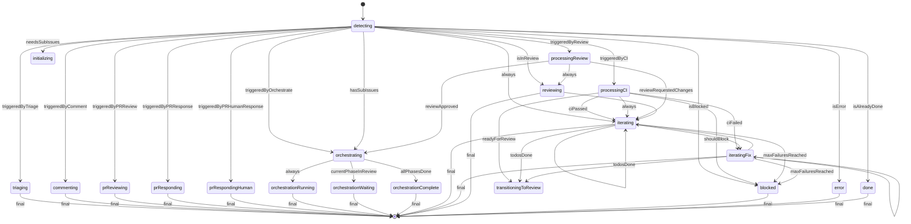

# Claude Automation State Machine

## Overview

The Claude automation system uses a TypeScript state machine (XState v5) to manage issue lifecycle from assignment through merge. This provides:

- **Deterministic transitions**: Given the same state, always produces the same actions
- **Testable logic**: State machine can be tested in isolation from GitHub API
- **Visualizable flow**: Machine definition can be exported and visualized
- **Type safety**: Zod schemas ensure all state and actions are validated

## Architecture

```
┌─────────────────────────────────────────────────────────────────────────────┐
│                           GitHub Actions Workflow                            │
│                                                                              │
│  ┌─────────────┐    ┌─────────────────┐    ┌─────────────┐    ┌──────────┐ │
│  │   Trigger   │───►│  State Parser   │───►│   XState    │───►│  Action  │ │
│  │   Event     │    │   (Zod)         │    │   Machine   │    │  Runner  │ │
│  └─────────────┘    └─────────────────┘    └─────────────┘    └──────────┘ │
│                              │                    │                  │       │
│                              ▼                    ▼                  ▼       │
│                     MachineContext         Action[]           GitHub API     │
│                     (typed state)     (typed commands)        (mutations)    │
└─────────────────────────────────────────────────────────────────────────────┘
```

## State Diagram



## States

| State | Description | Entry Actions |
|-------|-------------|---------------|
| `detecting` | Initial state, determines next transition based on context and trigger | `logDetecting` |
| `initializing` | Creates sub-issues for phased work | `setInProgress` |
| `orchestrating` | Advances through phases, checks completion | None |
| `processingCI` | Handles CI completion events | None |
| `processingReview` | Handles review submission events | None |
| `transitioningToReview` | Transitions from working to review | `transitionToReview` |
| `iterating` | Claude is working on implementation | `setWorking`, `incrementIteration`, `runClaude` |
| `iteratingFix` | Claude is fixing CI failures | `incrementIteration`, `runClaudeFixCI` |
| `reviewing` | PR is ready for review | `logReviewing` |
| `blocked` | Circuit breaker triggered | `setBlocked`, `unassign` |
| `error` | Unrecoverable error | None |
| `done` | All phases complete | `setDone`, `closeIssue` |

## Guards (Conditions)

### Terminal State Guards
| Guard | Description |
|-------|-------------|
| `isAlreadyDone` | Issue Project Status = Done |
| `isBlocked` | Issue Project Status = Blocked |
| `isError` | Issue Project Status = Error |

### Sub-Issue Guards
| Guard | Description |
|-------|-------------|
| `needsSubIssues` | Issue needs phases but has none |
| `hasSubIssues` | Issue has sub-issues |

### Phase State Guards
| Guard | Description |
|-------|-------------|
| `allPhasesDone` | All sub-issues Status = Done |
| `currentPhaseNeedsWork` | Current sub-issue Status = In progress/Ready |
| `currentPhaseInReview` | Current sub-issue Status = Review |
| `isInReview` | Current context is in review state |

### Todo Guards
| Guard | Description |
|-------|-------------|
| `todosDone` | All non-manual todos are checked |
| `readyForReview` | CI passed AND todos done AND has PR |

### CI Guards
| Guard | Description |
|-------|-------------|
| `ciPassed` | CI result = success |
| `ciFailed` | CI result = failure |
| `triggeredByCI` | Event triggered by workflow_run_completed |

### Failure Guards
| Guard | Description |
|-------|-------------|
| `maxFailuresReached` | Failures >= maxRetries |
| `shouldBlock` | CI failed AND max failures reached |

### Review Guards
| Guard | Description |
|-------|-------------|
| `reviewApproved` | Review decision = APPROVED |
| `reviewRequestedChanges` | Review decision = CHANGES_REQUESTED |
| `triggeredByReview` | Event triggered by pr_review_submitted |

### PR Guards
| Guard | Description |
|-------|-------------|
| `hasPR` | PR exists for current issue |
| `prIsDraft` | PR is in draft state |
| `hasBranch` | Branch exists for current issue |

## Actions Emitted

The state machine accumulates typed actions that the runner executes sequentially.

### Project Field Actions
| Action | Description |
|--------|-------------|
| `updateProjectStatus` | Set Status field (In progress, In review, Done, etc.) |
| `incrementIteration` | Increment Iteration field by 1 |
| `recordFailure` | Increment Failures field by 1 |
| `clearFailures` | Reset Failures to 0 |

### Issue Actions
| Action | Description |
|--------|-------------|
| `createSubIssues` | Create sub-issues for phases |
| `closeIssue` | Close completed issue |
| `appendHistory` | Add row to Iteration History table |
| `updateHistory` | Update existing history row |
| `updateIssueBody` | Update issue body content |
| `addComment` | Add comment to issue |
| `unassignUser` | Remove assignee from issue |

### Git/PR Actions
| Action | Description |
|--------|-------------|
| `createBranch` | Create feature branch |
| `gitPush` | Push commits to branch |
| `createPR` | Create pull request |
| `convertPRToDraft` | Convert PR to draft state |
| `markPRReady` | Mark PR as ready for review |
| `requestReview` | Request reviewer on PR |
| `mergePR` | Merge approved PR |

### Claude Actions
| Action | Description |
|--------|-------------|
| `runClaude` | Invoke Claude CLI with implementation prompt |

### Control Actions
| Action | Description |
|--------|-------------|
| `log` | Log a message (debug/info/warning/error) |
| `stop` | Stop execution with reason |
| `block` | Block issue (circuit breaker) |
| `noop` | No operation (placeholder) |

## File Structure

```
.github/actions-ts/claude-state-machine/
├── action.yml                  # GitHub Action definition
├── index.ts                    # Entry point
├── dist/                       # Bundled output
│
├── schemas/
│   ├── state.ts                # Issue state Zod schemas
│   ├── actions.ts              # Action Zod schemas (discriminated unions)
│   ├── events.ts               # GitHub event schemas
│   └── index.ts                # Re-exports
│
├── parser/
│   ├── state-parser.ts         # Fetches & parses GitHub state
│   ├── todo-parser.ts          # Parses todo checkboxes from markdown
│   ├── history-parser.ts       # Parses iteration history table
│   └── index.ts
│
├── machine/
│   ├── machine.ts              # XState machine definition
│   ├── guards.ts               # Condition guards
│   ├── actions.ts              # Action emitters
│   └── index.ts
│
├── runner/
│   ├── runner.ts               # Executes action array
│   ├── executors/
│   │   ├── project.ts          # Project field mutations
│   │   ├── github.ts           # GitHub API operations
│   │   ├── git.ts              # Git operations
│   │   └── claude.ts           # Claude CLI invocation
│   └── index.ts
│
├── scripts/
│   ├── export-machine.ts       # Export for Stately Studio
│   ├── inspect-state.ts        # CLI for testing transitions
│   └── generate-diagram.ts     # Generate Mermaid diagram
│
└── __tests__/
    ├── schemas/                # Schema validation tests
    ├── parser/                 # Parser tests
    ├── machine/                # State transition tests
    └── runner/                 # Executor tests
```

## Local Development & Visualization

### Prerequisites

```bash
cd .github/actions-ts
pnpm install
```

### Running Tests

```bash
# All state machine tests
pnpm test -- claude-state-machine

# Specific test file
pnpm test -- claude-state-machine/__tests__/machine/machine.test.ts
```

### Generate Mermaid Diagram

Auto-generate the state diagram from machine definition:

```bash
cd .github/actions-ts
pnpm tsx claude-state-machine/scripts/generate-diagram.ts

# Output to file
pnpm tsx claude-state-machine/scripts/generate-diagram.ts > claude-state-machine/state-diagram.mmd

# With markdown wrapper
pnpm tsx claude-state-machine/scripts/generate-diagram.ts --format markdown
```

### Visualize Locally (HTML)

Generate a self-contained HTML file with interactive diagram:

```bash
cd .github/actions-ts
pnpm tsx claude-state-machine/scripts/visualize.ts

# Generate and open in browser
pnpm tsx claude-state-machine/scripts/visualize.ts --open
```

This creates `claude-state-machine/state-machine.html` which you can open in any browser. Features:
- Zoom in/out controls
- Download as SVG

### Export Machine Definition (JSON)

Export the machine definition as JSON:

```bash
cd .github/actions-ts
pnpm tsx claude-state-machine/scripts/export-machine.ts > machine.json

# Raw format (machine only, no metadata)
pnpm tsx claude-state-machine/scripts/export-machine.ts --raw
```

### Online Visualization

You can also paste the Mermaid diagram output at [mermaid.live](https://mermaid.live):

```bash
pnpm tsx claude-state-machine/scripts/generate-diagram.ts | pbcopy
# Then paste at mermaid.live
```

### Inspect State Transitions

Test how the machine behaves with different contexts:

```bash
cd .github/actions-ts

# List available scenarios
pnpm tsx claude-state-machine/scripts/inspect-state.ts --list-scenarios

# List available guards
pnpm tsx claude-state-machine/scripts/inspect-state.ts --list-guards

# Run with a predefined scenario
pnpm tsx claude-state-machine/scripts/inspect-state.ts --scenario ci-success-todos-done

# Run with custom context (JSON string)
pnpm tsx claude-state-machine/scripts/inspect-state.ts '{"trigger":"workflow_run_completed","ciResult":"success"}'

# Basic inspection (default context)
pnpm tsx claude-state-machine/scripts/inspect-state.ts
```

## Usage in GitHub Actions

```yaml
- name: Run Claude State Machine
  uses: ./.github/actions-ts/claude-state-machine
  with:
    github_token: ${{ secrets.GITHUB_TOKEN }}
    project_number: ${{ vars.PROJECT_NUMBER }}
    issue_number: ${{ github.event.issue.number }}
    trigger: issue_assigned
```

### Inputs

| Input | Required | Description |
|-------|----------|-------------|
| `github_token` | Yes | GitHub token for API access |
| `project_number` | Yes | GitHub Project number for state storage |
| `issue_number` | Yes | Issue number to process |
| `trigger` | Yes | Trigger type (issue_assigned, workflow_run_completed, etc.) |
| `ci_result` | No | CI result (success/failure) for workflow_run triggers |
| `ci_run_url` | No | URL to CI run |
| `ci_commit_sha` | No | Commit SHA that triggered CI |
| `review_decision` | No | Review decision for pr_review triggers |
| `reviewer_id` | No | Reviewer username |
| `dry_run` | No | If true, log actions without executing |

### Outputs

| Output | Description |
|--------|-------------|
| `final_state` | Final state after machine execution |
| `actions_executed` | Number of actions executed |
| `success` | Whether execution completed successfully |

## Trigger Types

| Trigger | When Used | Expected Context |
|---------|-----------|------------------|
| `issue_assigned` | Bot assigned to issue | Issue details |
| `issue_edited` | Issue body edited | Issue details |
| `workflow_run_completed` | CI finishes | CI result, run URL, commit SHA |
| `pr_review_submitted` | Review submitted | Review decision, reviewer |
| `issue_comment` | Comment on issue | Comment details |

## Circuit Breaker

When `Failures >= maxRetries` (default: 5), the machine transitions to `blocked` state:

1. Sets Project Status to "Blocked"
2. Unassigns the bot
3. Stops execution

To resume: Human fixes the issue and re-assigns the bot, which resets Failures to 0.

## Testing

The state machine has comprehensive test coverage:

- **Schema tests**: Validate Zod schemas accept/reject correct data
- **Parser tests**: Test markdown parsing (todos, history tables)
- **Guard tests**: Test all guard conditions
- **Machine tests**: Test state transitions with various contexts
- **Executor tests**: Test GitHub API calls with mocked Octokit

Run all tests:
```bash
pnpm test -- claude-state-machine
```

## Debugging

### Enable Debug Logging

Set `ACTIONS_STEP_DEBUG=true` in GitHub Actions to see detailed logs.

### Common Issues

1. **Machine stays in detecting**: Check that trigger type and context match expected guards
2. **Actions not executing**: Verify `dry_run` is not set, check runner logs
3. **CI not triggering next iteration**: Ensure workflow edits issue body (appends history)
4. **Review loop not working**: Check PR draft state and review decision parsing
