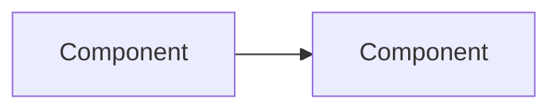

# AGENTS.md - Nopo Project Guidelines

This document provides comprehensive guidance for AI coding agents working on the Nopo monorepo. Nopo (mo**no**re**po**) is a Docker-based development environment with a custom CLI for managing services, featuring a Django backend, React Router frontend, and infrastructure-as-code for GCP and Fly.io deployments.

---

## Table of Contents

1. [Project Overview](#project-overview)
2. [Getting Started](#getting-started)
3. [Git Worktrees (Parallel Development)](#git-worktrees-parallel-development)
4. [Command Reference](#command-reference)
5. [Development Workflow](#development-workflow)
6. [Testing Philosophy](#testing-philosophy)
7. [Code Quality](#code-quality)
8. [Database & Migrations](#database--migrations)
9. [Pull Request Guidelines](#pull-request-guidelines)
10. [CI/CD Pipeline](#cicd-pipeline)
11. [GitHub Actions Development](#github-actions-development)
12. [Architecture & Documentation](#architecture--documentation)
13. [Conventions & Patterns](#conventions--patterns)
14. [Tripwires & Anti-patterns](#tripwires--anti-patterns)
15. [Claude Automation State Machine](#claude-automation-state-machine)

---

## Project Overview

### Repository Structure

```
nopo/
├── apps/                      # Application services
│   ├── backend/              # Django REST API (Python 3.12+)
│   ├── web/                  # React Router frontend (TypeScript)
│   ├── db/                   # PostgreSQL database config
│   └── nginx/                # Nginx reverse proxy config
├── packages/                  # Shared packages
│   ├── configs/              # Shared ESLint, TypeScript, Vite configs
│   ├── plop/                 # Code generators
│   └── ui/                   # Shared React UI components (Storybook)
├── nopo/                      # CLI tool
│   ├── scripts/              # TypeScript CLI implementation
│   ├── docker/               # Base Docker configuration
│   └── docs/                 # CLI documentation
├── infrastructure/            # GCP Terraform configs
├── fly/                       # Fly.io deployment configs
├── decisions/                 # Architecture Decision Records (ADRs)
└── .github/                   # GitHub Actions workflows
```

### Key Technologies

| Layer          | Technologies                                                  |
| -------------- | ------------------------------------------------------------- |
| Frontend       | React 19, React Router 7, TypeScript, Vite, Tailwind CSS      |
| Backend        | Django 5, Django REST Framework, Python 3.12+, Gunicorn       |
| Database       | PostgreSQL 16                                                 |
| Build Tools    | pnpm 10.11+, uv (Python), Docker, Docker Compose, Buildx Bake |
| Testing        | Vitest (unit), Playwright (e2e), Storybook (visual)           |
| Linting        | ESLint 9, Prettier, Ruff (Python), mypy                       |
| Infrastructure | Terraform, GCP (Cloud Run, Cloud SQL), Fly.io                 |
| CI/CD          | GitHub Actions                                                |

---

## Getting Started

### Prerequisites

- Node.js 22.16+ (see [Node Version Management](#node-version-management) for auto-switching)
- pnpm 10.11+
- Docker and Docker Compose v2.20+
- Python 3.12+ (for backend development)
- uv (Python package manager)

### Initial Setup

```bash
# Install dependencies and see CLI help
make

# Set up environment variables
make env

# Build Docker images
make build

# Start all services
make up

# Access the application at http://localhost
```

### Node Version Management

This project uses Node.js 22. Version is managed through multiple files for different contexts:

| File | Value | Purpose |
|------|-------|---------|
| `.nvmrc` | `22` | Local development (nvm/fnm auto-switch) |
| `package.json` engines | `>=22.16` | Enforced during `pnpm install` |
| `nopo.yml` os.base.image | `node:22.16.0-slim` | Docker base image |

**Manual usage:**

```bash
nvm use       # Switch to project's Node version
node -v       # Verify: should be v22.x.x
```

**Auto-switch setup (recommended):**

Most Node version managers can automatically switch when you `cd` into the project:

```bash
# nvm (bash) - add to ~/.bashrc
cdnvm() {
  cd "$@" || return $?
  if [[ -f .nvmrc && -r .nvmrc ]]; then
    nvm use
  fi
}
alias cd='cdnvm'

# nvm (zsh) - add to ~/.zshrc
autoload -U add-zsh-hook
load-nvmrc() {
  if [[ -f .nvmrc && -r .nvmrc ]]; then
    nvm use
  fi
}
add-zsh-hook chpwd load-nvmrc
load-nvmrc

# Oh My Zsh - enable the nvm plugin in ~/.zshrc
plugins=(... nvm)

# fnm - add to shell config
eval "$(fnm env --use-on-cd)"
```

**Why `22` instead of `22.16` in .nvmrc?**
- Local development gets the latest Node 22.x patches automatically
- The `package.json` engines constraint (`>=22.16`) still enforces the minimum version
- If your Node version is too old, `pnpm install` will fail with a clear error

---

## Git Worktrees (Parallel Development)

Git worktrees allow multiple independent working directories from a single repository, each with its own branch. This enables multiple Claude sessions to work on different issues simultaneously without conflicts.

### Why Use Worktrees

- **Parallel work**: Multiple Claude sessions can implement different issues at the same time
- **Isolated environments**: Each worktree has its own working directory, preventing conflicts
- **Shared git history**: All worktrees share the same `.git` database, keeping disk usage low
- **Independent testing**: Run tests in one worktree while developing in another

### Creating a Worktree

Worktrees are created as sibling directories to avoid nesting within the main repo:

```bash
# Ensure you're in the main nopo directory
cd /path/to/nopo

# Fetch latest branches
git fetch origin

# Create a worktree for an issue (creates branch if it doesn't exist)
git worktree add ../nopo-issue-123 claude/issue/123

# Or create from an existing branch
git worktree add ../nopo-issue-123 -b claude/issue/123 origin/main
```

This creates `../nopo-issue-123` as a separate working directory with its own checkout.

### Naming Convention

| Type | Pattern | Example |
|------|---------|---------|
| Worktree directory | `../nopo-issue-{N}` | `../nopo-issue-123` |
| Branch name | `claude/issue/{N}` | `claude/issue/123` |

This aligns with the branch naming used in CI workflows (`.github/workflows/claude-issue-loop.yml`).

### Working in a Worktree

```bash
# Navigate to the worktree
cd ../nopo-issue-123

# Install dependencies (required for each worktree)
pnpm install

# Work normally - all git commands work as expected
make up
make test
git add .
git commit -m "feat: implement feature"
git push origin claude/issue/123
```

### Cleanup

```bash
# Remove a worktree when done (from main repo or any worktree)
git worktree remove ../nopo-issue-123

# If files were left behind, force removal
git worktree remove --force ../nopo-issue-123

# Clean up stale worktree references
git worktree prune

# List all worktrees
git worktree list
```

### Avoiding Conflicts

Before starting work on a new issue:

1. **Check for overlapping PRs**: `gh pr list --search "is:open"` to see what's in progress
2. **Note potential conflicts**: If your changes might overlap with another PR, mention it in your PR description
3. **Rebase regularly**: Keep your branch up to date with main to minimize merge conflicts
   ```bash
   git fetch origin
   git rebase origin/main
   ```

### Known Limitations

Claude Code has some open issues with worktree support. Be aware of these limitations:

| Issue | Description | Workaround |
|-------|-------------|------------|
| [#17374](https://github.com/anthropics/claude-code/issues/17374) | Sandbox (bubblewrap) may fail due to `.git` file structure in worktrees | Use `--dangerously-skip-permissions` if sandbox fails |
| [#16600](https://github.com/anthropics/claude-code/issues/16600) | Memory/CLAUDE.md traversal may not respect worktree boundaries | Ensure each worktree has its own context |
| [#15776](https://github.com/anthropics/claude-code/issues/15776) | Session state may not persist correctly across worktrees | Start fresh sessions in each worktree |
| [#2841](https://github.com/anthropics/claude-code/issues/2841) | Directory restrictions may prevent worktree access | Launch Claude Code from within the worktree directory |

Check the linked issues for the latest status and workarounds.

---

## Command Reference

### Primary Interface: Make Commands

**Always prefer `make <command> -- <args>` for nopo CLI operations.** The Makefile routes commands to the nopo CLI.

```bash
# Core commands
make                          # Install deps + show nopo CLI help
make build                    # Build all Docker images
make build backend web        # Build specific services
make up                       # Start all services (auto-builds if needed)
make up backend               # Start specific service
make down                     # Stop all services
make pull                     # Pull images from registry
make status                   # Check service status
make list                     # List discovered services
make list -- --json           # Machine-readable output
make shell backend            # Shell into backend container

# Arbitrary commands (forwarded to pnpm)
make test                     # Run tests
make check                    # Run linting/type checks
make lint                     # Run linting
make fix                      # Auto-fix linting issues

# Configuration
make config validate -- --json --services-only
```

### Direct Tool Commands

Use nopo commands for most operations:

```bash
# Build and test operations
nopo compile                          # Build all services
nopo compile ui                       # Build specific service
nopo test ui                          # Test specific package
nopo lint backend                     # Lint specific package

# Python packages (backend)
uv sync --frozen                      # Sync Python dependencies
uv run python manage.py test          # Run Django tests
uv run python manage.py migrate       # Run migrations
uv tool run ruff check                # Run Python linter

# Docker Compose
docker compose up -d                  # Start services in background
docker compose logs -f backend        # Follow backend logs
docker compose exec backend bash      # Shell into running container
```

### Service-Specific Commands (from nopo.yml)

Each service defines commands in its `nopo.yml`:

```bash
# Backend (apps/backend)
make test backend             # Run Django tests
make check backend            # Run ruff + eslint + mypy + tsc
make dev backend              # Start dev server + vite
make migrate backend          # Run migrations

# Web (apps/web)
make dev web                  # Start React Router dev server
make check web                # Run TypeScript type checking
make compile web              # Build for production
```

---

## Development Workflow

### Test-Driven Development (TDD) Pattern

All changes should follow this TDD workflow:

#### 1. Create a Plan Document

Before implementing any significant feature, create `plan-<feature>.md`:

```markdown
# Plan: <Feature Name>

## Overview

Brief description of what this feature does and why it's needed.

## Requirements

- [ ] Requirement 1
- [ ] Requirement 2

## Technical Approach

Description of how we'll implement this.

## Tasks

- [ ] Task 1
- [ ] Task 2

## Tripwires

Signs we're going down the wrong path:

- If we need to modify more than X files...
- If tests require excessive mocking...
- If the change breaks existing tests unexpectedly...

## Success Criteria

How we know we're done:

- All tests pass
- No increase in test execution time > X%
- Documentation updated
```

#### 2. Write Tests First

```bash
# Create test file
# tests should cover API input/output, NOT implementation details

# Run tests - they should FAIL initially
make test backend
nopo test ui
```

#### 3. Verify Expected Failures

Ensure tests fail for the right reasons - they should fail because the feature doesn't exist, not because of test errors.

#### 4. Implement Until Tests Pass

```bash
# Iterate on implementation
make test backend

# Once passing, run full check
make check
make test
```

---

## Testing Philosophy

### Core Principles

1. **Test the API, not the implementation** - Tests should verify inputs and outputs, not internal details
2. **Minimize mocking** - Mock as little as possible; prefer integration tests
3. **Integration first, unit second** - Test at the integration layer first; use unit tests for what can't be covered there
4. **E2E for critical user flows** - Playwright tests for essential user journeys

### Test Hierarchy

```
Integration Tests (preferred)
    └── Cover API endpoints, database interactions
    └── Minimal mocking, real dependencies where possible

Unit Tests (supplementary)
    └── Cover logic that can't be integration tested
    └── Pure functions, utility code

E2E Tests (critical paths)
    └── Cover essential user flows
    └── Page Object Model pattern
```

### Backend Testing (Django)

```python
# Good: Test API input/output
class TestUserAPI(TestCase):
    def test_create_user_returns_201(self):
        response = self.client.post('/api/users/', {'name': 'Test'})
        self.assertEqual(response.status_code, 201)
        self.assertEqual(response.json()['name'], 'Test')

# Bad: Test implementation details
class TestUserAPI(TestCase):
    def test_create_user_calls_save(self):
        with mock.patch.object(User, 'save') as mock_save:
            self.client.post('/api/users/', {'name': 'Test'})
            mock_save.assert_called_once()  # Too coupled to implementation
```

### Frontend Testing (Vitest)

```typescript
// Good: Test component behavior
test('button calls onClick when clicked', async () => {
  const onClick = vi.fn();
  render(<Button onClick={onClick}>Click me</Button>);
  await userEvent.click(screen.getByRole('button'));
  expect(onClick).toHaveBeenCalledOnce();
});

// Bad: Test implementation details
test('button has correct internal state', () => {
  // Don't test internal state, test observable behavior
});
```

### E2E Testing (Playwright)

Use Page Object Model pattern:

```typescript
// pages/HomePage.ts
export class HomePage {
  constructor(private page: Page) {}

  async goto() {
    await this.page.goto("/");
  }

  async getHeading() {
    return this.page.getByRole("heading", { level: 1 });
  }

  async clickGetStarted() {
    await this.page.getByTestId("get-started-btn").click();
  }
}

// tests/user-flow.spec.ts
test("user can complete onboarding", async ({ page }) => {
  const homePage = new HomePage(page);
  const onboardingPage = new OnboardingPage(page);

  await homePage.goto();
  await homePage.clickGetStarted();
  await onboardingPage.fillForm({ name: "Test User" });
  await onboardingPage.submit();

  await expect(page.getByText("Welcome, Test User")).toBeVisible();
});
```

**E2E Element Selection Priority:**

1. `data-testid` attributes for test-specific elements
2. Accessible roles (`getByRole`)
3. Text content (`getByText`)
4. Never use implementation-specific selectors (CSS classes, DOM structure)

### Running Tests

```bash
# All tests
make test

# Backend tests
make test backend
# or inside backend container:
uv run python manage.py test src

# Frontend tests
nopo test ui

# E2E tests (smoketest)
make smoketest
# or with custom URL:
PUBLIC_URL=https://stage.example.com nopo smoketest root
```

---

## Code Quality

### Pre-commit Checklist

**Always run before pushing:**

```bash
make check    # Lint + type check all code
make test     # Run all tests
```

### Linting & Formatting

```bash
# Check all
make check

# Fix auto-fixable issues
make fix

# Specific tools
nopo check lint root      # ESLint at root
nopo check types root     # TypeScript at root
nopo check knip root      # Dead code detection
uv tool run ruff check       # Python linting
uv run mypy .                # Python type checking
```

### TypeScript Conventions

- Use strict mode (`strict: true` in tsconfig)
- Prefer `interface` over `type` for object shapes
- Use `unknown` over `any` when type is truly unknown
- Co-locate types with their usage

### Python Conventions

- Follow PEP 8 (enforced by Ruff)
- Use type hints everywhere
- Django: follow Django coding style

---

## Database & Migrations

### Expand-Contract Migration Pattern

**All data migrations must follow the expand-contract method:**

#### Phase 1: Expand

Add new fields/tables without removing old ones:

```python
# Migration: Add new field
class Migration(migrations.Migration):
    operations = [
        migrations.AddField(
            model_name='user',
            name='new_email',
            field=models.EmailField(null=True),
        ),
    ]
```

#### Phase 2: Transform

Write to both old and new locations:

```python
# Application code: Write to both
user.email = new_email  # Old field
user.new_email = new_email  # New field
```

#### Phase 3: Switch

Change reads to use new field:

```python
# Application code: Read from new
email = user.new_email or user.email
```

#### Phase 4: Contract

Remove old field (only after all consumers updated):

```python
# Migration: Remove old field (separate PR!)
class Migration(migrations.Migration):
    operations = [
        migrations.RemoveField(model_name='user', name='email'),
        migrations.RenameField(model_name='user', old_name='new_email', new_name='email'),
    ]
```

### Critical Migration Rules

1. **Migrations and code changes must be in separate PRs** - Never combine schema changes with application code changes
2. **Migrations must be self-contained** - Any code executed in a migration must be defined within the migration file itself
3. **Test migrations locally first** - `make migrate backend`
4. **Check for pending migrations** - `make migrate:check backend`

### Migration Commands

```bash
# Create new migration
make makemigrations backend

# Apply migrations
make migrate backend

# Check for pending migrations
uv run python manage.py migrate --check

# Show migration status
uv run python manage.py showmigrations
```

---

## Pull Request Guidelines

### Size Limits

- **Target: < 500 lines of change**
- **Commits: 1-2 per PR**
- If a change grows larger, break it into incremental PRs

### PR Description Template

```markdown
## Summary

Brief description of what this PR does.

## Why

Explanation of why this change is needed.

## Changes

- Change 1
- Change 2

## Testing

How to test this change manually:

1. Step 1
2. Step 2

## Checklist

- [ ] Tests added/updated
- [ ] Documentation updated (if applicable)
- [ ] `make check` passes
- [ ] `make test` passes
```

### Commit Message Format

```
<type>: <short description>

<longer description if needed>
```

Types: `feat`, `fix`, `docs`, `refactor`, `test`, `chore`

### Before Opening PR

```bash
# 1. Ensure tests pass
make test

# 2. Ensure linting passes
make check

# 3. Rebase on main if needed
git fetch origin
git rebase origin/main

# 4. Squash to 1-2 commits if needed
git rebase -i origin/main
```

---

## CI/CD Pipeline

### Automated Pipeline

CI is fully automated. Push a branch, create a PR, and:

1. Build runs automatically
2. Tests run automatically
3. Linting runs automatically
4. Deployment to staging (on merge to main)
5. Deployment to production (after staging success)

### Merge Process

```bash
# Create PR and queue for merge
gh pr create --fill
gh pr merge --auto --squash
```

**Manual work in CI/deployment is a code smell.** If you find yourself doing manual steps, consider automating them.

### CI Commands

```bash
# Check CI status
gh pr checks

# View workflow runs
gh run list

# Re-run failed checks
gh run rerun <run-id>
```

---

## GitHub Actions Development

### TypeScript Actions

The project uses TypeScript for GitHub Actions to provide type safety and better tooling. TypeScript actions are located in `.github/actions-ts/`.

#### Structure

```
.github/actions-ts/
├── package.json              # Package configuration
├── tsconfig.json             # TypeScript config
├── vitest.config.ts          # Test configuration
├── scripts/
│   └── build.ts              # esbuild-based build script
├── lib/
│   ├── index.ts              # Shared utilities
│   └── index.test.ts         # Utility tests
├── docker-tag/               # Docker tag action
│   ├── action.yml            # Action definition
│   ├── index.ts              # Action implementation
│   └── dist/                 # Bundled output (committed)
├── app-names/                # App names action
│   ├── action.yml
│   ├── index.ts
│   └── dist/
└── run-docker/               # Run docker action
    ├── action.yml
    ├── index.ts
    └── dist/
```

#### Creating a New TypeScript Action

1. Create a new directory under `.github/actions-ts/`:
   ```bash
   mkdir .github/actions-ts/my-action
   ```

2. Create `action.yml`:
   ```yaml
   name: My Action
   description: What my action does
   inputs:
     my_input:
       description: Input description
       required: true
   outputs:
     my_output:
       description: Output description
   runs:
     using: node20
     main: dist/index.js
   ```

3. Create `index.ts`:
   ```typescript
   import * as core from '@actions/core'
   import { getRequiredInput, setOutputs } from '../lib/index.js'

   async function run(): Promise<void> {
     try {
       const myInput = getRequiredInput('my_input')
       // ... action logic
       setOutputs({ my_output: 'result' })
     } catch (error) {
       if (error instanceof Error) {
         core.setFailed(error.message)
       }
     }
   }

   run()
   ```

4. Build and test:
   ```bash
   nopo compile actions root
   nopo test actions root
   ```

5. Commit the `dist/` folder (required for GitHub Actions to run the bundled code)

#### When to Use TypeScript vs Composite Actions

| Use TypeScript Actions | Use Composite Actions |
|------------------------|----------------------|
| Complex logic (parsing, transformations) | Simple delegation to other actions |
| Multiple outputs from computation | Single-step wrappers |
| JSON/data manipulation | Environment setup |
| Need unit testing | Simple bash scripts |
| Shared utilities across actions | External action composition |

#### CI Validation

TypeScript actions are validated in CI:
- Tests run via `nopo test actions root`
- Build is validated via `nopo check actions root`
- Ensures `dist/` matches source code

---

## Architecture & Documentation

### When to Update Documentation

Update documentation when making:

- Significant architectural changes
- New service additions
- API changes
- Configuration changes
- New patterns or conventions

### Documentation Locations

| Type                   | Location                         |
| ---------------------- | -------------------------------- |
| Architecture decisions | `decisions/` (ADR format)        |
| CLI documentation      | `nopo/docs/`                     |
| Infrastructure         | `infrastructure/ARCHITECTURE.md` |
| Service-specific       | `apps/<service>/README.md`       |

### Creating Architecture Decision Records

```bash
# Copy template
cp decisions/template.md decisions/NNNN_<topic>.md

# Edit with:
# - Context: What problem are we solving?
# - Decision: What did we decide?
# - Consequences: What are the trade-offs?
```

---

## Conventions & Patterns

### Package Naming

- NPM packages: `@more/<name>` (e.g., `@more/backend`, `@more/ui`)
- Python packages: workspace members without prefix

### Script Naming Convention

```
<script>:workspace  - Runs on all workspace packages
<script>:root       - Runs at project root
<script> (bare)     - Runs both via regex pattern matching
```

### Environment Variables

| Variable        | Purpose                       |
| --------------- | ----------------------------- |
| `SERVICE_NAME`  | Current service context       |
| `DOCKER_TAG`    | Full Docker image tag         |
| `DOCKER_TARGET` | `development` or `production` |
| `NODE_ENV`      | Node environment              |

### Be Eventually DRY

- **It's okay to duplicate initially** - Duplication measures reusability
- **Rule of thumb: 3+ instances = consider abstracting**
- When abstracting, prefer composition over inheritance

---

## Tripwires & Anti-patterns

### Signs You're Going Wrong

1. **Excessive mocking in tests** - If you need to mock many dependencies, reconsider the architecture
2. **PR > 500 lines** - Break it up into smaller changes
3. **Migrations + code in same PR** - Separate them
4. **Manual CI/deployment steps** - Automate them
5. **Tests checking implementation details** - Test behavior, not internals
6. **Modifying > 10 files for a simple feature** - Architecture may need refactoring

### Common Mistakes to Avoid

```bash
# DON'T: Run production build during development
make build -- --target=production

# DO: Use development mode
make up

# DON'T: Combine migrations with code changes
git add migrations/ src/
git commit -m "Add feature with migration"

# DO: Separate PRs
# PR 1: Migration only
# PR 2: Code changes only

# DON'T: Push without testing
git push

# DO: Test first
make check && make test && git push

# DON'T: Create giant PRs
# 1500 lines of changes

# DO: Incremental changes
# PR 1: Add data model (200 lines)
# PR 2: Add API endpoint (150 lines)
# PR 3: Add UI (200 lines)
```

### When to Ask for Help

- Architectural decisions affecting multiple services
- Changes to CI/CD pipeline
- Database migrations affecting production data
- Security-sensitive changes

---

## Claude Automation State Machine

This project uses Claude AI agents for automated issue management with GitHub Project fields for state storage. State is queryable via GraphQL and visible on the Project board. Race conditions between iteration and review loops are prevented using draft/ready PR states.

### Actors

| Actor | Role |
|-------|------|
| **nopo-bot** | Trigger account - assign to issues or request as reviewer to activate Claude |
| **claude[bot]** | AI worker - performs implementations, submits reviews, responds to comments |
| **Human** | Supervisor - assigns nopo-bot, requests reviews, merges approved PRs |

### Two-Level State Machine

**Parent issues** track overall progress (big loop).
**Sub-issues** track work cycle per phase (little loop).

Each sub-issue is independently deployable - goes through full work → CI → review → merge cycle.

```
┌─────────────────────────────────────────────────────────────────────┐
│                     PARENT ISSUE (Big Loop)                          │
│                                                                      │
│  Project Status:  Backlog | In Progress | Done | Blocked | Error    │
│  Iteration:       number (global counter across all phases)         │
│  Failures:        number (consecutive failure count)                │
│                                                                      │
│  Body:                                                               │
│    ## Description       ← Context and requirements                  │
│    ## Iteration History ← Full log across all phases                │
└─────────────────────────────────────────────────────────────────────┘
        │
        │ has sub-issues (1 per phase)
        ▼
┌─────────────────────────────────────────────────────────────────────┐
│                     SUB-ISSUE (Little Loop)                          │
│                                                                      │
│  Project Status:  Ready | Working | Review | Done                   │
│  PR:              linked to this sub-issue                          │
│  Branch:          claude/issue/{parent}/phase-{N}                   │
│                                                                      │
│  Body:                                                               │
│    ## Todos    ← Implementation tasks                               │
│    ## Testing  ← Verification tasks                                 │
└─────────────────────────────────────────────────────────────────────┘
```

### Project Fields (Stored State)

Only 3 fields are stored in the GitHub Project:

| Field Name | Type | Options |
|------------|------|---------|
| Status | Single Select | Backlog, In Progress, Ready, Working, Review, Done, Blocked, Error |
| Iteration | Number | Global counter across all phases |
| Failures | Number | Consecutive failure count |

**Parent issue statuses:**
- **Backlog**: Not yet assigned, waiting for work
- **In Progress**: At least one sub-issue being worked on
- **Done**: All sub-issues merged
- **Blocked**: Circuit breaker triggered
- **Error**: Unrecoverable failure

**Sub-issue statuses:**
- **Ready**: Waiting to be worked on (previous phases not done)
- **Working**: Claude is implementing or fixing CI failures
- **Review**: PR ready, waiting for review
- **Done**: PR merged, phase complete

### Derived State (Not Stored)

Everything else is derived from context:

| Derived | Source |
|---------|--------|
| Current phase | First sub-issue where Status != Done |
| Branch | Convention: `claude/issue/{parent}/phase-{N}` |
| PR | Linked to sub-issue via "Fixes #N" |
| CI result | Workflow trigger context |
| Parent complete | All sub-issues Status = Done |
| Phase number | Sub-issue order |

### State Transitions

```
PARENT ISSUE (Big Loop):
┌─────────┐     assign      ┌─────────────┐   all phases   ┌──────┐
│ Backlog │ ───────────────►│ In Progress │ ──────────────►│ Done │
└─────────┘                 └─────────────┘   merged       └──────┘
                                   │
                                   │ max failures
                                   ▼
                            ┌─────────┐
                            │ Blocked │ (re-assign to resume)
                            └─────────┘

SUB-ISSUE (Little Loop) - repeats for each phase:
┌───────┐   iterate   ┌─────────┐   CI pass   ┌────────┐   merge   ┌──────┐
│ Ready │ ───────────►│ Working │ ───────────►│ Review │ ────────►│ Done │
└───────┘             └─────────┘             └────────┘          └──────┘
                           │                       │
                           │ CI fail               │ changes requested
                           └───────────────────────┘ (back to Working)
```

### Issue Structure

**Parent issues have NO todos** - they are for context and progress tracking.
**Even single-phase work gets a sub-issue** - consistency in structure.

**Parent Issue Template:**
```markdown
## Description

<context and requirements>

## Questions

<clarifying questions, if any>

---

## Iteration History

| # | Phase | Action | SHA | CI |
|---|-------|--------|-----|-----|
| 1 | Phase 1 | Initial implementation | abc123 | ✅ |
| 2 | Phase 1 | Fixed type errors | def456 | ❌ |
| 3 | Phase 1 | Fixed CI | ghi789 | ✅ |
```

**Sub-Issue Template:**
```markdown
## Todos

- [ ] Task 1
- [ ] Task 2
- [ ] Task 3

## Testing

- [ ] Test scenario 1
- [ ] Test scenario 2
```

### Branch Naming

| Issue Type | Branch Pattern | Example |
|------------|----------------|---------|
| Regular issue (single phase) | `claude/issue/{N}` | `claude/issue/42` |
| Sub-issue (phase) | `claude/issue/{parent}/phase-{N}` | `claude/issue/123/phase-2` |

### Trigger Flow

**Initialization (Parent Assigned):**
1. Human assigns `nopo-bot` to parent issue
2. `init-parent` job creates sub-issues if none exist
3. Sets Parent Project: Status = In Progress, Iteration = 0, Failures = 0
4. Sets first Sub-issue Project: Status = Working
5. Appends to Parent History ("Initialized, {N} phases")
6. History edit triggers iterate loop

**Iteration Loop:**
1. `issues: edited` on parent triggers `iterate` job
2. State check (exits early if Done, Blocked, Error, or Review)
3. Find current sub-issue (first where Status = Working)
4. Claude implements next todo or fixes CI failure
5. Push code to branch
6. Increment Parent Iteration field
7. Append to Parent History ("Phase {N}: pushed {sha}")
8. CI runs automatically on push

**CI Completion:**
1. `workflow_run.completed` triggers `claude-ci-state.yml`
2. On failure: increment Parent Failures, append history
3. On success: clear Parent Failures, append history
4. History edit triggers iterate (exits if Review status)

**Phase Completion (PR Merged):**
1. Set Sub-issue Project: Status = Done
2. Close sub-issue
3. Append to Parent History ("Phase {N}: merged")
4. If more sub-issues: set next to Working, append history
5. If all done: set Parent to Done, close parent

### Breakpoints

| Condition | Action |
|-----------|--------|
| CI passed + todos done | Set sub-issue Status = Review, request review |
| All phases Done | Set parent Status = Done, close parent |
| Max consecutive failures | Set parent Status = Blocked, unassign nopo-bot |

**Configurable retry count**: Set `vars.MAX_CLAUDE_RETRIES` GitHub variable (default: 5)

**Circuit breaker**: When Failures >= MAX_RETRIES, the parent is set to Blocked and nopo-bot is unassigned. This prevents infinite loops. To resume: human fixes issue and re-assigns nopo-bot (which clears Failures to 0).

### Time Travel (Manual State Changes)

Because state is stored in Project fields, you can manually change state and the next iteration will see the new value.

| Change | Effect |
|--------|--------|
| Set `Failures` to 0 | Clear circuit breaker on next re-assign |
| Set `Status` to "In Progress" + re-assign | Resume blocked issue |
| Set `Iteration` to 0 | Reset iteration count |
| Close a sub-issue | Skip to next phase |
| Reopen a sub-issue | Go back to that phase |
| Set sub-issue Status = "Done" | Skip that phase |

### Draft/Ready State Machine

PR state controls which automation loops can run, preventing race conditions. CI is the gatekeeper between the two loops:

```
┌─────────────────────────────────────────────────────────────────────────────────────┐
│                                                                                     │
│  ┌───────────────────────────────────────┐    ┌───────────────────────────────────┐ │
│  │         ITERATION LOOP (draft)        │    │        REVIEW LOOP (ready)        │ │
│  │                                       │    │                                   │ │
│  │         ITERATE                       │    │                  ┌─────────────┐  │ │
│  │             │                         │    │     no commits   │   REVIEW    │  │ │
│  │             │ create draft PR         │    │   ┌─────────────►│             │  │ │
│  │             ▼                         │    │   │    ┌────────►│  submitted  │  │ │
│  │  ┌─────────────┐                      │    │   │    │         └──────┬──────┘  │ │
│  │  │     CI      │                      │    │   │    │                │         │ │
│  │  │   RUNNING   │──────────────────────┼────┼───┼────┘                ▼         │ │
│  │  │             │  pass: ready +       │    │   │  request     ┌─────────────┐  │ │
│  │  └──────┬──────┘     request review   │    │   │  review      │  RESPONSE   │  │ │
│  │         │                             │    │   │              │             │  │ │
│  │         │ fail                        │    │   └──────────────│ commits? ───┼───┼──┐
│  │         ▼                             │    │                  │             │  │ │  │
│  │  ┌─────────────┐                      │    │                  └─────────────┘  │ │  │
│  │  │  ITERATE    │                      │    │                                   │ │  │
│  │  │             │                      │    │                                   │ │  │
│  │  │ fix & push  │───┐                  │    │                                   │ │  │
│  │  └─────────────┘   │                  │    │                                   │ │  │
│  │         ▲          │                  │    │                                   │ │  │
│  │         └──────────┘                  │    │                                   │ │  │
│  │                                       │    │                                   │ │  │
│  └───────────────────────────────────────┘    └───────────────────────────────────┘ │  │
│            ▲                                                                        │  │
│            │                        yes: convert to draft & push                    │  │
│            └────────────────────────────────────────────────────────────────────────┘  │
│                                                                                        │
└────────────────────────────────────────────────────────────────────────────────────────┘
```

**Two loops, one gateway:**
1. **Iteration Loop** (draft PRs): `push → CI → fail → iterate (fix) → push` (repeats until green)
2. **Review Loop** (ready PRs): `review → response` with two paths:
   - **No commits** (questions/discussion): re-request review → stays in review loop
   - **Has commits** (changes made): convert to draft → push → iteration loop
3. **CI is the bridge**: Only code changes go through CI; pure discussion stays in review loop

### Trigger Details

| Action | Event | Condition |
|--------|-------|-----------|
| **Triage** | `issues: [opened, edited]` | No "triaged" label AND not a sub-issue AND nopo-bot not assigned |
| **Iterate** | `issues: [assigned]` | Assigned to `nopo-bot`, regular issue OR sub-issue (first iteration) |
| **Iterate** | `issues: [edited]` | `nopo-bot` is assigned, parent Status not terminal (continuation via history append) |
| **Orchestrate** | `issues: [assigned]` | Assigned to `nopo-bot`, main issue with sub-issues |
| **Orchestrate** | `issues: [edited]` | `nopo-bot` is assigned, main issue with sub-issues |
| **@claude Comment** | `issue_comment`, `pull_request_review_comment` | Contains `@claude`, not from Bot |
| **Push to Draft** | `push` (non-main) | Ready PR exists for branch |
| **Review** | `pull_request: [review_requested]` | Reviewer is `nopo-bot`, PR is ready (not draft) |
| **Review Response** | `pull_request_review: [submitted]` | Review by `claude[bot]`, PR is ready |

**CI result flow**: When CI completes, `claude-ci-state.yml` updates Project Failures field and appends to parent Iteration History. This edit triggers `issues: edited`, which starts the next iteration. This decouples CI handling from iteration logic.

### Concurrency Groups

Concurrency groups prevent race conditions between loops:

| Group | Workflows | Behavior |
|-------|-----------|----------|
| `claude-resource-issue-{number}` | Triage (cancel), Iterate (queue) | Triage cancels on edit; Iterate queues (each edit processed) |
| `claude-review-{branch}` | Push-to-draft, Review Loop | Push uses `cancel-in-progress: true` to cancel reviews |
| `claude-signal-{type}-{number}` | Signal start | Queue mode - status updates must complete |

**Critical behaviors:**
- **Iteration uses queue mode** (`cancel-in-progress: false`): Each `issues: edited` event is processed in order, ensuring no edits are missed
- **Triage uses cancel mode** (`cancel-in-progress: true`): If an issue is edited while triage is running, the new edit re-triggers triage
- **Push cancels reviews**: The push-to-draft job shares `claude-review-{branch}` with the review loop. When code is pushed, it cancels any in-flight review and converts the PR to draft. This prevents reviews from acting on stale code.

### Review Loop Details

The review loop only operates on **ready** PRs:

1. **Review Request** (triggered by `review_requested` for `nopo-bot`)
   - Skips if PR is draft
   - Reviews code against issue requirements
   - Submits batch review (approve, request changes, or comment)

2. **Review Response** (triggered by `claude[bot]` submitting a review)
   - Only runs if state is `changes_requested` or `commented`
   - Processes each comment from the review
   - Two paths based on whether commits were made:
     - **Has commits**: Convert to draft → push → CI loop takes over
     - **No commits** (discussion only): Re-request review → stays in review loop

3. **Loop exits** when Claude approves the PR

### Human Feedback Flow

When a human reviews a Claude PR, the response is NOT automatic. This keeps the loops isolated and predictable:

1. **Human submits review** with changes_requested or comments
2. **Human triggers Claude's response** by either:
   - **@claude in a comment**: Claude responds to the specific question/request
   - **Re-request nopo-bot as reviewer**: Triggers a full review cycle where Claude sees and addresses the human's feedback
3. **Claude addresses feedback** in the triggered workflow

This design ensures humans control when Claude acts on their feedback and prevents unexpected automation loops.

### Human Gates

These actions **require human intervention**:

1. **Assign to Claude**: Assign `nopo-bot` to an issue to trigger implementation
2. **Request Claude as reviewer**: Request `nopo-bot` as reviewer to trigger review loop
3. **Merge PR**: Only humans can merge approved PRs

### Agent Responsibilities

| Agent | Actions |
|-------|---------|
| **Triage** | Adds labels (type/priority/topic), sets project fields (Priority/Size/Estimate), creates sub-issues for phased work, links related issues, expands context, answers questions, adds "triaged" label |
| **Iterate** | Reads Project state, implements/fixes code, pushes. On CI success + todos done: sets sub-issue Status = Review, requests review. Updates parent Iteration History. |
| **Orchestrate** | Manages phased work on parent issues: reads Project state, advances sub-issues through phases, marks parent Done when all phases merged |
| **@claude Comment** | Answers questions, provides explanations, suggests approaches (no code changes unless asked) |
| **Push-to-Draft** | Converts ready PRs to draft on push, cancels in-flight reviews |
| **Review** | Reviews code, submits batch review (ready PRs only) |
| **Review Response** | Processes comments: if commits → draft + push (iteration loop); if no commits → re-request review (stays in review loop) |

### Triage Details

The triage agent performs comprehensive issue preparation:

**Labels:**
- **Type**: `bug`, `enhancement`, `documentation`, `refactor`, `test`, `chore`
- **Priority**: `priority:low`, `priority:medium`, `priority:high`, `priority:critical` (extracted from issue template)
- **Topic**: `topic:*` labels based on content analysis (max 3 per issue)

**Project Fields** (if issue is linked to a project):
- **Priority**: P0 (critical), P1 (high), P2 (normal)
- **Size**: XS (<1hr), S (1-4hr), M (1-2 days), L (3-5 days), XL (1+ week)
- **Estimate**: Hours in Fibonacci values (1, 2, 3, 5, 8, 13, 21)

**Sub-Issues for Phased Work:**
- M/L/XL issues with distinct phases get sub-issues created (2-5 phases max)
- Sub-issues are linked to parent via GitHub's sub-issue feature (GraphQL `addSubIssue`)
- Sub-issues are NOT triaged (they're implementation tasks, not full tickets)
- Title format: `[Phase N]: <Phase Title>`
- Body contains phase-specific todos using sub-task.yml template
- If work cannot fit in 5 phases, triage suggests splitting into smaller issues

### PR Requirements

All PRs created by Claude automation must:

1. Include `Fixes #N` in the body to link to the sub-issue
2. Pass CI checks before review
3. Have all sub-issue todos addressed
4. Have no unresolved review comments
5. Be approved by Claude before human merge

### Setup Requirements

1. **CLAUDE_CODE_OAUTH_TOKEN secret**: OAuth token for Claude (uses subscription)
2. **NOPO_BOT_PAT secret**: Personal Access Token for nopo-bot with `repo` scope for git push operations and reviews. Required because `GITHUB_TOKEN` pushes don't trigger other workflows (GitHub security feature). This PAT is NOT given to Claude - it's only used by workflow steps after Claude finishes.
3. **PROJECT_NUMBER variable**: GitHub Project number for state storage (required for Project field-based state)
4. **GitHub Project**: Project board with Status, Iteration, and Failures fields configured

---

## Discussion Automation

GitHub Discussions are automated with Claude for research, Q&A, and project planning. Unlike issues/PRs, discussions don't involve code changes or CI, so the automation is simpler and focused on knowledge discovery.

### Discussion Loop Overview

```
┌─────────────┐     ┌─────────────┐     ┌─────────────┐     ┌─────────────┐
│   CREATE    │────►│  RESEARCH   │────►│   RESPOND   │────►│   UPDATE    │
│             │     │ (questions) │     │(investigate)│     │(description)│
└─────────────┘     └─────────────┘     └─────────────┘     └─────────────┘
      │                   │                   │                   │
      ▼                   ▼                   ▼                   ▼
 Discussion         Spawn threads      Answer threads      Living summary
 created            for each Q         with findings       in description
```

### Key Concept: Living Description

The discussion description is a **living document** that always reflects the current state of knowledge. After every agent action:
- Key findings are added
- Answered questions are documented
- Data tables are linked
- Decisions are recorded
- Open questions are tracked

This makes the description the authoritative summary - no need to read all comments.

### Workflow Files

| File | Triggers | Purpose |
|------|----------|---------|
| `discussion-dispatcher.yml` | `discussion: [created, edited]`, `discussion_comment: [created]` | Routes events to handler |
| `discussion-handler.yml` | `repository_dispatch` | Executes research, respond, commands |

### Jobs

| Job | Trigger | Action |
|-----|---------|--------|
| **prepare** | All events | Gets discussion ID, uploads original body |
| **research** | New discussion | Identifies questions, spawns research threads |
| **respond** | Human or bot research comment | Investigates and answers with concise findings |
| **summarize** | `/summarize` | Creates comprehensive summary |
| **plan** | `/plan` | Creates GitHub issues from discussion |
| **complete** | `/complete` | Marks discussion as complete |
| **update-description** | After any action | Updates discussion body with new knowledge |

### Research Behavior

When a new discussion is created, Claude **spawns research threads** (it doesn't do the research itself):

1. Analyzes the discussion topic
2. Identifies 3-7 distinct research questions
3. Creates a top-level comment for each question
4. Each comment triggers a separate investigation agent

**Research Thread Format:**
```markdown
## 🔍 Research: <Topic Name>

**Question:** <The specific question to investigate>

**Investigation Areas:**
- Area 1 to explore
- Area 2 to explore

**Expected Deliverables:**
- What information to find
- What code examples to provide
```

**Example Research Threads:**
- "## 🔍 Research: Current Architecture" - How does it work?
- "## 🔍 Research: Related Issues & PRs" - What prior work exists?
- "## 🔍 Research: Implementation Approaches" - What are the options?

### Response Format

All responses must be **concise and scannable**:

- **Under 1000 words** - focused and actionable
- **Structured with headers** - easy to scan
- **Visual-first** - diagrams, tables, lists over paragraphs

```markdown
## Context Summary
> 1-2 sentence summary of what was investigated

## Findings

### <Finding 1>
- Bullet points, not paragraphs
- Code references: `path/file.ts:42`

| Column 1 | Column 2 |
|----------|----------|
| Data     | Data     |

## Code References
- `src/module/file.ts:123` - Brief description

## Diagram (if applicable)


## Next Steps
- Actionable recommendation
```

### Trigger Rules (Preventing Infinite Loops)

| Author | Comment Type | Action |
|--------|--------------|--------|
| Human | Any | Trigger respond |
| Bot | Top-level research thread | Trigger respond (investigate) |
| Bot | Reply to thread | Skip (prevent loop) |

### Description Structure

The discussion description follows a consistent structure:

```markdown
<Original user content - preserved exactly>

---

## Current State

### Summary
- High-level summary of current knowledge

### Research Threads
- 🔍 **Topic 1** - Status/summary
- 🔍 **Topic 2** - Status/summary

### Key Findings
- Validated fact 1
- Validated fact 2

### Answered Questions
- **Q: Question asked?** A: Brief answer

### Data & Tables
- [Table description](link-to-comment) - What it shows

### Decisions
- Decision made with rationale

### Implementation Plan
- #123 - Issue title
- #124 - Issue title

### Code References
- `src/file.ts:123` - Description
- `src/other.ts:456` - Description

### Related Resources
- #100 - Related issue
- [External doc](url) - Description

### Open Questions
- Question still needing answers
```

### Thread Structure

GitHub Discussions support native threading via `replyTo` field:

```
Discussion: "How does the build system work?"
├─ claude[bot]: "## Research: Docker Build Architecture" (top-level)
│  ├─ claude[bot]: "Additional findings on multi-stage builds..." (reply)
│  ├─ human: "What about caching?" (reply)
│  └─ claude[bot]: "Cache layers use..." (reply to human)
├─ claude[bot]: "## Research: CI Pipeline" (top-level)
│  └─ claude[bot]: "GitHub Actions workflows..." (reply)
└─ human: "Can you explain X?" (top-level)
   └─ claude[bot]: "X works by..." (reply to human)
```

### Completeness Criteria

A research thread is considered complete when ANY of:

1. **Comment limit reached**: ≥20 comments in the thread (hard stop to prevent infinite loops)
2. **Human marks complete**: `/complete` command posted
3. **Claude determines complete**: No unanswered questions remain (Claude analyzes thread)

When complete, the thread is ignored on future workflow runs.

### Available Commands

| Command | Trigger | Action |
|---------|---------|--------|
| `/summarize` | Standalone line in comment | Generates comprehensive summary of entire discussion (all threads, questions, findings) |
| `/plan` | Standalone line in comment | Analyzes discussion, creates GitHub issues with `discussion:<number>` label, links to project |
| `/complete` | Standalone line in comment | Marks discussion as complete, stops further automated research |

**Command Format:**
- Commands must be on their own line (e.g., `/summarize` not "Please `/summarize` this")
- Commands are case-sensitive
- Only one command per comment (first one wins)

### Comment Limits

To prevent infinite loops and spam:

- **Global limit**: Max 20 Claude comments per discussion
- **Thread limit**: Max 20 Claude replies per thread
- When limit is reached, workflow exits gracefully
- Limits reset only if discussion is edited or manually triggered

### Human Interaction

**To get Claude's help in a discussion:**

1. **Create a discussion** → Claude automatically researches and posts findings
2. **Post a question** → Claude answers in thread context
3. **Post `/summarize`** → Get a comprehensive summary
4. **Post `/plan`** → Create implementation issues from the discussion

**To trigger implementation:**
- Use `/plan` to create issues from discussion
- Assign `nopo-bot` to created issues to trigger normal implementation flow
- Issues are labeled `discussion:<number>` and linked back to discussion

### Issue Creation via /plan

When `/plan` is used, Claude:

1. Analyzes all discussion content (research threads, questions, answers)
2. Extracts actionable items (features, bugs, refactoring, docs)
3. Groups related changes into logical issues
4. Creates issues with:
   - Clear, actionable titles
   - Task.yml template structure (Description, Details, Todo checkboxes)
   - Labels: `triaged`, `discussion:<number>`, and type (`enhancement`, `bug`, etc.)
   - Link: "Related to discussion: #<number>"
   - Project: Added to GitHub Project with status "Ready" (if available)

**Example output:**
```markdown
## 📦 Implementation Plan Created

Created the following issues based on this discussion:

- #123: Add Docker build caching support
- #124: Update CI pipeline documentation
- #125: Refactor multi-stage build configuration

All issues labeled with `discussion:42` and added to project board.
```

### Concurrency

```yaml
concurrency:
  group: claude-discussion-${{ github.event.discussion.number }}
  cancel-in-progress: false  # Queue mode
```

- One job at a time per discussion (prevents race conditions)
- Queue mode preserves all work (no cancellation)
- Simpler than PR automation (no draft/ready state transitions)

### State Tracking

**All state is derived from GitHub on each run:**
- **Thread structure**: GraphQL `replyTo` field identifies parent/child relationships
- **Comment counts**: Queried via GraphQL, no external storage
- **Completion**: Detected by analyzing comment count, thread content, or `/complete` command
- **No persistent state** between workflow runs (stateless design)

### GraphQL Usage

Discussion automation uses GraphQL for:

**Reading:**
```graphql
query($owner: String!, $repo: String!, $number: Int!) {
  repository(owner: $owner, name: $repo) {
    discussion(number: $number) {
      id
      title
      body
      comments(first: 100) {
        nodes {
          id
          body
          author { login }
          replyTo { id }
          replies(first: 100) {
            nodes { body author { login } }
          }
        }
      }
    }
  }
}
```

**Writing (top-level comment):**
```graphql
mutation($discussionId: ID!, $body: String!) {
  addDiscussionComment(input: {
    discussionId: $discussionId
    body: $body
  }) {
    comment { id }
  }
}
```

**Writing (threaded reply):**
```graphql
mutation($replyToId: ID!, $body: String!) {
  addDiscussionComment(input: {
    replyToId: $replyToId
    body: $body
  }) {
    comment { id }
  }
}
```

### Error Handling

On workflow failure:
- Posts error comment with workflow run link
- Suggests retry by editing discussion or posting new comment
- Gracefully exits if discussion is locked or deleted
- Handles GraphQL pagination for large discussions (>100 comments)

### When to Use Discussions vs Issues

| Use Discussions | Use Issues |
|-----------------|------------|
| Open-ended research questions | Specific bugs or features |
| Architecture discussions | Tasks with clear acceptance criteria |
| "How does X work?" | "Implement Y" or "Fix Z" |
| Exploring multiple approaches | Tracking implementation progress |
| Knowledge sharing | Actionable work items |

**Workflow:**
1. Start with a **discussion** for research and exploration
2. Use `/plan` to create **issues** for implementation
3. Assign `nopo-bot` to issues to trigger automated development

---

## Quick Reference Card

```bash
# Daily Development
make up                    # Start services
make shell backend         # Shell into container
make test                  # Run tests
make check                 # Lint + type check

# Before PR
make check && make test    # Full validation

# Debugging
make status                # Check service status
docker compose logs -f     # View logs

# Database
make migrate backend       # Run migrations
make makemigrations backend # Create migration

# E2E Testing
make smoketest             # Run Playwright tests

# Git Worktrees
git worktree add ../nopo-issue-123 claude/issue/123  # Create worktree
git worktree list                                     # List worktrees
git worktree remove ../nopo-issue-123                 # Remove worktree
git worktree prune                                    # Clean stale refs
```

---

_This document should be kept up-to-date as the project evolves. When making significant changes, update the relevant sections._
