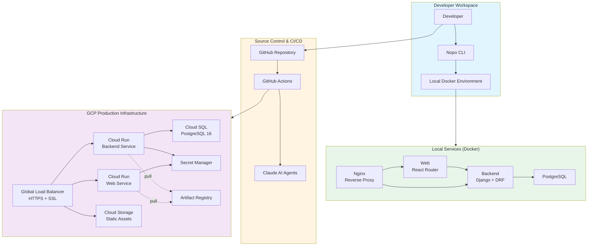
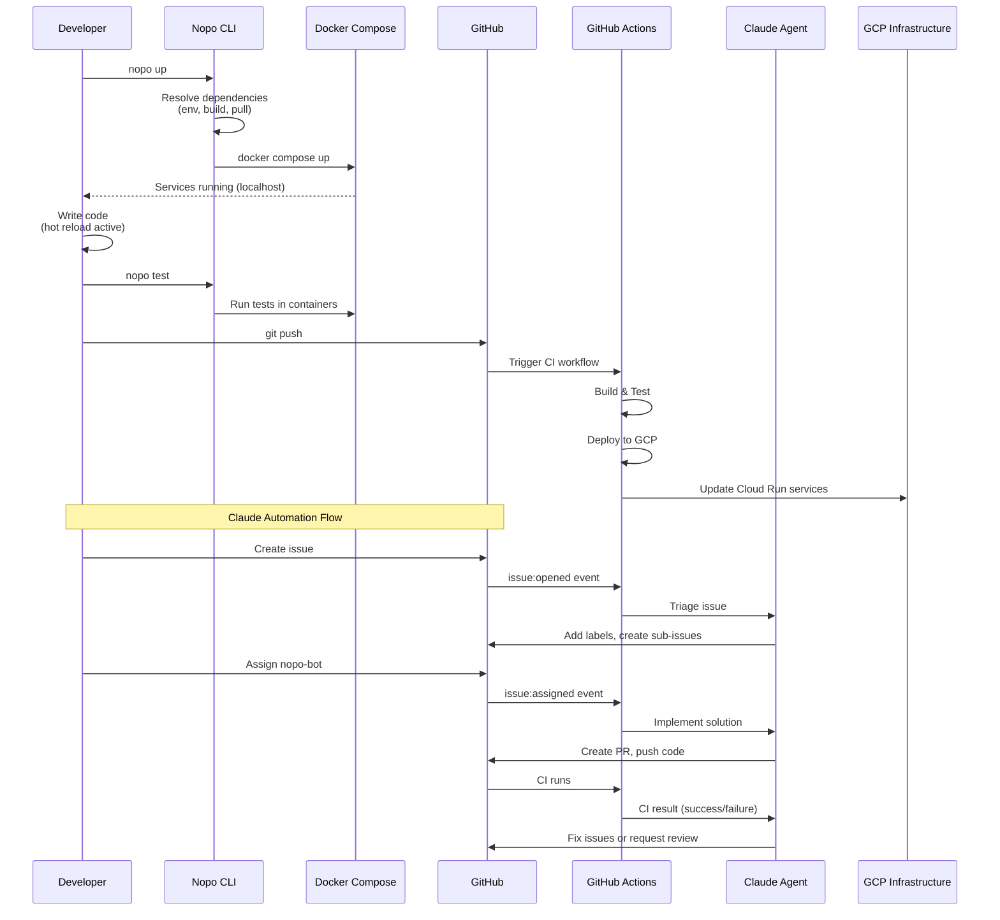
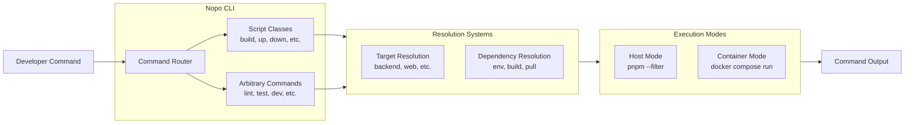
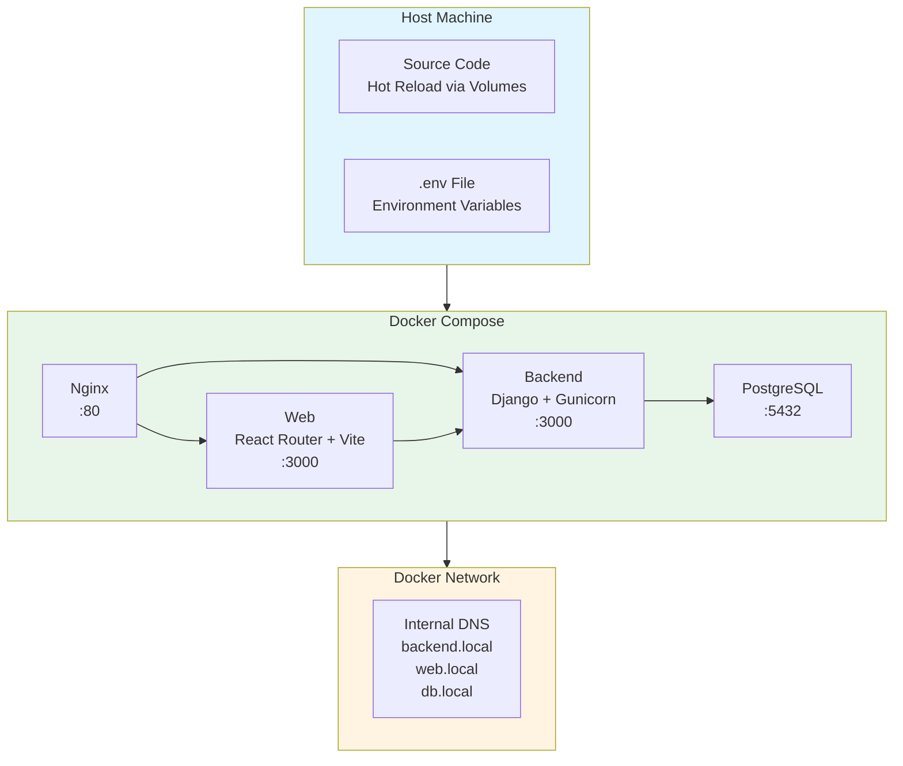
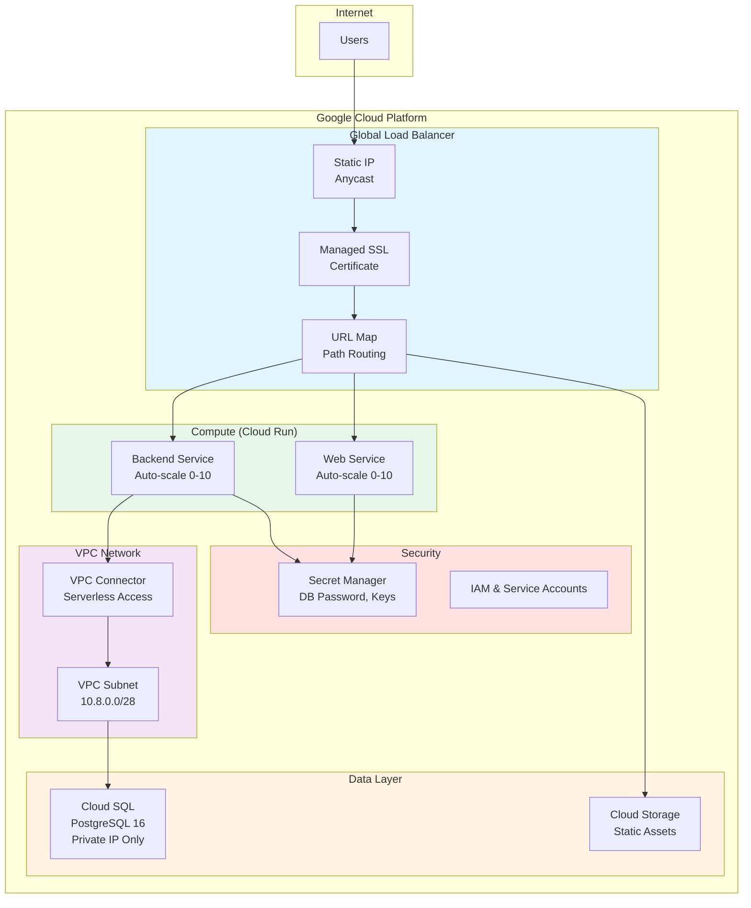
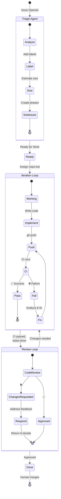
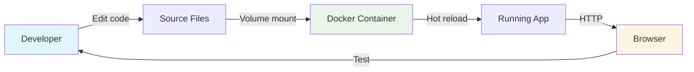
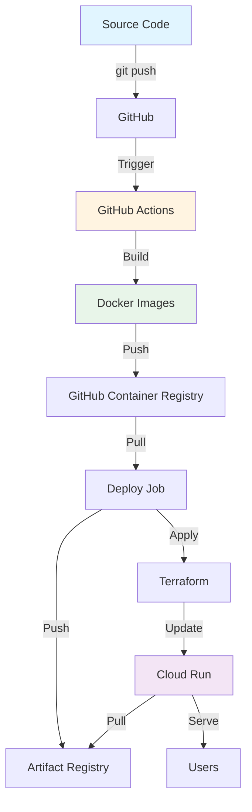
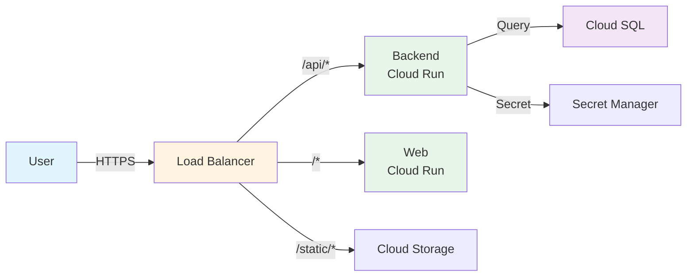
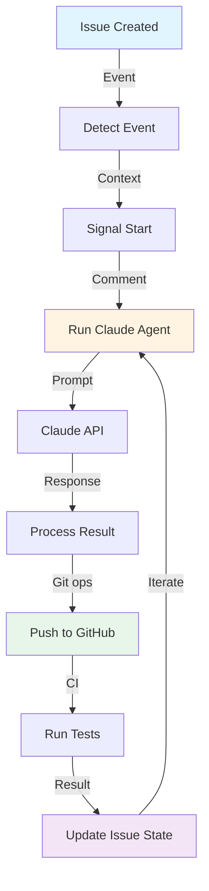

# Nopo Architecture

This document provides a comprehensive overview of the Nopo (monorepo) architecture, covering the CLI tool, development workflow, automation system, and infrastructure.

## Table of Contents

1. [System Overview](#system-overview)
2. [Architecture Diagram](#architecture-diagram)
3. [Component Layers](#component-layers)
4. [Core Interfaces](#core-interfaces)
5. [Data Flow](#data-flow)
6. [Related Documentation](#related-documentation)

---

## System Overview

Nopo is a Docker-based monorepo development platform that provides:

- **CLI Tool**: Unified command routing for building, testing, and running services
- **Local Development**: Docker Compose orchestration with hot-reloading
- **Cloud Deployment**: Terraform-managed GCP infrastructure (Cloud Run, Cloud SQL, Load Balancer)
- **Automation**: GitHub Actions with Claude AI agents for issue triage, implementation, and code review

### Technology Stack

| Layer | Technologies |
|-------|--------------|
| Frontend | React 19, React Router 7, TypeScript, Vite, Tailwind CSS |
| Backend | Django 5, Django REST Framework, Python 3.12+, Gunicorn |
| Database | PostgreSQL 16 |
| Build System | pnpm 10.11+, uv (Python), Docker Buildx Bake |
| Testing | Vitest, Playwright, Storybook |
| Linting | ESLint 9, Prettier, Ruff, mypy |
| Infrastructure | Terraform, GCP (Cloud Run, Cloud SQL, Load Balancer) |
| Automation | GitHub Actions, Claude AI agents, TypeScript actions |

---

## Architecture Diagram

### High-Level System Architecture



### Component Interaction Flow



---

## Component Layers

### Layer 1: CLI & Development Workflow

The Nopo CLI provides unified command routing for all development tasks.



**Key Features:**
- **Unified Routing**: Single entry point for all commands (`nopo <command> [targets...]`)
- **Target Resolution**: Automatic discovery of services from `apps/*/Dockerfile`
- **Dependency Resolution**: Automatic prerequisite execution (env setup, builds, pulls)
- **Dual Execution**: Host mode (fast, no Docker) or container mode (isolated)

**Interface:**
```typescript
interface BaseScript {
  name: string;
  dependencies: ScriptDependency[];
  fn: (runner: Runner, argv: string[]) => Promise<void>;
}

interface Runner {
  targets: string[];
  availableTargets: string[];
  executeCommand(command: string): Promise<Result>;
}
```

See: [CLI Architecture](./cli/architecture.md)

---

### Layer 2: Local Development Environment

Docker Compose orchestrates local services with hot-reloading and development tooling.



**Service Configuration:**

| Service | Port | Purpose | Hot Reload |
|---------|------|---------|------------|
| nginx | 80 | Reverse proxy, serves frontend | No |
| backend | 3000 | Django REST API | Yes (via runserver) |
| web | 3000 | React Router SSR | Yes (via Vite HMR) |
| db | 5432 | PostgreSQL database | N/A |

**Interface:**
```yaml
# apps/<service>/nopo.yml
name: backend
dockerfile: Dockerfile
dependencies: [db]
commands:
  test:
    dependencies: {}
    command: pytest
  migrate:
    dependencies: [db]
    command: python manage.py migrate
```

---

### Layer 3: Cloud Infrastructure

Terraform-managed GCP infrastructure for staging and production environments.



**Infrastructure Resources:**

| Resource | Purpose | Scaling |
|----------|---------|---------|
| Global Load Balancer | HTTPS termination, path routing | Global (Anycast) |
| Cloud Run (Backend) | Django API service | 0-10 instances |
| Cloud Run (Web) | React Router SSR | 0-10 instances |
| Cloud SQL | PostgreSQL database | db-f1-micro (stage)<br/>db-custom-1-3840 (prod) |
| Cloud Storage | Static assets (CSS, JS, images) | Unlimited |
| VPC Network | Private connectivity | 10.8.0.0/28 |

**Interface:**
```hcl
# infrastructure/terraform/modules/cloudrun/main.tf
resource "google_cloud_run_v2_service" "service" {
  name     = "${var.environment}-${var.service_name}"
  location = var.region

  template {
    containers {
      image = var.image

      resources {
        limits = {
          cpu    = var.cpu
          memory = var.memory
        }
      }

      env {
        name  = "DB_HOST"
        value = var.db_host
      }
    }

    scaling {
      min_instance_count = var.min_instances
      max_instance_count = var.max_instances
    }
  }
}
```

See: [Infrastructure Architecture](../infrastructure/ARCHITECTURE.md)

---

### Layer 4: Claude Automation System

GitHub Actions workflows integrated with Claude AI agents for automated issue management.



**Automation Actors:**

| Actor | Role | Trigger |
|-------|------|---------|
| **Triage Agent** | Labels issues, creates sub-issues | Issue opened/edited |
| **Iterate Agent** | Implements code, fixes CI failures | Issue assigned to nopo-bot |
| **Review Agent** | Reviews code, approves PRs | Review requested from nopo-bot |
| **Human** | Supervisor, merges PRs | Manual action |

**State Storage:**
```html
<!-- Stored in issue body -->
<!-- CLAUDE_ITERATION
iteration: 3
branch: claude/issue/42
pr_number: 123
last_ci_result: failure
consecutive_failures: 1
complete: false
-->
```

**Interface:**
```typescript
interface IterationState {
  iteration: number;
  branch: string;
  pr_number?: string;
  last_ci_run?: string;
  last_ci_result: 'success' | 'failure' | 'first';
  consecutive_failures: number;
  failure_type?: 'ci' | 'workflow';
  complete: boolean;
}

interface AgentContext {
  issue_number: string;
  issue_title: string;
  issue_body: string;
  branch_name: string;
  trigger_type: 'assigned' | 'edited';
}
```

See: [Automation Architecture](./automation/ARCHITECTURE.md)

---

## Core Interfaces

### CLI to Services Interface

The CLI communicates with services through standardized `nopo.yml` configuration files.

```yaml
# apps/<service>/nopo.yml
name: string                    # Service name (must match directory)
dockerfile: string              # Path to Dockerfile (default: Dockerfile)
dependencies: string[]          # Service-level dependencies
static_path: string            # Path to static files for deployment
commands:
  <command_name>:
    dependencies: object | []   # Command-specific dependencies
    command: string             # Shell command to execute
```

**Example:**
```yaml
name: web
dockerfile: Dockerfile
dependencies: [backend]
static_path: dist
commands:
  build:
    dependencies: {}
    command: vite build
  test:
    dependencies: [backend]
    command: vitest run
  lint:
    dependencies: {}
    command: eslint .
```

### Service to Database Interface

Services connect to PostgreSQL using environment variables.

```bash
# Local (Docker Compose)
DB_HOST=db.local
DB_PORT=5432
DB_NAME=database
DB_USER=app
DB_PASSWORD=<secret>

# Production (Cloud Run)
DB_HOST=/cloudsql/<connection_name>  # Unix socket
# OR
DB_HOST=10.x.x.x  # Private IP via VPC
DB_PORT=5432
DB_NAME=database
DB_USER=app
DB_PASSWORD=<from Secret Manager>
```

### Frontend to Backend Interface

Frontend communicates with backend via REST API.

```typescript
// Frontend API client
interface APIClient {
  baseURL: string;  // http://backend.local:3000 (local) or https://api.domain.com (prod)

  async request<T>(
    method: 'GET' | 'POST' | 'PUT' | 'DELETE',
    path: string,
    options?: RequestOptions
  ): Promise<T>;
}

// Backend REST endpoints
// GET /api/v1/resource
// POST /api/v1/resource
// PUT /api/v1/resource/:id
// DELETE /api/v1/resource/:id
```

### CI/CD to Infrastructure Interface

GitHub Actions deploy to GCP using Terraform and environment variables.

```yaml
# .github/workflows/_deploy_gcp.yml inputs
environment: staging | production
version: string  # Docker image tag (sha-abc1234)

# Terraform variables
project_id: string
backend_image: string  # us-central1-docker.pkg.dev/.../backend:tag
web_image: string      # us-central1-docker.pkg.dev/.../web:tag
db_password: string    # From Secret Manager
site_url: string       # https://domain.com
```

### GitHub Actions to Claude Interface

GitHub Actions communicate with Claude agents via standardized context JSON.

```json
{
  "job": "issue-iterate",
  "context_json": {
    "issue_number": "123",
    "issue_title": "Fix login bug",
    "issue_body": "...",
    "branch_name": "claude/issue/123",
    "trigger_type": "assigned",
    "ci_result": "failure"
  }
}
```

---

## Data Flow

### Development Flow



### Build & Deploy Flow



### Request Flow (Production)



### Claude Automation Flow



---

## Related Documentation

### Development
- [CLI Architecture](./cli/architecture.md) - Detailed CLI command routing and execution
- [CLI Quick Start](./cli/quick-start.md) - Getting started guide
- [CLI Commands](./cli/commands/) - Command reference documentation

### Infrastructure
- [Infrastructure Architecture](../infrastructure/ARCHITECTURE.md) - GCP infrastructure deep dive
- [Adding Services](../infrastructure/ADDING_SERVICES.md) - How to add new services
- [GCP Setup](../infrastructure/GCP_GITHUB_SETUP.md) - GCP and GitHub integration

### Automation
- [Automation Architecture](./automation/ARCHITECTURE.md) - Claude automation system details
- [Workflow Files](../.github/workflows/) - GitHub Actions implementations

### Project Guidelines
- [AGENTS.md](../AGENTS.md) - Project guidelines for Claude agents
- [CLAUDE.md](../CLAUDE.md) - Codebase instructions (auto-loaded)
- [Decisions](../decisions/) - Architectural Decision Records (ADRs)

---

## Key Design Principles

1. **Convention over Configuration**: Services are auto-discovered from `apps/*/Dockerfile`
2. **Unified Command Interface**: Single `nopo` entry point for all operations
3. **Environment Parity**: Local Docker mirrors production Cloud Run as closely as possible
4. **Infrastructure as Code**: All GCP resources managed via Terraform
5. **Automation First**: GitHub Actions + Claude agents handle triage, implementation, and review
6. **Security by Default**: Private database IPs, Secret Manager, no public access
7. **Scale to Zero**: Cost optimization via Cloud Run auto-scaling
8. **Dependency Resolution**: Automatic prerequisite execution (env, build, pull)
9. **Test-Driven Development**: Tests must fail first, then pass
10. **Minimal Abstraction**: No premature optimization, duplicate before abstracting

---

## Future Enhancements

### CLI
- Dependency caching for faster builds
- Incremental build support
- Watch mode for continuous testing
- Parallel command execution

### Infrastructure
- Multi-region deployment
- Disaster recovery automation
- Read replicas for database
- Cloud CDN for static assets

### Automation
- Discussion automation (research threads)
- Automatic performance regression detection
- Security vulnerability scanning
- Automated rollback on failure

---

## Glossary

| Term | Definition |
|------|------------|
| **Target** | A service in `apps/` directory (backend, web, etc.) |
| **Script Class** | Built-in CLI command (build, up, down, etc.) |
| **Arbitrary Command** | Any pnpm script executed via CLI |
| **Host Mode** | Command execution on host machine using pnpm |
| **Container Mode** | Command execution inside Docker container |
| **nopo-bot** | GitHub bot account that triggers Claude automation |
| **claude[bot]** | Claude AI agent that implements code and reviews PRs |
| **NEG** | Network Endpoint Group (GCP serverless backend) |
| **Cloud Run** | GCP's serverless container platform |
| **VPC Connector** | Bridge between Cloud Run and VPC network |
