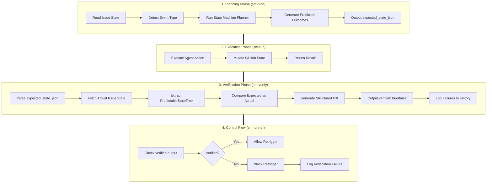
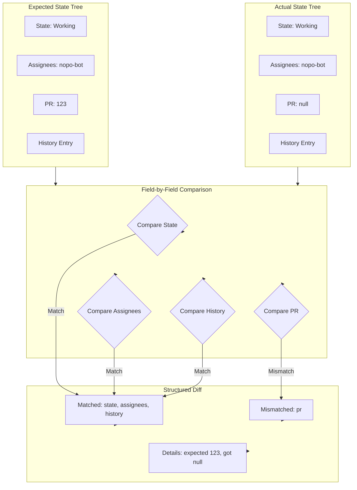
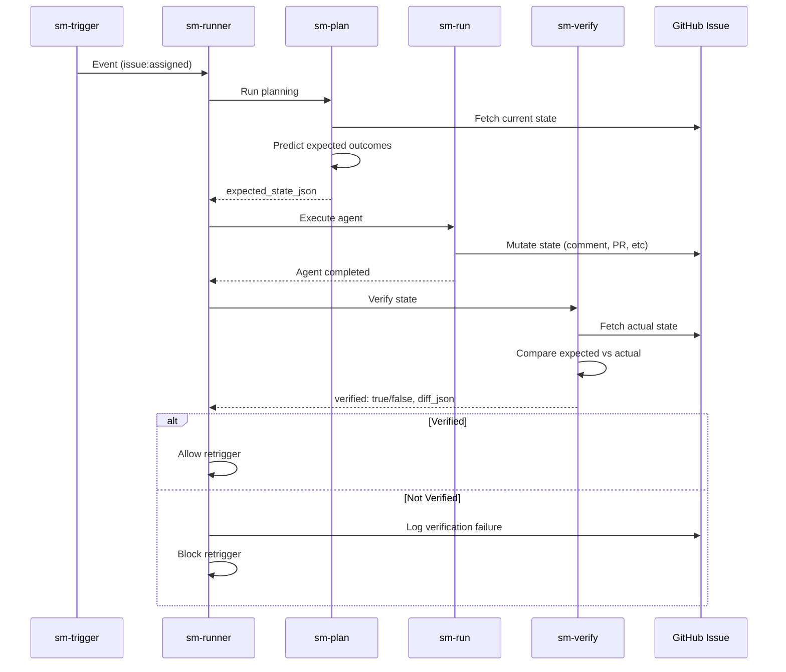
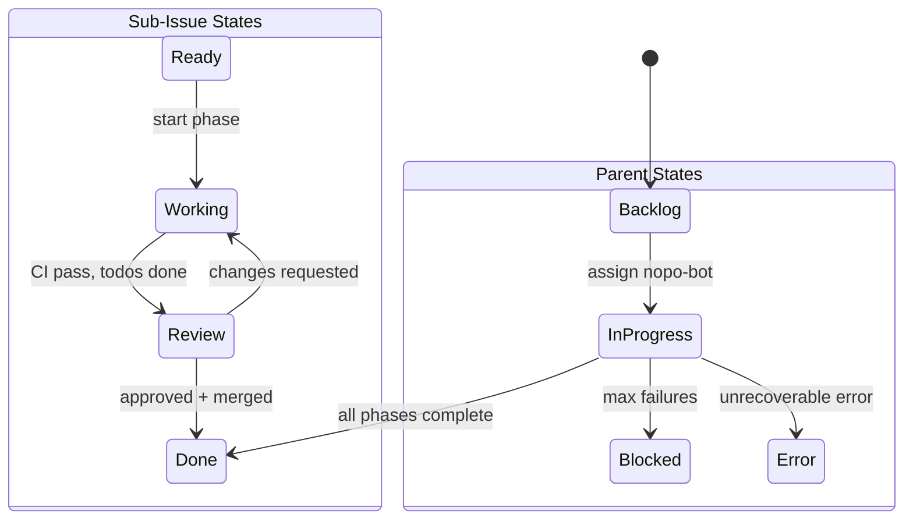

# State Machine Verification System Architecture

## Overview

The State Machine Verification System provides a prediction → execution → verification loop for the Claude automation state machine. It ensures that state transitions behave as expected and gates retriggers when verification fails, preventing infinite loops or incorrect state transitions.

## High-Level Architecture



## Component Architecture

### 1. State Extraction & Prediction

```mermaid
flowchart LR
    subgraph Input["Issue State"]
        I1[Issue Body]
        I2[Issue Labels]
        I3[Issue Assignees]
        I4[PR State]
        I5[Project Fields]
    end

    subgraph Parser["Body Structure Parser"]
        B1[Section Schemas]
        B2[Extract Sections]
        B3[Parse Metadata]
        B4[Extract History]
    end

    subgraph Predictor["State Machine Planner"]
        SM1[State Machine Graph]
        SM2[Current State Node]
        SM3[Event Type]
        SM4[Derive Next State]
        SM5[Generate Predictions]
    end

    subgraph Output["Expected State Tree"]
        O1[State Field]
        O2[Phase Field]
        O3[PR Number]
        O4[Assignees]
        O5[Labels]
        O6[History Entries]
    end

    Input --> Parser
    Parser --> Predictor
    Predictor --> Output
```



### 2. State Mutators

State mutators are pure functions that transform PredictableStateTree based on state machine events:

```typescript
type Mutator = (
  tree: PredictableStateTree,
  event: Event,
  context: Context
) => PredictableStateTree;
```

**Mutator Categories:**

| Category | Mutators | Purpose |
|----------|----------|---------|
| **Control** | `transitionState`, `updatePhase`, `assignBot`, `unassignBot` | Core state transitions and assignments |
| **Iteration** | `markSubIssueWorking`, `createPR`, `markReadyForReview` | Issue iteration lifecycle |
| **Review** | `requestReview`, `approveReview`, `requestChanges`, `convertToDraft` | PR review workflow |
| **Orchestration** | `createSubIssue`, `markSubIssueDone`, `moveToNextPhase` | Parent issue coordination |
| **Terminal** | `markDone`, `markBlocked`, `markError` | Terminal states |
| **Logging** | `addHistoryEntry`, `recordMetrics` | Observability |
| **AI-Dependent** | `agentCompletesTodo`, `agentCreatesCommit` | Non-deterministic outcomes |

**Mutator Chain Example:**

```typescript
// Event: issue-iterate (first iteration)
const expectedTree = compose(
  transitionState("Working"),
  markSubIssueWorking(subIssueNumber),
  addHistoryEntry({ icon: "▶️", message: "Started implementation" }),
  createPR(branchName),
  assignBot("nopo-bot")
)(initialTree, event, context);
```

### 3. Comparison Engine



**Comparison Rules:**

1. **Exact Match**: Simple scalars (strings, numbers) must match exactly
2. **Union Types**: `state` field supports unions like `"Working" | "Review"` (any match passes)
3. **Array Comparison**: Sets (order-independent) or sequences (order-dependent)
4. **Nested Objects**: Recursive field-by-field comparison
5. **Null Handling**: `null` is distinct from `undefined` (missing field)

**Diff Structure:**

```typescript
interface VerificationDiff {
  verified: boolean;
  mismatches: Array<{
    field: string;
    expected: unknown;
    actual: unknown;
    path: string[];
  }>;
  matched: string[];
}
```

### 4. Workflow Integration



## Data Structures

### Core State Trees

#### PredictableStateTree

The top-level structure representing a parent issue and its sub-issues:

```typescript
interface PredictableStateTree {
  issue: PredictableIssueState;
  subIssues: PredictableSubIssueState[];
}
```

#### PredictableIssueState

The predictable subset of a parent issue's state:

```typescript
interface PredictableIssueState {
  // Identity
  number: number;

  // State machine fields
  state: IssueState;  // "Backlog" | "In Progress" | "Done" | "Blocked" | "Error"
  projectStatus: ProjectStatus | null;
  iteration: number;
  failures: number;

  // Metadata
  labels: string[];
  assignees: string[];

  // Resources
  hasBranch: boolean;
  hasPR: boolean;
  pr: PredictablePRState | null;

  // Structured body
  body: ParentIssueBodyStructure;
}
```

#### PredictableSubIssueState

The predictable subset of a sub-issue's state:

```typescript
interface PredictableSubIssueState {
  // Identity
  number: number;

  // State machine fields
  state: IssueState;  // "Ready" | "Working" | "Review" | "Done"
  projectStatus: ProjectStatus | null;

  // Metadata
  labels: string[];

  // Resources
  hasBranch: boolean;
  hasPR: boolean;
  pr: PredictablePRState | null;

  // Structured body
  body: SubIssueBodyStructure;
}
```

#### PredictablePRState

The predictable subset of a PR's state:

```typescript
interface PredictablePRState {
  isDraft: boolean;
  state: PRState;  // "open" | "closed" | "merged"
}
```

### Body Structure Schemas

#### ParentIssueBodyStructure

Structured representation of a parent issue body:

```typescript
interface ParentIssueBodyStructure {
  description: {
    raw: string;
    sections: Array<{
      name: string;
      content: string;
    }>;
  };
  history: {
    entries: HistoryEntry[];
  };
  metadata: {
    iteration: number;
    phase: string;
    failures: number;
  };
}
```

#### SubIssueBodyStructure

Structured representation of a sub-issue body:

```typescript
interface SubIssueBodyStructure {
  description: {
    raw: string;
    sections: Array<{
      name: string;
      content: string;
    }>;
  };
  todos: {
    items: TodoItem[];
    completed: number;
    total: number;
  };
  history: {
    entries: HistoryEntry[];
  };
}
```

#### HistoryEntry

A single entry in the iteration history table:

```typescript
interface HistoryEntry {
  iteration: number;
  phase: string;
  icon: string;
  message: string;
  timestamp: string;
  link: string | null;
}
```

### Planning & Verification

#### ExpectedState

Output from sm-plan, consumed by sm-verify:

```typescript
interface ExpectedState {
  // Final state name after action completes
  finalState: string;

  // Possible outcome trees (union for AI-dependent states)
  outcomes: PredictableStateTree[];

  // Metadata
  timestamp: string;
  trigger: TriggerType;
  issueNumber: number;
  parentIssueNumber: number | null;
}
```

#### VerifyResult

Output from compareStateTree:

```typescript
interface VerifyResult {
  // Whether verification passed
  pass: boolean;

  // Index of matched outcome (if pass = true)
  matchedOutcomeIndex: number | null;

  // Best match details (for debugging)
  bestMatch: {
    outcomeIndex: number;
    diffs: FieldDiff[];
  };
}
```

#### FieldDiff

A single field mismatch between expected and actual:

```typescript
interface FieldDiff {
  // Dot-notation path to the field (e.g., "issue.state", "subIssues.0.labels")
  path: string;

  // Expected value
  expected: unknown;

  // Actual value
  actual: unknown;

  // Type of comparison that failed
  comparison: "exact" | "superset" | "gte" | "lte" | "history_entry";
}
```

### State Mutators

#### StateMutator

A function that predicts state changes based on state machine transitions:

```typescript
type StateMutator = (
  current: PredictableStateTree,
  context: MachineContext,
) => PredictableStateTree[];
```

**Signature Details:**
- **Input**: Current predicted state tree and machine context
- **Output**: Array of possible outcome trees
  - Deterministic states return exactly 1 outcome
  - AI-dependent states return N outcomes (actual must match ANY)

**Example Usage:**

```typescript
// Deterministic mutator (1 outcome)
function iteratingMutator(
  current: PredictableStateTree,
  context: MachineContext
): PredictableStateTree[] {
  const outcome = structuredClone(current);
  const subIssue = findCurrentSubIssue(outcome, context);

  subIssue.state = "Working";
  subIssue.projectStatus = "In Progress";
  subIssue.hasBranch = true;
  subIssue.hasPR = true;
  subIssue.pr = { isDraft: true, state: "open" };

  // Add history entry
  subIssue.body.history.entries.push({
    iteration: context.issue.iteration + 1,
    phase: context.issue.phase,
    icon: "▶️",
    message: "Started implementation",
    timestamp: new Date().toISOString(),
    link: null,
  });

  return [outcome];  // Single deterministic outcome
}

// AI-dependent mutator (multiple outcomes)
function triagingMutator(
  current: PredictableStateTree,
  context: MachineContext
): PredictableStateTree[] {
  // Outcome 1: Creates sub-issues (multi-phase)
  const multiPhase = structuredClone(current);
  multiPhase.issue.state = "In Progress";
  multiPhase.subIssues = [
    { number: 999, state: "Ready", /* ... */ },
    { number: 1000, state: "Ready", /* ... */ },
  ];

  // Outcome 2: No sub-issues (single-phase)
  const singlePhase = structuredClone(current);
  singlePhase.issue.state = "In Progress";
  singlePhase.subIssues = [];

  return [multiPhase, singlePhase];  // Either outcome is valid
}
```

#### Mutator Registry

Map of state names to mutator functions:

```typescript
const MUTATOR_REGISTRY: Record<string, StateMutator> = {
  // Terminal states
  done: doneMutator,
  blocked: blockedMutator,
  error: errorMutator,

  // Iteration states
  iterating: iteratingMutator,
  iteratingFix: iteratingFixMutator,

  // Review states
  reviewing: reviewingMutator,
  transitioningToReview: transitioningToReviewMutator,
  awaitingMerge: awaitingMergeMutator,

  // Orchestration states
  orchestrationRunning: orchestrationRunningMutator,
  orchestrationWaiting: orchestrationWaitingMutator,
  orchestrationComplete: orchestrationCompleteMutator,

  // AI-dependent states
  triaging: triagingMutator,
  commenting: commentingMutator,

  // Logging states
  mergedLogging: mergedLoggingMutator,
  deployedStageLogging: deployedStageLoggingMutator,

  // ... more mutators
};
```

**Accessor Functions:**

```typescript
// Get mutator for a state (returns undefined if not registered)
function getMutator(finalState: string): StateMutator | undefined;

// Check if mutator exists
function hasMutator(finalState: string): boolean;
```

## State Machine Integration

### State Nodes

The verification system integrates with these state machine nodes:



**Verifiable Transitions:**

| From | Event | To | Predictable? |
|------|-------|----|--------------|
| Backlog | assign | InProgress | ✅ Yes |
| Ready | iterate | Working | ✅ Yes |
| Working | CI pass | Review | ✅ Yes |
| Working | CI fail | Working | ✅ Yes (stays) |
| Review | approve | Done | ✅ Yes |
| Review | request changes | Working | ✅ Yes |
| InProgress | max failures | Blocked | ✅ Yes |

**Non-Verifiable Transitions:**

| Transition | Reason |
|------------|--------|
| Working → Error | External factors (API failure, etc.) |
| AI-generated content | Todo completion, commit messages, PR descriptions |

### Event Types

```typescript
type Event =
  | { type: "issue:assigned"; assignee: string }
  | { type: "issue:iterate"; trigger: "ci-pass" | "ci-fail" | "edited" }
  | { type: "pr:review_requested"; reviewer: string }
  | { type: "pr:review_submitted"; state: "approved" | "changes_requested" }
  | { type: "ci:completed"; result: "success" | "failure" }
  | { type: "orchestrate:phase_complete"; phase: string };
```

## Error Handling

### Verification Failures

When verification fails, sm-verify:

1. **Logs structured diff** to GitHub Actions output
2. **Adds history entry** to issue with failure details
3. **Outputs `verified: false`** to gate retrigger
4. **Preserves expected vs actual** in diff_json output

### Recovery Strategies

| Failure Type | Recovery |
|--------------|----------|
| **Transient** | Retry on next event (state may self-correct) |
| **Persistent** | Block retrigger, require human intervention |
| **AI-Dependent** | Skip verification of non-deterministic fields |
| **Timing** | Use eventually-consistent checks with retries |

### Debugging

Verification failures include:

```typescript
{
  verified: false,
  mismatches: [
    {
      field: "prNumber",
      expected: 123,
      actual: null,
      path: ["prNumber"],
      reason: "PR creation may have failed or not yet completed"
    }
  ],
  matched: ["state", "assignees", "history"],
  summary: "1 field mismatched: prNumber"
}
```

## Performance Considerations

### Optimization Strategies

1. **Lazy Evaluation**: Only fetch actual state fields that are predicted
2. **Caching**: Cache issue state between planner and verify steps
3. **Parallel Fetching**: Fetch issue, PR, and project fields concurrently
4. **Selective Verification**: Skip verification of AI-dependent fields

### Scalability

| Operation | Time Complexity | Notes |
|-----------|----------------|-------|
| State Extraction | O(n) | n = issue body size |
| Mutator Chain | O(m) | m = number of mutators |
| Comparison | O(k) | k = number of predictable fields |
| History Logging | O(1) | Append-only operation |

**Typical Workflow Runtime:**

- Planning: ~200-500ms
- Execution: 30s-2min (agent runtime)
- Verification: ~100-300ms
- Total Overhead: ~1s (< 5% of total)

## Testing Strategy

### Unit Tests

```typescript
describe("State Mutators", () => {
  it("should transition state", () => {
    const tree = { state: "Ready", ... };
    const result = transitionState("Working")(tree, event, ctx);
    expect(result.state).toBe("Working");
  });

  it("should create PR", () => {
    const tree = { prNumber: null, ... };
    const result = createPR("branch-name")(tree, event, ctx);
    expect(result.prNumber).toBeNumber();
  });
});

describe("Comparison Engine", () => {
  it("should detect mismatches", () => {
    const expected = { state: "Working", prNumber: 123 };
    const actual = { state: "Working", prNumber: null };
    const diff = compare(expected, actual);
    expect(diff.verified).toBe(false);
    expect(diff.mismatches).toHaveLength(1);
  });

  it("should handle union types", () => {
    const expected = { state: ["Working", "Review"] };
    const actual = { state: "Review" };
    const diff = compare(expected, actual);
    expect(diff.verified).toBe(true);
  });
});
```

### Integration Tests

Test scenarios use real issue state snapshots:

```typescript
describe("Verification Scenarios", () => {
  it("should verify successful iteration", async () => {
    const fixture = loadFixture("issue-assign-success");
    const expected = await plan(fixture.before);
    await execute(fixture.before);
    const result = await verify(expected, fixture.after);
    expect(result.verified).toBe(true);
  });

  it("should detect PR creation failure", async () => {
    const fixture = loadFixture("pr-creation-failure");
    const expected = await plan(fixture.before);
    await execute(fixture.before); // PR creation fails
    const result = await verify(expected, fixture.after);
    expect(result.verified).toBe(false);
    expect(result.diff.mismatches[0].field).toBe("prNumber");
  });
});
```

### End-to-End Tests

Use `_test_state_machine.yml` workflow with scenarios:

```yaml
- scenario_name: triage
  mock_event: issue:opened
  verify_outcomes: true

- scenario_name: iterate-success
  mock_event: issue:assigned
  verify_outcomes: true

- scenario_name: ci-failure-loop
  mock_event: ci:completed
  initial_state: { iteration: 2, consecutive_failures: 1 }
  verify_outcomes: true
```

## Security Considerations

### Principle of Least Privilege

- sm-verify runs with **read-only** GitHub token
- No write permissions to issues or PRs
- Only logs failures to history (append-only)

### Data Validation

1. **Input Validation**: Validate expected_state_json schema
2. **Sanitization**: Escape user input in history entries
3. **Secrets**: Never log sensitive data in diffs

### Rate Limiting

- Verification uses cached state when possible
- Batch multiple field fetches into single API call
- Respect GitHub API rate limits (5000/hour)

## Future Enhancements

### Planned Features

1. **Probabilistic Verification**: Support "likely" outcomes with confidence thresholds
2. **Temporal Verification**: Allow eventually-consistent checks with retry logic
3. **Metric Collection**: Track verification success rates over time
4. **Auto-Healing**: Suggest corrective actions for common verification failures
5. **Diff Visualization**: Render diffs in GitHub UI with rich formatting

### Research Areas

1. **Formal Verification**: Prove state machine properties using TLA+ or similar
2. **Property-Based Testing**: Generate random state transitions and verify invariants
3. **Symbolic Execution**: Explore all possible execution paths statically
4. **Differential Testing**: Compare predictions across different planning strategies

## API Reference

### Extraction Functions

#### extractPredictableTree

Extracts a PredictableStateTree from a MachineContext:

```typescript
function extractPredictableTree(
  context: MachineContext
): PredictableStateTree;
```

**Behavior:**
- If `context.parentIssue` exists, parent is root and current issue's sub-issues are used
- If no parent, current issue is root with its own subIssues

**Example:**

```typescript
const tree = extractPredictableTree(machineContext);
// tree.issue = parent or current issue
// tree.subIssues = all sub-issues in the tree
```

#### buildExpectedState

Builds an ExpectedState object from predictions:

```typescript
function buildExpectedState(options: {
  finalState: string;
  outcomes: PredictableStateTree[];
  trigger: TriggerType;
  issueNumber: number;
  parentIssueNumber: number | null;
}): ExpectedState;
```

**Example:**

```typescript
const expectedState = buildExpectedState({
  finalState: "iterating",
  outcomes: [predictedTree],
  trigger: "issue:assigned",
  issueNumber: 123,
  parentIssueNumber: null,
});
```

### Comparison Functions

#### compareStateTree

Compares actual state tree against expected outcomes:

```typescript
function compareStateTree(
  expected: ExpectedState,
  actual: PredictableStateTree
): VerifyResult;
```

**Behavior:**
- Tries each outcome tree in `expected.outcomes`
- Returns `pass: true` if ANY outcome matches
- Returns best match (fewest diffs) if all fail

**Example:**

```typescript
const result = compareStateTree(expectedState, actualTree);
if (!result.pass) {
  console.error("Verification failed:");
  result.bestMatch.diffs.forEach(diff => {
    console.error(`  ${diff.path}: expected ${diff.expected}, got ${diff.actual}`);
  });
}
```

### Comparison Helpers

Internal functions used by compareStateTree:

```typescript
// Exact equality check
function diffExact(
  path: string,
  expected: unknown,
  actual: unknown
): FieldDiff | null;

// Greater-than-or-equal check (for iteration, failures)
function diffGte(
  path: string,
  expected: number,
  actual: number
): FieldDiff | null;

// Less-than-or-equal check (for max iterations)
function diffLte(
  path: string,
  expected: number,
  actual: number
): FieldDiff | null;

// Superset check (expected labels must be present in actual)
function diffSuperset(
  path: string,
  expected: string[],
  actual: string[]
): FieldDiff | null;

// Boolean flag check (if expected true, actual must be true)
function diffBooleanFlag(
  path: string,
  expected: boolean,
  actual: boolean
): FieldDiff | null;
```

### Schema Exports

All schemas are exported using Zod for runtime validation:

```typescript
import {
  PredictablePRStateSchema,
  PredictableSubIssueStateSchema,
  PredictableIssueStateSchema,
  PredictableStateTreeSchema,
  ExpectedStateSchema,
} from "@more/statemachine";

// Parse and validate
const tree = PredictableStateTreeSchema.parse(data);

// Type-safe inference
type Tree = z.infer<typeof PredictableStateTreeSchema>;
```

### Action Inputs/Outputs

#### sm-plan Action

**Inputs:**
```yaml
- github_token: string (required)
- project_number: number (optional, default: 1)
- event_type: TriggerType (from detect-event)
- issue_number: number
- parent_issue_number: number | null
```

**Outputs:**
```yaml
- expected_state_json: string (JSON-serialized ExpectedState)
- final_state: string (e.g., "iterating", "triaging")
- issue_number: number
```

#### sm-verify Action

**Inputs:**
```yaml
- github_token: string (required)
- expected_state_json: string (from sm-plan)
- project_number: number (optional, default: 1)
```

**Outputs:**
```yaml
- verified: string ("true" | "false")
- diff_json: string (JSON-serialized VerifyResult)
- summary: string (human-readable summary)
```

#### sm-run Action

**Inputs:**
```yaml
- github_token: string (required)
- issue_number: number
- parent_issue_number: number | null
- final_state: string (from sm-plan)
- project_number: number (optional)
```

**Outputs:**
```yaml
- success: string ("true" | "false")
- error_message: string (if failed)
```

### Workflow Integration Points

#### sm-runner.yml

Main workflow orchestration:

```yaml
jobs:
  plan:
    steps:
      - uses: ./.github/actions/sm-plan
        id: plan
        with:
          github_token: ${{ secrets.GITHUB_TOKEN }}
          event_type: ${{ needs.detect.outputs.event_type }}
    outputs:
      expected_state_json: ${{ steps.plan.outputs.expected_state_json }}

  execute:
    needs: [plan]
    steps:
      - uses: ./.github/actions/sm-run
        with:
          github_token: ${{ secrets.NOPO_BOT_PAT }}
          final_state: ${{ needs.plan.outputs.final_state }}

  verify:
    needs: [plan, execute]
    steps:
      - uses: ./.github/actions/sm-verify
        id: verify
        with:
          github_token: ${{ secrets.GITHUB_TOKEN }}
          expected_state_json: ${{ needs.plan.outputs.expected_state_json }}

  retrigger:
    needs: [verify]
    if: needs.verify.outputs.verified == 'true'
    steps:
      - name: Trigger next iteration
        # ... retrigger logic
```

## References

### Implementation Files

- `packages/statemachine/src/verify/` - Core verification logic
- `packages/statemachine/src/verify/mutators/` - State mutators
- `packages/statemachine/src/verify/compare.ts` - Comparison engine
- `packages/statemachine/src/verify/predictable-state.ts` - State extraction
- `packages/statemachine/actions/sm-verify/` - GitHub Action wrapper
- `packages/statemachine/actions/sm-plan/lib/expected-state.ts` - Prediction generator

### Related Documentation

- [State Machine Architecture](../docs/automation/ARCHITECTURE.md)
- [GitHub Actions Workflows](.github/workflows/sm-runner.yml)
- [Issue State Parser](packages/issue-state/README.md)

### External Resources

- [XState Documentation](https://xstate.js.org/docs/)
- [Formal Methods in Software Engineering](https://en.wikipedia.org/wiki/Formal_methods)
- [Property-Based Testing](https://hypothesis.works/)
