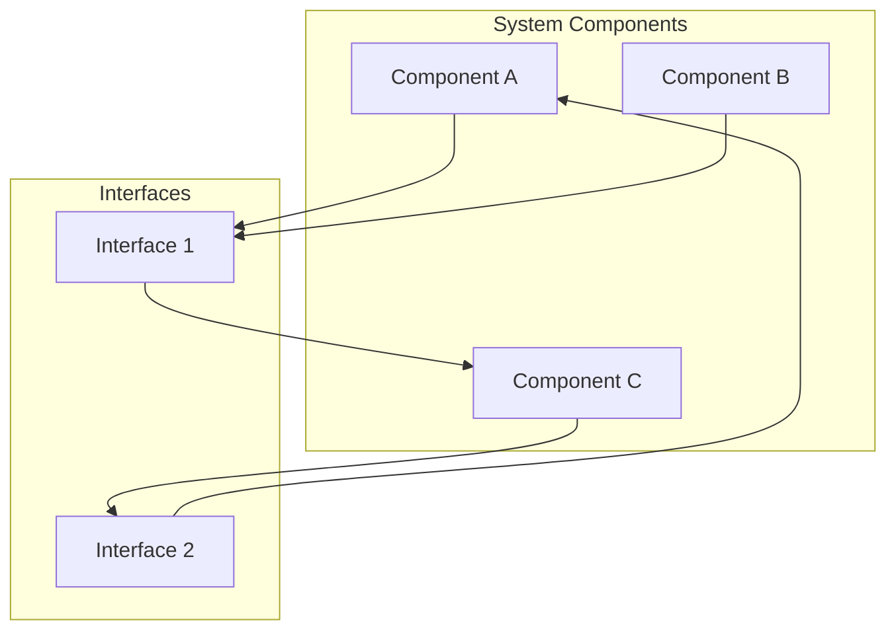

# Phase 1 Architecture Design

This document outlines the architecture design for the Phase 1 implementation.

## Architecture Diagram



## Component Overview

| Component | Purpose | Technology |
|-----------|---------|------------|
| Component A | Primary entry point | TBD |
| Component B | Processing logic | TBD |
| Component C | Data storage | TBD |

## Interface Definitions

### Interface 1: Component Communication

**Purpose**: Enables communication between Component A and Component B

**Methods**:
- `process(data)`: Process incoming data
- `validate(input)`: Validate input before processing
- `transform(result)`: Transform processing result

**Data Format**:
```json
{
  "id": "string",
  "data": "object",
  "metadata": {
    "timestamp": "ISO8601",
    "source": "string"
  }
}
```

### Interface 2: Storage Interface

**Purpose**: Provides abstraction layer for data persistence

**Methods**:
- `save(entity)`: Persist entity to storage
- `retrieve(id)`: Retrieve entity by identifier
- `update(id, changes)`: Update existing entity
- `delete(id)`: Remove entity from storage

**Data Format**:
```json
{
  "entity_id": "string",
  "entity_type": "string",
  "attributes": "object",
  "version": "number"
}
```

## Design Decisions

1. **Separation of Concerns**: Each component has a single, well-defined responsibility
2. **Interface-Based Design**: Components interact through defined interfaces for flexibility
3. **Data Format**: Standardized JSON format for all inter-component communication
4. **Versioning**: Support for entity versioning in storage interface

## Next Steps

- Implement Component A
- Implement Component B
- Implement Component C
- Define detailed API specifications
- Create integration tests
