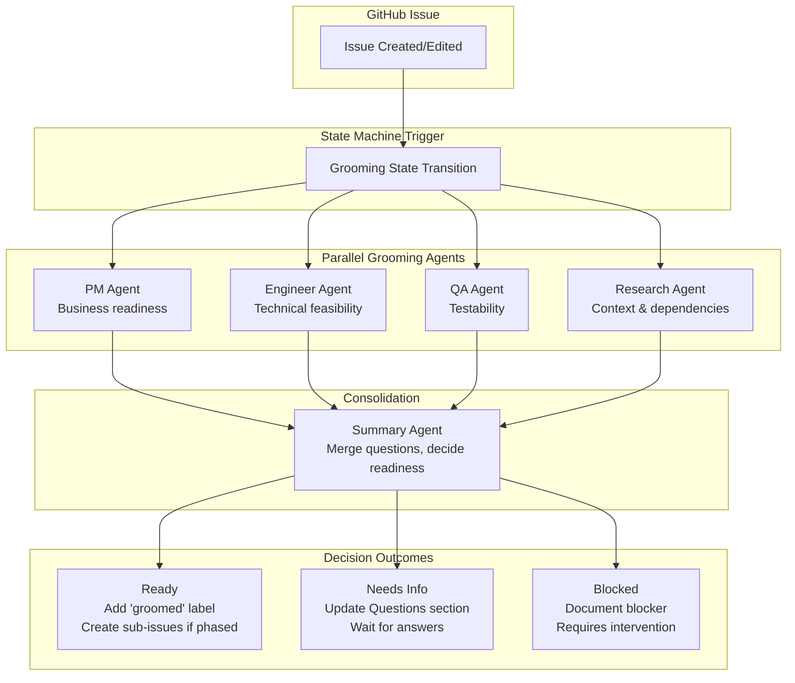
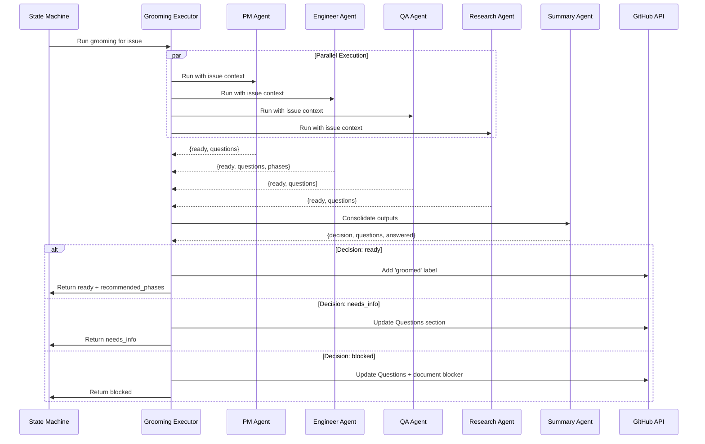
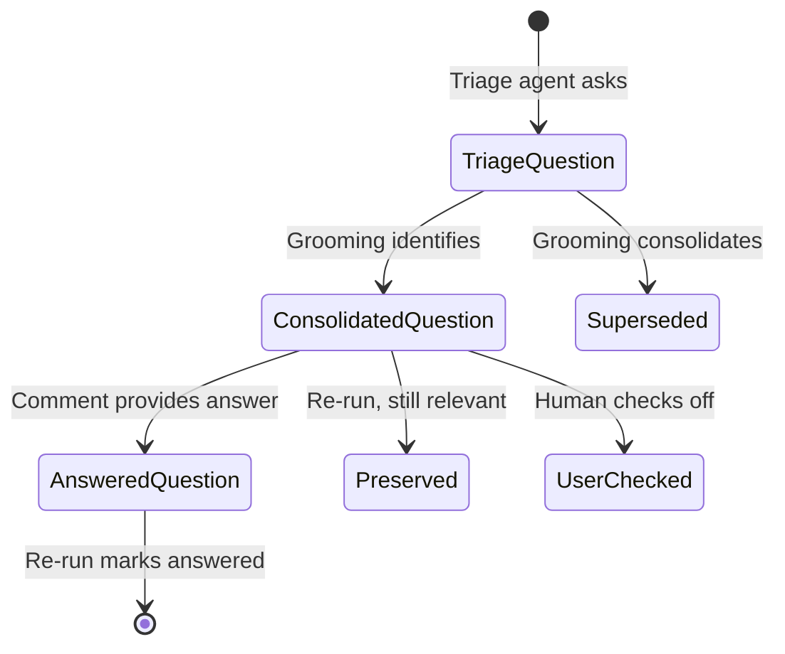
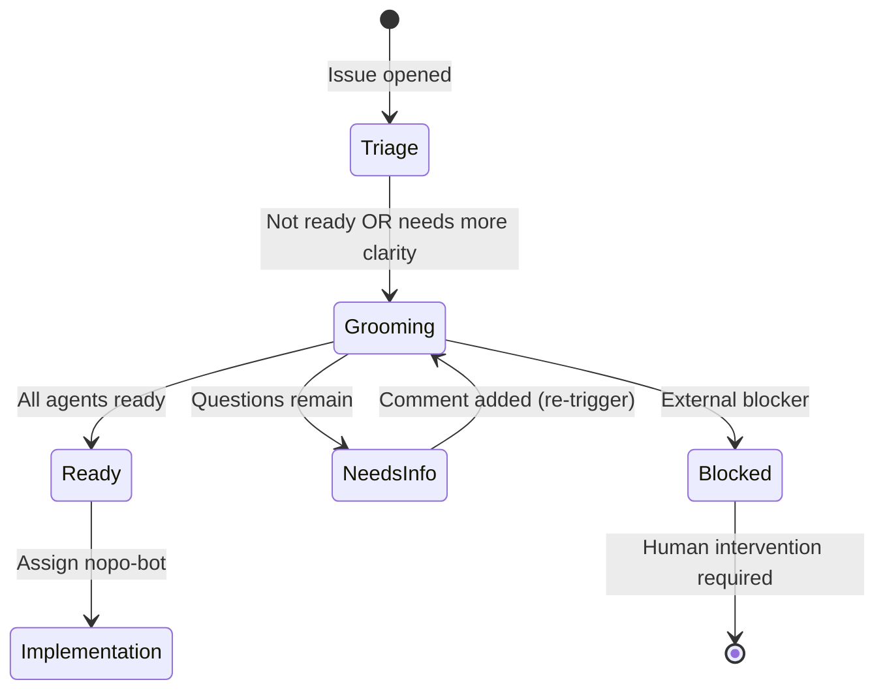

# Grooming System Architecture

## Overview

The grooming system is a multi-agent AI workflow that evaluates GitHub issues before implementation. It runs parallel specialized agents (PM, Engineer, QA, Research) to assess readiness, identify blockers, and consolidate questions that need answers before work can begin.

## High-Level Architecture



## Agent Responsibilities

### PM Agent
**Purpose**: Validate business requirements and product clarity

**Checks**:
- Clear problem statement
- Success criteria defined
- Priority and scope understood
- User impact clear
- Dependencies on other work

**Output**:
- `ready`: boolean - Can implementation proceed from product perspective?
- `questions`: string[] - Unresolved product questions

### Engineer Agent
**Purpose**: Assess technical feasibility and architecture

**Checks**:
- Technical approach viable
- Architecture decisions made
- Complexity understood
- Breaking into phases recommended
- Dependencies identified

**Output**:
- `ready`: boolean - Technically ready to implement?
- `questions`: string[] - Technical clarifications needed
- `recommended_phases`: SubIssueSpec[] - If large, how to split into phases

### QA Agent
**Purpose**: Ensure testability and quality requirements

**Checks**:
- Acceptance criteria testable
- Edge cases identified
- Test strategy clear
- Manual testing requirements
- Performance/security considerations

**Output**:
- `ready`: boolean - Can this be adequately tested?
- `questions`: string[] - Testing gaps or concerns

### Research Agent
**Purpose**: Identify context, prior art, and external dependencies

**Checks**:
- Related issues/PRs reviewed
- Similar patterns in codebase
- External documentation needed
- Third-party dependencies
- Breaking changes impact

**Output**:
- `ready`: boolean - Sufficient context gathered?
- `questions`: string[] - Research gaps

### Summary Agent
**Purpose**: Consolidate agent outputs into a unified decision

**Input**: All 4 agent outputs + issue body + comments

**Process**:
1. Merge duplicate questions from different agents
2. Identify questions answered in comments
3. Determine overall readiness
4. Format consolidated questions for issue body

**Output**:
- `summary`: string - Overall assessment
- `decision`: "ready" | "needs_info" | "blocked"
- `decision_rationale`: string - Why this decision
- `consolidated_questions`: Question[] - Pending questions with IDs
- `answered_questions`: AnsweredQuestion[] - Previously answered
- `blocker_reason`: string (if blocked)

## Data Flow



## Question Management

### Question Lifecycle



### Question Format

**Pending Questions**:
```markdown
- [ ] **Auth method?** - Need to decide OAuth vs JWT _(pm, engineer)_ `id:auth-method`
```

**Answered Questions**:
```markdown
- [x] ~~Which auth method?~~ - Decided OAuth based on comment #5 `id:auth-method`
```

### Question Properties

```typescript
interface ConsolidatedQuestion {
  id: string;                           // Unique ID (persists across re-runs)
  title: string;                        // Short question (≤60 chars)
  description: string;                  // Full question context
  sources: ("pm" | "engineer" | "qa" | "research")[]; // Which agents asked
  priority: "important" | "critical";   // Urgency level
}

interface AnsweredQuestion {
  id: string;                           // Matches original question ID
  title: string;                        // Original question
  answer_summary: string;               // How it was answered
}
```

### Question Merging Strategy

When re-running grooming on an issue:

1. **New pending questions** → Added unchecked (unless user already checked them)
2. **Answered questions** → Added checked with strikethrough
3. **Triage questions (no ID)** → Dropped when summary has output (superseded)
4. **Existing grooming questions not in new output** → Preserved with current state
5. **User-checked questions** → Respect checked state (don't uncheck)

This preserves user input while keeping questions fresh.

## Sub-Issue Creation

When the Engineer agent recommends breaking work into phases:

```typescript
interface SubIssueSpec {
  phase_number: number;                 // 1-based phase number
  title: string;                        // Phase title
  description: string;                  // Phase description
  affected_areas?: AffectedArea[];      // Files to change
  todos?: TodoItem[];                   // Task checklist
  depends_on?: number[];                // Other phase numbers
}
```

**Sub-issue title format**: `[Phase N]: {title}`

**Sub-issue body**:
```markdown
## Description
{description}

## Affected Areas
- `src/auth.ts` - (add) New auth module

## Todo
- [ ] Create auth module
- [ ] Add tests
- [ ] [Manual] Verify login flow
```

## Integration with State Machine

The grooming system integrates with the broader issue automation state machine:



### State Machine Actions

**Run grooming**:
```typescript
{
  type: "run-claude-grooming",
  issueNumber: number,
  promptVars: Record<string, string>
}
```

**Apply grooming output**:
```typescript
{
  type: "apply-grooming-output",
  issueNumber: number,
  filePath?: string  // JSON output from agents
}
```

### Outputs

**Ready outcome**:
```typescript
{
  applied: true,
  decision: "ready",
  recommendedPhases: SubIssueSpec[]  // Passed to sub-issue reconciliation
}
```

**Needs info outcome**:
```typescript
{
  applied: true,
  decision: "needs_info"
}
```

## Performance Characteristics

### Parallelization

- **4 agents run in parallel** (PM, Engineer, QA, Research)
- **Summary agent runs serially** after all agents complete
- **Total time**: ~max(agent times) + summary time

### Typical costs (Sonnet 4.5)

- **PM agent**: 2-4 turns, ~$0.05
- **Engineer agent**: 3-6 turns, ~$0.10 (reads more code)
- **QA agent**: 2-4 turns, ~$0.05
- **Research agent**: 2-5 turns, ~$0.08
- **Summary agent**: 1-2 turns, ~$0.03
- **Total**: ~$0.25-0.35 per grooming run

### When to re-run

- **Comment with answer**: If comment likely answers a question, re-run
- **Issue edited**: If body changes significantly, re-run
- **Manual trigger**: `/groom` command in comment
- **Avoid**: Don't re-run on every comment (noise)

## Error Handling

### Agent failure

If an agent fails to produce valid output:
```typescript
{
  ready: false,
  questions: [`Agent ${name} failed to complete analysis`]
}
```

Summary agent treats this as "needs_info" with a diagnostic question.

### Summary failure

If summary agent fails, fall back to raw question collection:
```typescript
function buildFallbackSummary(outputs: CombinedGroomingOutput) {
  // Collect all questions from all agents
  // Assign sequential IDs: fallback-0, fallback-1, etc.
  // Mark as needs_info
}
```

## Testing Strategy

### Unit tests

- Schema validation (Zod schemas)
- Question merging logic
- Fallback summary generation
- Markdown formatting

### Integration tests

- Full grooming flow with mock agents
- State transitions (triage → grooming → ready)
- Sub-issue creation from phases
- Question lifecycle (pending → answered)

### Scenario tests

State machine test runner with fixtures:
- `grooming-ready`: All agents ready, proceed to implementation
- `grooming-with-subissues`: Engineer recommends phases, creates sub-issues
- `grooming-supersede`: Re-run answers questions, marks ready

## Future Enhancements

### Considered but not implemented

1. **Confidence scores**: Agents rate their confidence (low/medium/high)
2. **Agent debate**: Agents discuss conflicting assessments
3. **Incremental re-run**: Only re-run agents with unanswered questions
4. **Custom agent types**: Project-specific agents (e.g., security, performance)
5. **Learning from history**: Agents reference similar past issues

### Potential optimizations

- Cache issue context between agents (single fetch)
- Use cheaper model (Haiku) for research agent
- Batch multiple issues in one grooming session
