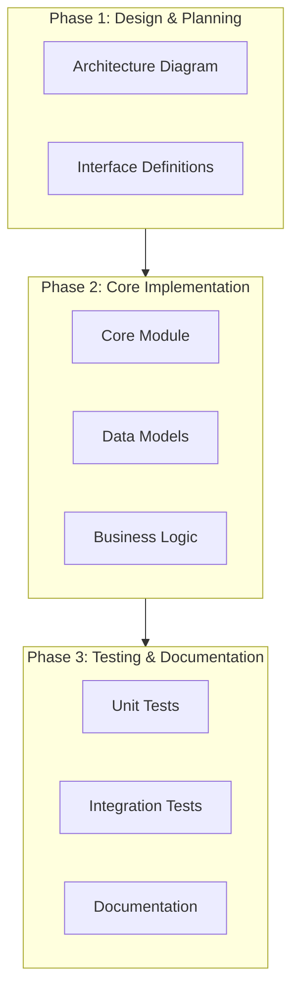
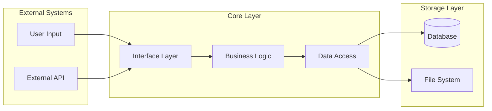
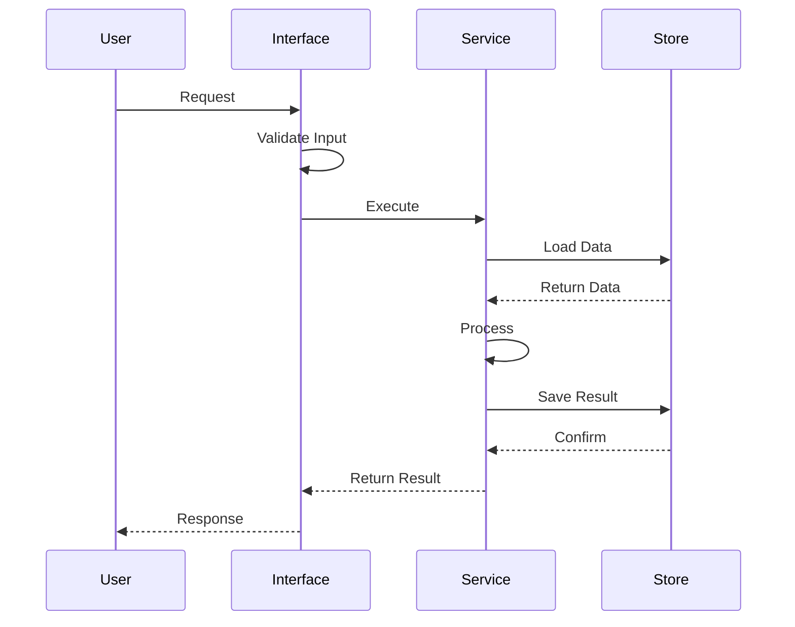

# Multi-Phase Feature Architecture

## Overview

This document describes the architecture for a multi-phase feature implementation, designed to demonstrate the phased development workflow.

## High-Level Architecture



## Component Architecture



## Interfaces

### Core Interfaces

```typescript
interface FeatureConfig {
  enabled: boolean;
  options: Record<string, unknown>;
}

interface FeatureService {
  initialize(config: FeatureConfig): Promise<void>;
  execute(input: unknown): Promise<unknown>;
  cleanup(): Promise<void>;
}

interface DataStore {
  save(key: string, value: unknown): Promise<void>;
  load(key: string): Promise<unknown>;
  delete(key: string): Promise<void>;
}
```

### API Interfaces

```typescript
interface RequestContext {
  user: {
    id: string;
    permissions: string[];
  };
  metadata: Record<string, string>;
}

interface ApiResponse<T> {
  success: boolean;
  data?: T;
  error?: {
    code: string;
    message: string;
  };
}
```

## Data Flow



## Implementation Phases

### Phase 1: Design & Planning (Current)

**Deliverables:**
- Architecture documentation
- Interface definitions
- Component diagrams

**Acceptance Criteria:**
- Architecture diagram created
- Core interfaces defined
- Data flow documented

### Phase 2: Core Implementation

**Deliverables:**
- Core service implementation
- Data access layer
- Configuration system

**Acceptance Criteria:**
- All interfaces implemented
- Basic functionality working
- Configuration validated

### Phase 3: Testing & Documentation

**Deliverables:**
- Comprehensive test suite
- API documentation
- User guide

**Acceptance Criteria:**
- 80%+ test coverage
- All public APIs documented
- Integration tests passing

## Technology Stack

| Layer | Technology | Purpose |
|-------|-----------|---------|
| Interface | TypeScript | Type-safe interfaces |
| Runtime | Node.js | Execution environment |
| Storage | PostgreSQL | Persistent data |
| Testing | Vitest | Unit testing |

## Design Principles

1. **Separation of Concerns**: Each layer has clear responsibilities
2. **Interface-Driven**: All components implement well-defined interfaces
3. **Testability**: Design for easy unit and integration testing
4. **Extensibility**: Support future enhancements without breaking changes
5. **Type Safety**: Leverage TypeScript for compile-time validation

## Security Considerations

- Input validation at interface layer
- Authentication/authorization checks
- Data sanitization before storage
- Secure configuration management

## Performance Considerations

- Lazy loading of components
- Caching strategy for frequently accessed data
- Connection pooling for database access
- Asynchronous processing for long-running tasks

## Error Handling

```typescript
enum ErrorCode {
  VALIDATION_ERROR = 'VALIDATION_ERROR',
  NOT_FOUND = 'NOT_FOUND',
  INTERNAL_ERROR = 'INTERNAL_ERROR',
  UNAUTHORIZED = 'UNAUTHORIZED',
}

interface ErrorContext {
  code: ErrorCode;
  message: string;
  details?: Record<string, unknown>;
  timestamp: Date;
}
```

## Future Enhancements

- Real-time updates via WebSocket
- Distributed caching layer
- Event-driven architecture
- Microservices decomposition

## References

- [Project Guidelines](../CLAUDE.md)
- [CLI Architecture](../nopo/docs/cli/architecture.md)
- [Automation Architecture](./automation/ARCHITECTURE.md)
