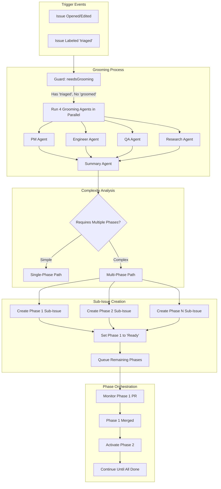
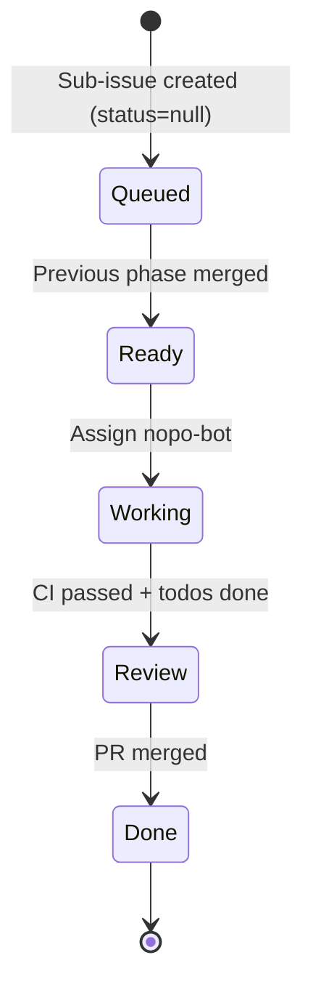
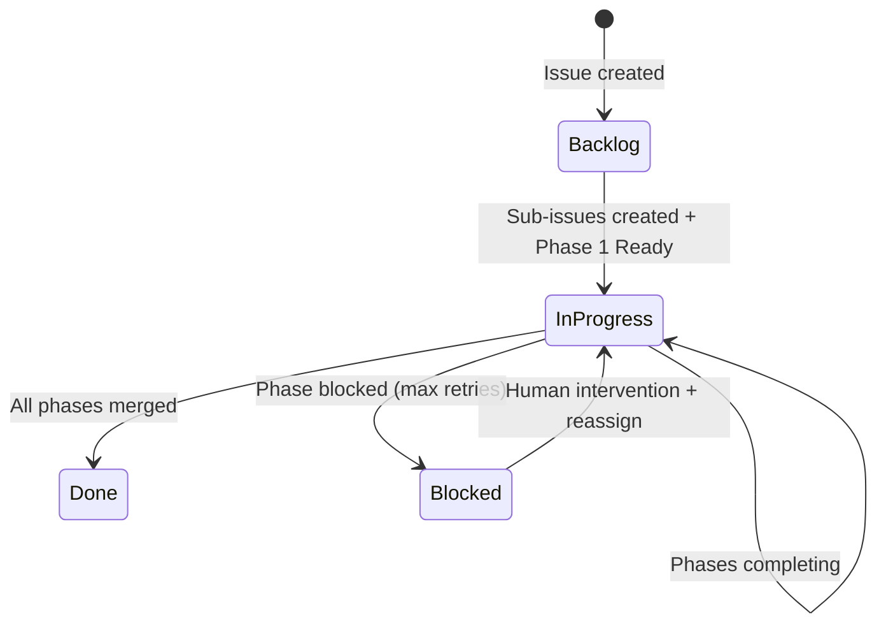
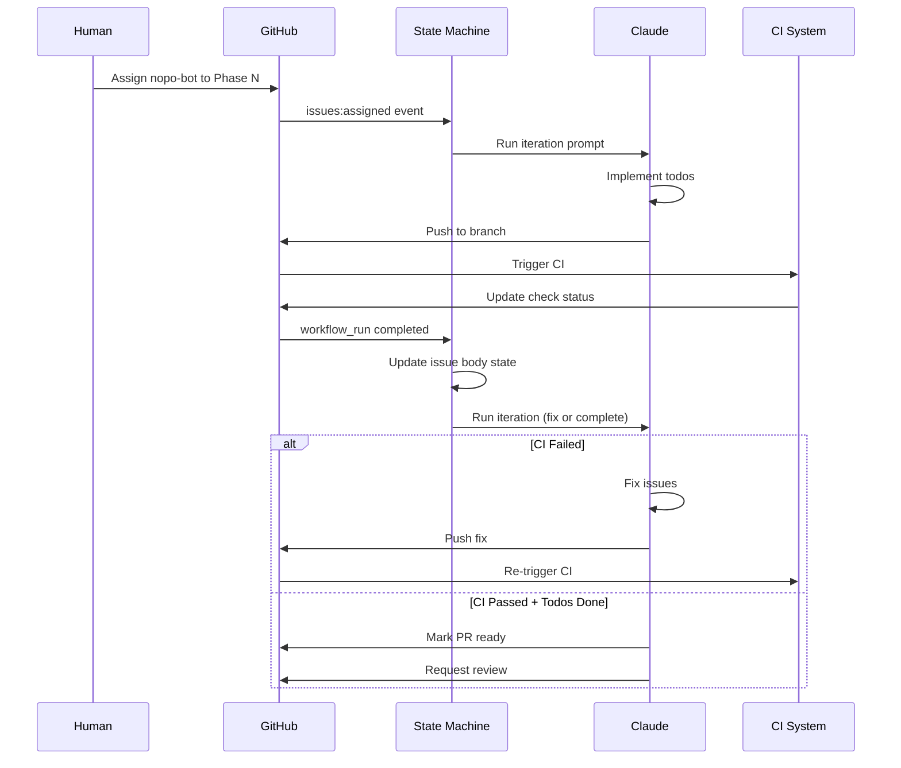
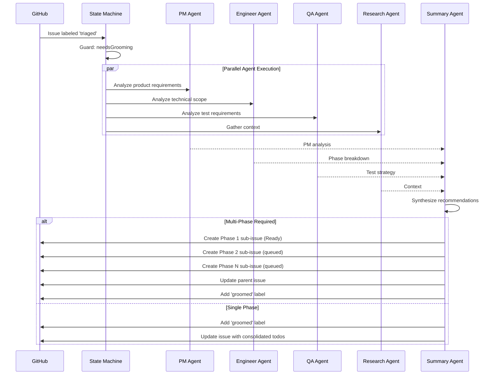
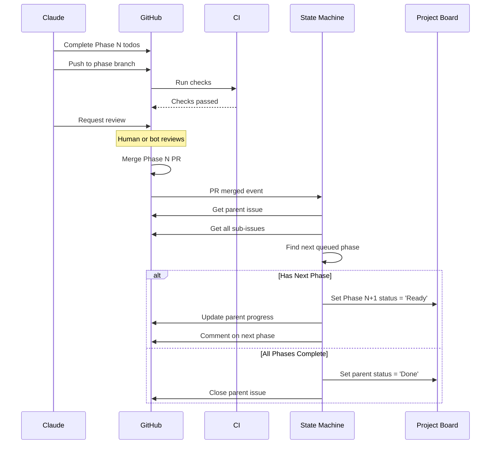

# Issue Grooming with Sub-Issues Architecture

## Overview

The Issue Grooming with Sub-Issues feature enables automated analysis and breakdown of complex GitHub issues into manageable phases. When an issue is deemed too large or complex for a single implementation cycle, the grooming process creates sub-issues representing different phases of work, each with their own todo lists and workflows.

## High-Level Architecture



## Components

### 1. Grooming Trigger System

**Purpose:** Detect issues that require grooming analysis.

**Entry Condition:**
- Issue has `triaged` label (from initial triage)
- Issue does NOT have `groomed` label
- Issue is not already a sub-issue (no parent issue)

**Implementation:** Guard function `needsGrooming` in the state machine.

### 2. Multi-Agent Grooming Process

**Purpose:** Analyze the issue from multiple perspectives to determine scope and complexity.

**Agents:**

| Agent | Role | Key Outputs |
|-------|------|-------------|
| PM Agent | Product analysis | Priority, user impact, acceptance criteria |
| Engineer Agent | Technical analysis | **Phase breakdown**, complexity estimate, dependencies |
| QA Agent | Testing strategy | Test requirements, edge cases |
| Research Agent | Context gathering | Related code, patterns, constraints |
| Summary Agent | Synthesis | Final decision on phases, creates sub-issues |

**Key Decision Point:** The Engineer Agent determines if work should be broken into phases based on:
- Scope complexity
- Technical dependencies
- Estimated effort
- Natural breakpoints in the work

### 3. Sub-Issue Creation

**Purpose:** Break complex work into sequential phases with clear boundaries.

**Sub-Issue Structure:**
```markdown
Title: [Phase N]: <Descriptive Title>

Body:
<Phase-specific description>

## Affected Areas
- File paths and components

## Todo
- [ ] Task 1
- [ ] Task 2
- [ ] [Manual] Manual verification task
```

**Metadata:**
- **Labels:** Inherit from parent + `sub-issue` label
- **Project Status:** First phase = "Ready", others = null (queued)
- **Parent Link:** GitHub sub-issue relationship
- **Branch:** Each phase gets `claude/issue/{N}/phase-{M}` branch

**Distribution Logic:**
- Todos are distributed across phases based on logical groupings
- Each phase is independently completable
- Later phases may depend on earlier phases' outputs

### 4. Phase Status Management

**Status Progression:**



**Rules:**
1. **Phase 1** starts as "Ready" immediately after creation
2. **Subsequent phases** start as queued (status=null)
3. When a phase PR is merged, the **next phase** automatically transitions to "Ready"
4. Only one phase is active (Working/Review) at a time

### 5. Parent Issue Orchestration

**Purpose:** Track overall progress across all phases.

**Parent Status Mapping:**



**Parent Issue Body Updates:**
- Lists all sub-issues with their status
- Shows overall progress (X/N phases complete)
- Tracks which phase is currently active

### 6. Iteration Loop (Per Phase)

Each sub-issue follows the standard iteration loop:



## Interfaces

### GroomingInput Interface

```typescript
interface GroomingInput {
  issue: {
    number: number;
    title: string;
    body: string;
    labels: string[];
  };
  repository: {
    owner: string;
    name: string;
  };
}
```

### GroomingOutput Interface

```typescript
interface GroomingOutput {
  decision: 'single-phase' | 'multi-phase';
  labels: string[];  // Updated labels including 'groomed'
  agentNotes: string;  // Summary of grooming analysis
  phases?: Phase[];  // Only present if multi-phase
}

interface Phase {
  number: number;
  title: string;
  description: string;
  affectedAreas: string[];
  todos: Todo[];
}

interface Todo {
  text: string;
  isManual: boolean;  // Requires human action
}
```

### SubIssueCreationInput Interface

```typescript
interface SubIssueCreationInput {
  parentIssue: {
    number: number;
    title: string;
    labels: string[];
  };
  phases: Phase[];
  repository: {
    owner: string;
    name: string;
  };
}
```

### SubIssueCreationOutput Interface

```typescript
interface SubIssueCreationOutput {
  subIssues: SubIssue[];
  parentUpdated: boolean;
}

interface SubIssue {
  number: number;
  title: string;
  body: string;
  labels: string[];
  projectStatus: 'Ready' | null;
  parentIssue: number;
}
```

### PhaseTransitionInput Interface

```typescript
interface PhaseTransitionInput {
  completedPhase: {
    number: number;
    pr: number;
    merged: boolean;
  };
  parentIssue: {
    number: number;
    subIssues: number[];
  };
}
```

### PhaseTransitionOutput Interface

```typescript
interface PhaseTransitionOutput {
  nextPhase?: {
    number: number;
    activated: boolean;
  };
  parentCompleted: boolean;
}
```

## Data Flow

### Grooming Flow



### Phase Completion Flow



## State Management

### Issue Body State (Embedded in HTML Comment)

```html
<!-- CLAUDE_ITERATION
iteration: 3
branch: claude/issue/6261/phase-1
pr_number: 1234
last_ci_run: 567890
last_ci_result: success
consecutive_failures: 0
failure_type: null
last_failure_timestamp: null
complete: false
-->
```

### Parent Issue Tracking

```markdown
<!-- PARENT_TRACKING
total_phases: 3
completed_phases: 1
current_phase: 2
phase_1: 6261 (Done)
phase_2: 6262 (Working)
phase_3: 6263 (Queued)
-->
```

## Error Handling

### Circuit Breaker

**Trigger:** Phase reaches `MAX_CLAUDE_RETRIES` (default: 5) consecutive failures

**Action:**
1. Set phase project status to "Blocked"
2. Unassign nopo-bot from phase
3. Add comment explaining blockage
4. Update parent issue with blocked status
5. **Do NOT** activate next phase

**Recovery:**
1. Human investigates and resolves issue
2. Human reassigns nopo-bot to blocked phase
3. State machine resets consecutive failures
4. Iteration resumes from current state

### Phase Dependency Failures

**Scenario:** Phase 2 requires output from Phase 1, but Phase 1 failed/was skipped

**Prevention:**
- Phases only activate after previous phase PR is merged
- Blocked phases prevent subsequent phases from starting
- Parent orchestration validates completion before advancing

## Testing Strategy

### Unit Tests

- Guard function `needsGrooming`
- Phase distribution algorithm
- Status transition logic
- State parsing and update

### Integration Tests

- Full grooming flow (single-phase)
- Full grooming flow (multi-phase)
- Phase transition after merge
- Circuit breaker activation
- Parent completion detection

### Test Fixtures

Located in: `packages/statemachine/actions/sm-test-runner/fixtures/scenarios/`

Key scenarios:
- `grooming-ready`: Simple grooming without sub-issues
- `grooming-with-subissues`: Full multi-phase flow
- `grooming-supersede`: Handling grooming changes

### Mock Structure

```typescript
// Mock agent outputs for testing
{
  "grooming/engineer": {
    // Single-phase recommendation
    "complexity": "medium",
    "phases": null
  },
  "grooming/engineer-with-phases": {
    // Multi-phase recommendation
    "complexity": "large",
    "phases": [
      {
        "number": 1,
        "title": "Design and planning",
        "todos": ["Create architecture diagram", "Define interfaces"]
      },
      {
        "number": 2,
        "title": "Core implementation",
        "todos": ["Implement agent logic", "Add state transitions"]
      },
      {
        "number": 3,
        "title": "Testing and documentation",
        "todos": ["Write unit tests", "Write integration tests", "Update docs"]
      }
    ]
  }
}
```

## Performance Considerations

### Grooming Agent Parallelization

- PM, Engineer, QA, and Research agents run in parallel
- Summary agent waits for all four to complete
- Total grooming time ≈ max(agent times) + summary time

### Sub-Issue Creation Batching

- All sub-issues created in a single operation
- Project status updates batched
- Parent issue updated once at the end

### Phase Activation

- Triggered by PR merge webhook (near-instantaneous)
- No polling required
- Project board updates happen in same transaction

## Security Considerations

### Permission Boundaries

- Grooming agents read-only access to repository
- Sub-issue creation requires `issues: write` permission
- nopo-bot token used for automation actions
- Human review required before merge (enforced by branch protection)

### Data Isolation

- Each phase works in isolated branch
- Phase todos scoped to phase sub-issue
- No cross-phase state pollution

### Audit Trail

- All grooming decisions recorded in agent notes
- Phase transitions logged in issue comments
- Iteration history preserved in issue body

## Metrics and Observability

### Key Metrics

1. **Grooming Metrics:**
   - Time to groom (end-to-end)
   - Single-phase vs multi-phase ratio
   - Average phases per complex issue

2. **Phase Metrics:**
   - Time per phase (Ready → Done)
   - Phase failure rate
   - Average iterations per phase

3. **Overall Metrics:**
   - Parent issue completion time
   - Blocked phase count
   - Human intervention frequency

### Monitoring Points

- Grooming trigger (issues with `triaged` label)
- Agent execution duration
- Sub-issue creation success
- Phase transitions
- Circuit breaker activations
- Parent completion

## Future Enhancements

### Potential Improvements

1. **Dynamic Phase Adjustment:**
   - Allow adding/removing phases mid-flight
   - Support phase splitting if scope grows

2. **Parallel Phase Execution:**
   - Enable independent phases to run concurrently
   - Dependency graph for phase ordering

3. **Phase Templates:**
   - Predefined phase structures for common patterns
   - Customizable phase templates per issue type

4. **Enhanced Orchestration:**
   - Automatic rollback if later phase discovers issues
   - Cross-phase dependency tracking
   - Phase milestone notifications

5. **AI-Powered Phase Sizing:**
   - Learn optimal phase boundaries from history
   - Predict phase complexity more accurately
   - Suggest phase consolidation when appropriate

## References

- [AGENTS.md](/AGENTS.md) - Overall automation architecture
- [docs/automation/ARCHITECTURE.md](/docs/automation/ARCHITECTURE.md) - Claude automation workflows
- [Test Scenario: grooming-with-subissues](/packages/statemachine/actions/sm-test-runner/fixtures/scenarios/grooming-with-subissues/README.md)
