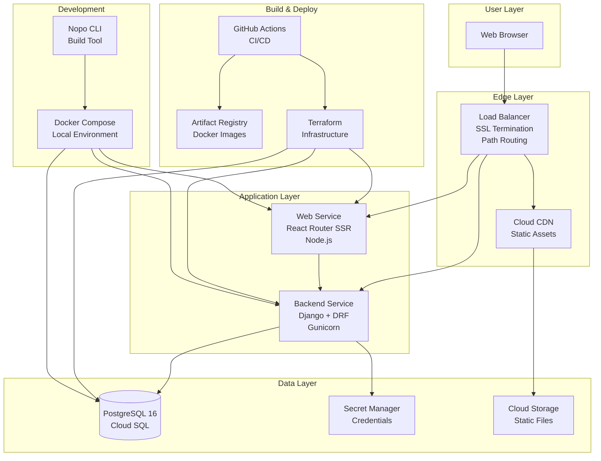
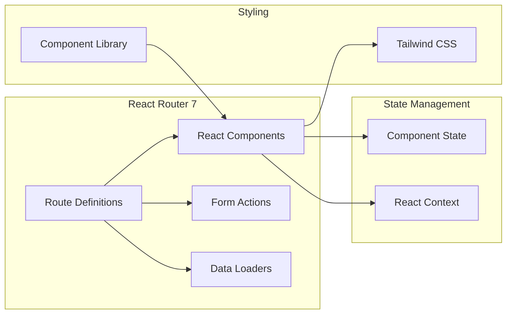
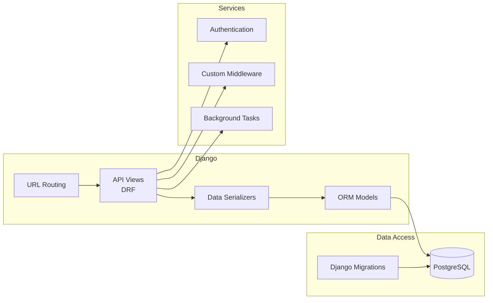
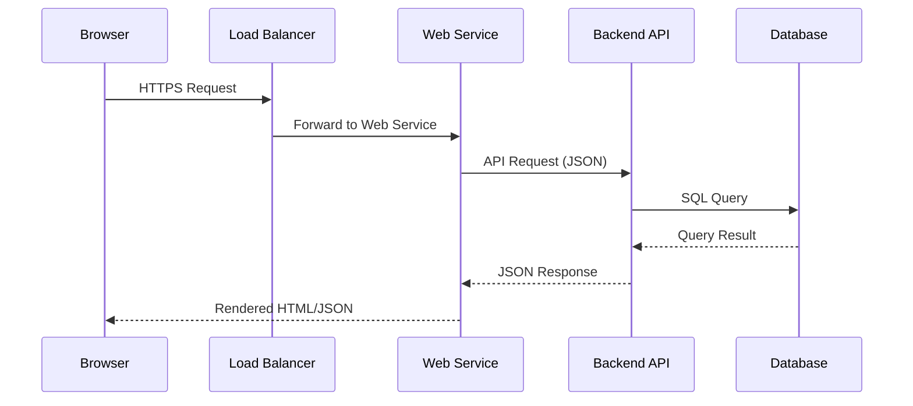
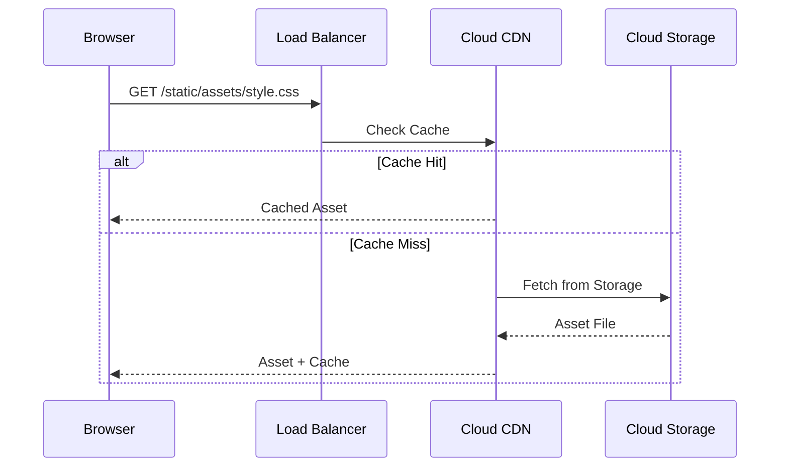
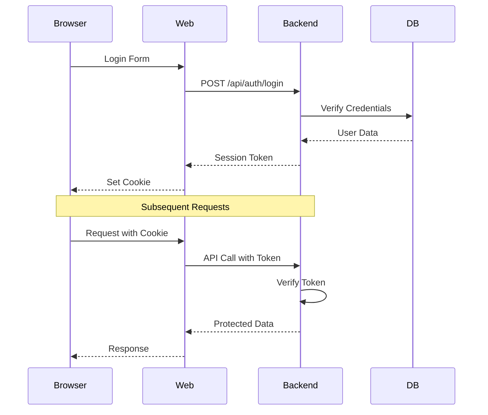
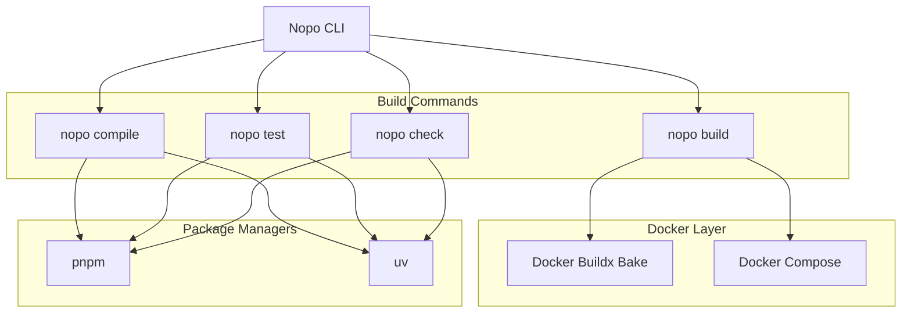
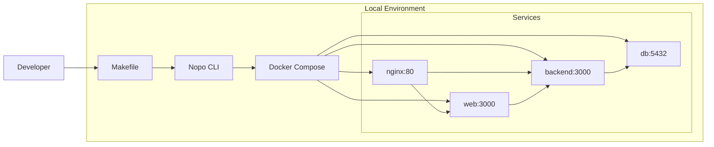
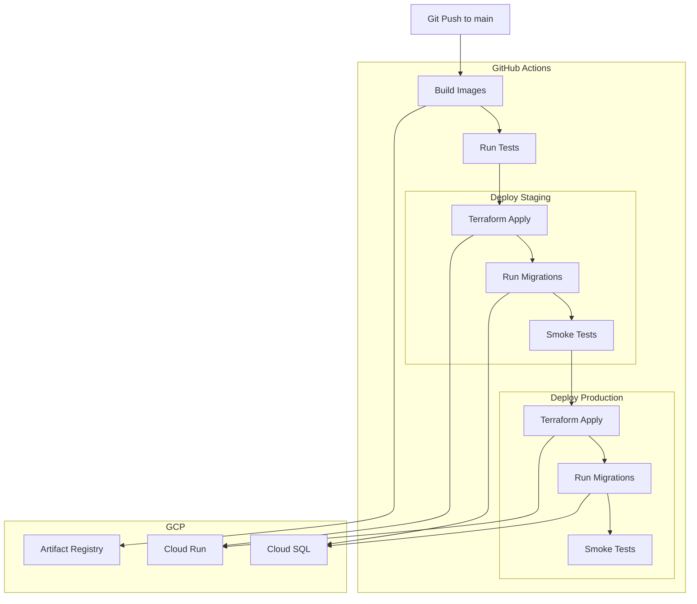

# Nopo Architecture

This document provides a comprehensive overview of the Nopo (monoреpo) project architecture, covering the system design, component interactions, and key architectural decisions.

## Table of Contents

1. [System Overview](#system-overview)
2. [Architecture Diagram](#architecture-diagram)
3. [Component Architecture](#component-architecture)
4. [Data Flow](#data-flow)
5. [Technology Stack](#technology-stack)
6. [Development Architecture](#development-architecture)
7. [Build & Deployment Pipeline](#build--deployment-pipeline)
8. [Interface Definitions](#interface-definitions)
9. [Architectural Decisions](#architectural-decisions)

---

## System Overview

Nopo is a Docker-based monorepo development environment that combines:
- **Backend**: Django REST Framework API
- **Frontend**: React Router 7 with Server-Side Rendering
- **Database**: PostgreSQL 16
- **Infrastructure**: Terraform-managed GCP deployment
- **Automation**: Claude-powered CI/CD and issue management

### Core Principles

1. **Monorepo Architecture**: All code in a single repository with shared tooling
2. **Docker-First Development**: Consistent environments across local and production
3. **Infrastructure as Code**: All infrastructure defined in Terraform
4. **API-First Design**: Backend exposes RESTful API, frontend consumes it
5. **Type Safety**: TypeScript for frontend, Python type hints for backend
6. **Automated Workflows**: Claude agents handle triage, implementation, and reviews

---

## Architecture Diagram



---

## Component Architecture

### Frontend (Web)



**Key Responsibilities:**
- Server-side rendering for initial page load
- Client-side routing and navigation
- Form handling and validation
- API communication with backend
- Component-based UI construction

**Technology:**
- React 19
- React Router 7 (SSR)
- TypeScript
- Vite (build tool)
- Tailwind CSS

### Backend (API)



**Key Responsibilities:**
- RESTful API endpoints
- Business logic implementation
- Database access and queries
- Authentication and authorization
- Data validation and serialization

**Technology:**
- Django 5
- Django REST Framework
- Python 3.12+
- Gunicorn (WSGI server)
- PostgreSQL (database driver)

### Database Layer

**Schema Management:**
- Django ORM for schema definition
- Migrations in version control
- Expand-contract pattern for schema changes

**Key Features:**
- Automated backups (7-day retention)
- Point-in-time recovery
- Query insights for performance monitoring
- Private IP (no public access)

### Infrastructure

See [Infrastructure Architecture](../infrastructure/ARCHITECTURE.md) for detailed information about:
- Cloud Run deployment
- Load balancing and SSL
- VPC networking
- Secret management
- Static asset delivery

---

## Data Flow

### API Request Flow



### Static Asset Flow



### Authentication Flow



---

## Technology Stack

### Frontend Stack

| Layer | Technology | Purpose |
|-------|------------|---------|
| Framework | React 19 | UI component framework |
| Routing | React Router 7 | SSR + client routing |
| Language | TypeScript | Type-safe JavaScript |
| Build Tool | Vite | Fast development builds |
| Styling | Tailwind CSS | Utility-first CSS |
| UI Components | Custom + Storybook | Component library |
| Testing | Vitest, Playwright | Unit + E2E tests |
| Linting | ESLint 9, Prettier | Code quality |

### Backend Stack

| Layer | Technology | Purpose |
|-------|------------|---------|
| Framework | Django 5 | Web framework |
| API | Django REST Framework | RESTful API |
| Language | Python 3.12+ | Backend language |
| WSGI Server | Gunicorn | Production server |
| Database | PostgreSQL 16 | Relational database |
| Migrations | Django Migrations | Schema management |
| Testing | Django TestCase | Unit + integration tests |
| Linting | Ruff, mypy | Code quality + types |

### Infrastructure Stack

| Layer | Technology | Purpose |
|-------|------------|---------|
| Compute | Cloud Run | Serverless containers |
| Database | Cloud SQL | Managed PostgreSQL |
| Load Balancer | GCP LB | HTTPS + routing |
| CDN | Cloud CDN | Static asset delivery |
| Storage | Cloud Storage | Static files |
| Secrets | Secret Manager | Credential storage |
| Registry | Artifact Registry | Docker images |
| IaC | Terraform | Infrastructure code |

### Development Stack

| Tool | Purpose |
|------|---------|
| Docker Compose | Local environment |
| pnpm | Node package manager |
| uv | Python package manager |
| Nopo CLI | Build orchestration |
| GitHub Actions | CI/CD |
| Act | Local workflow testing |

---

## Development Architecture

### Monorepo Structure

```
nopo/
├── apps/                    # Deployable services
│   ├── backend/            # Django API
│   ├── web/                # React Router app
│   ├── db/                 # Database (dev only)
│   └── nginx/              # Reverse proxy (dev only)
├── packages/               # Shared libraries
│   ├── configs/            # Shared configs
│   ├── plop/               # Code generators
│   └── ui/                 # UI component library
├── nopo/                   # CLI tool
│   ├── scripts/            # Build scripts
│   ├── docker/             # Docker configs
│   └── docs/               # CLI documentation
├── infrastructure/         # Terraform code
├── .github/                # GitHub workflows
└── decisions/              # Architecture decisions
```

### Build System

The Nopo CLI orchestrates builds across the monorepo:



### Local Development Flow



**Development Commands:**
```bash
make up          # Start all services
make build       # Build Docker images
make test        # Run all tests
make check       # Lint + type check
make shell       # Shell into container
```

---

## Build & Deployment Pipeline

### CI/CD Architecture



### Deployment Stages

1. **Build**: Docker images built and pushed to Artifact Registry
2. **Test**: Unit, integration, and E2E tests
3. **Staging Deploy**:
   - Terraform applies infrastructure changes
   - Database migrations run
   - Smoke tests verify deployment
4. **Production Deploy**:
   - Same process as staging
   - Optional manual approval gate

See [Infrastructure Architecture](../infrastructure/ARCHITECTURE.md) for deployment details.

---

## Interface Definitions

### Backend API Interface

**Base URL**: `/api/v1/`

**Standard Response Format**:
```typescript
interface APIResponse<T> {
  data: T;
  status: "success" | "error";
  message?: string;
  errors?: Record<string, string[]>;
}
```

**Authentication**:
- Session-based authentication
- CSRF token required for mutations
- Token passed via cookie

**Common Headers**:
```
Content-Type: application/json
X-CSRFToken: <token>
Authorization: Bearer <token>  // If using token auth
```

### Frontend-Backend Contract

**API Client Interface**:
```typescript
interface APIClient {
  get<T>(url: string, params?: Record<string, any>): Promise<T>;
  post<T>(url: string, data: any): Promise<T>;
  put<T>(url: string, data: any): Promise<T>;
  patch<T>(url: string, data: any): Promise<T>;
  delete<T>(url: string): Promise<T>;
}
```

**Data Loader Pattern** (React Router):
```typescript
interface LoaderFunction<T> {
  (args: { request: Request; params: Params }): Promise<T>;
}

interface ActionFunction<T> {
  (args: { request: Request; params: Params }): Promise<T>;
}
```

### Database Interface

**ORM Model Pattern**:
```python
from django.db import models
from typing import TypedDict

class ModelType(TypedDict):
    id: int
    created_at: datetime
    updated_at: datetime

class BaseModel(models.Model):
    created_at = models.DateTimeField(auto_now_add=True)
    updated_at = models.DateTimeField(auto_now=True)

    class Meta:
        abstract = True
```

**Migration Interface**:
```python
from django.db import migrations

class Migration(migrations.Migration):
    dependencies: list[tuple[str, str]]
    operations: list[migrations.Operation]
```

### Docker Interface

**Service Definition**:
```yaml
services:
  <service-name>:
    build:
      context: .
      dockerfile: apps/<service>/Dockerfile
      target: development
    ports:
      - "<host-port>:<container-port>"
    volumes:
      - .:/app
    environment:
      - SERVICE_NAME=<service-name>
    depends_on:
      - <dependency>
```

**Build Configuration** (`nopo.yml`):
```yaml
name: <service-name>
type: service | package
language: python | typescript | shell
manager: uv | pnpm

# For services
dockerfile: apps/<service>/Dockerfile
static_path: apps/<service>/build  # Static files location

# Commands
commands:
  build: <build-command>
  test: <test-command>
  check: <check-command>
  fix: <fix-command>
```

### Terraform Module Interface

**Module Input Variables**:
```hcl
variable "project_id" {
  type        = string
  description = "GCP project ID"
}

variable "environment" {
  type        = string
  description = "Environment name (stage, prod)"
}

variable "backend_image" {
  type        = string
  description = "Backend Docker image URI"
}
```

**Module Outputs**:
```hcl
output "service_url" {
  value       = google_cloud_run_v2_service.backend.uri
  description = "Cloud Run service URL"
}

output "database_connection" {
  value       = google_sql_database_instance.db.connection_name
  description = "Cloud SQL connection name"
  sensitive   = true
}
```

---

## Architectural Decisions

Key architecture decisions are documented in [decisions/](../decisions/) as ADRs (Architecture Decision Records).

### Key Design Decisions

1. **Monorepo vs Polyrepo**
   - **Decision**: Monorepo
   - **Rationale**: Simplified dependency management, atomic changes across services, shared tooling
   - **Trade-offs**: Larger repository size, more complex CI/CD

2. **Docker-First Development**
   - **Decision**: All services run in Docker, even locally
   - **Rationale**: Environment parity, consistent builds, easy onboarding
   - **Trade-offs**: Resource overhead, some performance loss on macOS

3. **SSR with React Router**
   - **Decision**: Server-side rendering for initial page load
   - **Rationale**: Better SEO, faster initial render, progressive enhancement
   - **Trade-offs**: More complex deployment, higher server load

4. **Django REST Framework for API**
   - **Decision**: DRF instead of FastAPI or Flask
   - **Rationale**: Mature ecosystem, built-in admin, ORM integration, batteries-included
   - **Trade-offs**: More opinionated, potentially slower than FastAPI

5. **Terraform for Infrastructure**
   - **Decision**: Terraform instead of gcloud CLI scripts
   - **Rationale**: Declarative, version controlled, supports drift detection
   - **Trade-offs**: Learning curve, state management complexity

6. **Cloud Run vs GKE**
   - **Decision**: Cloud Run (serverless containers)
   - **Rationale**: Simpler operations, scale-to-zero, pay-per-use
   - **Trade-offs**: Less control, vendor lock-in, cold start latency

7. **Expand-Contract Migrations**
   - **Decision**: Database migrations separate from code changes
   - **Rationale**: Zero-downtime deployments, safer rollbacks
   - **Trade-offs**: More PRs, slower feature delivery

8. **Claude Automation**
   - **Decision**: AI agents for triage, implementation, and reviews
   - **Rationale**: Faster iteration, consistent code quality, reduced manual work
   - **Trade-offs**: Requires trust in AI, needs human oversight

### Related Documentation

- [Infrastructure Architecture](../infrastructure/ARCHITECTURE.md) - GCP deployment details
- [Automation Architecture](./automation/ARCHITECTURE.md) - Claude workflow details
- [AGENTS.md](../AGENTS.md) - Development guidelines and conventions
- [ADRs](../decisions/) - Individual architecture decisions

---

## Future Considerations

### Scaling Considerations

As the system grows, consider:
1. **Caching Layer**: Redis/Memorystore for session and data caching
2. **Read Replicas**: Separate read/write database connections
3. **Message Queue**: Background job processing with Celery
4. **CDN Configuration**: More aggressive caching policies
5. **Database Sharding**: Horizontal partitioning for large datasets
6. **Microservices**: Split monolith if services have different scaling needs

### Observability

Current gaps to address:
1. **Distributed Tracing**: OpenTelemetry for request tracing
2. **Metrics**: Prometheus/Cloud Monitoring for application metrics
3. **Logging**: Structured logging with correlation IDs
4. **Error Tracking**: Sentry integration for error monitoring
5. **Performance Monitoring**: APM for slow query detection

### Security Enhancements

1. **WAF**: Cloud Armor for DDoS and attack protection
2. **Secrets Rotation**: Automated secret rotation policies
3. **Vulnerability Scanning**: Container image scanning in CI
4. **Compliance**: SOC 2, GDPR considerations
5. **Access Controls**: More granular IAM policies

---

## Appendix

### Glossary

- **ADR**: Architecture Decision Record - documents key design decisions
- **DRF**: Django REST Framework - REST API toolkit for Django
- **SSR**: Server-Side Rendering - rendering HTML on the server
- **NEG**: Network Endpoint Group - GCP load balancer target
- **PITR**: Point-in-Time Recovery - database backup restoration
- **VPC**: Virtual Private Cloud - isolated network in GCP
- **IaC**: Infrastructure as Code - managing infrastructure through code

### External Resources

- [Django Documentation](https://docs.djangoproject.com/)
- [React Router Documentation](https://reactrouter.com/)
- [GCP Documentation](https://cloud.google.com/docs)
- [Terraform GCP Provider](https://registry.terraform.io/providers/hashicorp/google/latest/docs)
- [Docker Documentation](https://docs.docker.com/)
- [12-Factor App](https://12factor.net/)
