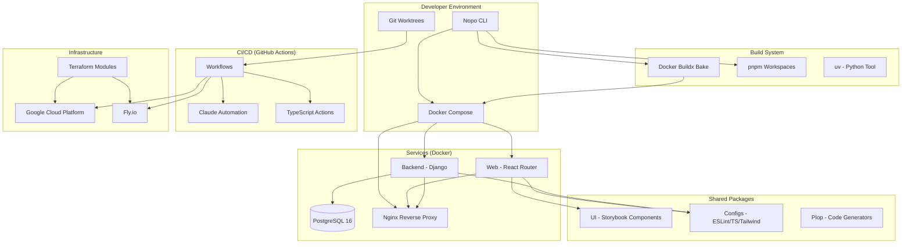
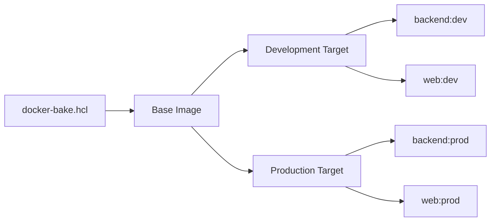
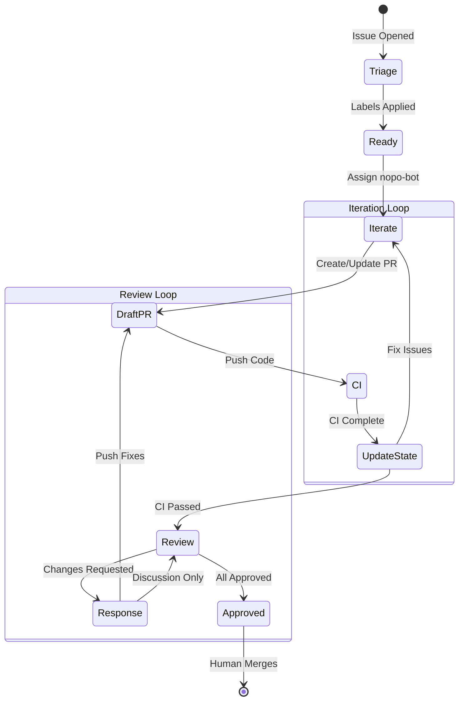
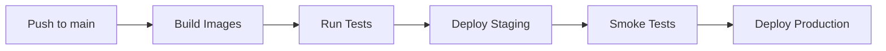
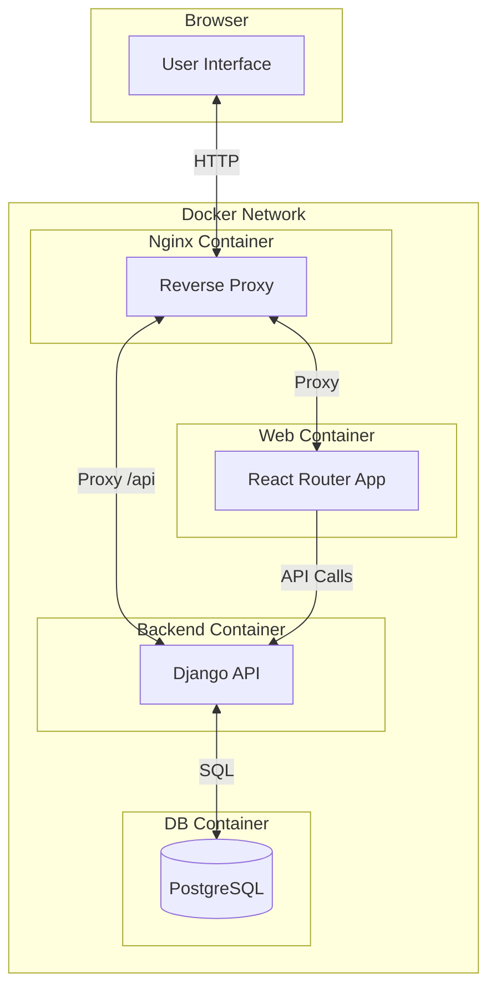
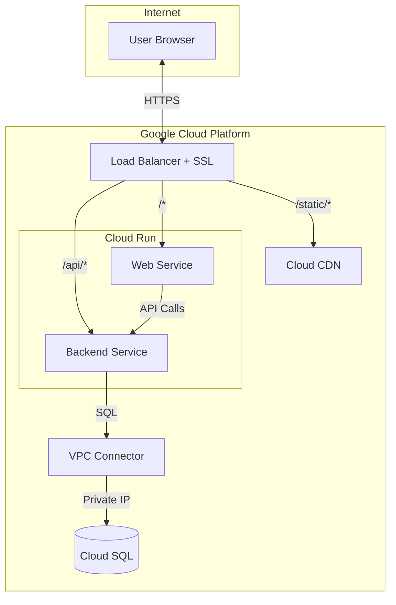

# Nopo Architecture

This document provides a comprehensive overview of the Nopo (monorepo) project architecture, covering the development environment, services, automation systems, and deployment infrastructure.

## Table of Contents

1. [System Overview](#system-overview)
2. [Architecture Diagram](#architecture-diagram)
3. [Core Components](#core-components)
4. [Development Environment](#development-environment)
5. [Build System](#build-system)
6. [Automation & CI/CD](#automation--cicd)
7. [Infrastructure](#infrastructure)
8. [Inter-Component Communication](#inter-component-communication)
9. [Security Model](#security-model)
10. [Related Documentation](#related-documentation)

---

## System Overview

Nopo is a Docker-based monorepo development environment that combines:

- **Frontend**: React 19 + React Router 7 with server-side rendering
- **Backend**: Django 5 REST API
- **Database**: PostgreSQL 16
- **Build Tools**: pnpm workspaces, Docker Compose, Buildx Bake
- **Infrastructure**: Terraform for GCP and Fly.io deployments
- **Automation**: Claude-powered GitHub Actions workflows

### Key Principles

1. **Docker-First Development**: All services run in containers for consistency
2. **Workspace-Based**: pnpm workspaces for shared packages and configurations
3. **Infrastructure as Code**: All infrastructure defined in version-controlled Terraform
4. **Automated Quality**: CI/CD with automated testing, linting, and deployment
5. **AI-Assisted Development**: Claude agents handle triaging, implementation, and reviews

---

## Architecture Diagram



---

## Core Components

### Services (`apps/`)

| Service | Technology | Port | Purpose |
|---------|-----------|------|---------|
| **backend** | Django 5 + DRF | 3000 | REST API, admin interface |
| **web** | React 19 + React Router 7 | 3000 | Frontend with SSR |
| **db** | PostgreSQL 16 | 5432 | Primary database |
| **nginx** | Nginx | 80 | Reverse proxy, static files |

### Shared Packages (`packages/`)

| Package | Purpose |
|---------|---------|
| **configs** | Shared configurations (ESLint 9, TypeScript, Tailwind, Prettier) |
| **plop** | Code generators for creating new components, features |
| **ui** | Reusable React components with Storybook documentation |

### Nopo CLI (`nopo/`)

The command-line interface for managing the development environment:

- **Command Routing**: Unified system for built-in and arbitrary commands
- **Dependency Resolution**: Automatic dependency management across services
- **Target Resolution**: Run commands on specific services or all services
- **Execution Modes**: Host execution (pnpm) or container execution (docker compose)

See [CLI Architecture](../nopo/docs/cli/architecture.md) for detailed documentation.

---

## Development Environment

### Local Development Stack

```
┌─────────────────────────────────────────────────────────────┐
│                    http://localhost                          │
├─────────────────────────────────────────────────────────────┤
│                                                             │
│  ┌─────────────────────────────────────────────────────┐   │
│  │               Nginx (Port 80)                       │   │
│  │                                                     │   │
│  │  /api/*    → Backend Container                      │   │
│  │  /admin/*  → Backend Container                      │   │
│  │  /django/* → Backend Container                      │   │
│  │  /static/* → Static Files (volume mount)            │   │
│  │  /*        → Web Container                          │   │
│  └─────────────────────────────────────────────────────┘   │
│                 ↓                    ↓                       │
│  ┌──────────────────────┐  ┌──────────────────────┐         │
│  │  Backend Container   │  │   Web Container      │         │
│  │  Django + Gunicorn   │  │   React Router SSR   │         │
│  │  Port 3000           │  │   Port 3000          │         │
│  └──────────┬───────────┘  └──────────────────────┘         │
│             │                                                │
│             ↓                                                │
│  ┌──────────────────────┐                                   │
│  │  PostgreSQL 16       │                                   │
│  │  Port 5432           │                                   │
│  └──────────────────────┘                                   │
│                                                             │
└─────────────────────────────────────────────────────────────┘
```

### Environment Configuration

Environment variables are managed through:

1. **`.env` files**: Service-specific configuration
2. **`nopo env` command**: Generates/updates `.env` from templates
3. **Docker Compose**: Injects environment into containers
4. **Secret Manager**: Production secrets (GCP only)

### Git Worktrees

Parallel development sessions are enabled through Git worktrees:

```bash
# Create worktree for new issue
git worktree add ../nopo-issue-123 claude/issue/123

# Each worktree is independent
cd ../nopo-issue-123
pnpm install
make up
```

**Use Case**: Multiple Claude Code sessions working on different issues simultaneously.

---

## Build System

### Docker Build Architecture



### Multi-Stage Dockerfile Pattern

All services use multi-stage builds:

1. **base**: Common dependencies, user setup
2. **development**: Development dependencies, hot reload
3. **production**: Optimized, minimal dependencies

### Build Commands

```bash
make build              # Build all services
make build backend      # Build specific service
make build base         # Build base image only

# Advanced options
make build backend --no-cache
DOCKER_VERSION=test make build web
```

### Dependency Management

- **Node.js**: pnpm 10.11+ with workspaces
- **Python**: uv for fast, reliable package installation
- **Shared configs**: Centralized in `packages/configs`

---

## Automation & CI/CD

### Claude Automation State Machine

Fully automated development workflow powered by Claude agents:



### Key Automation Jobs

| Job | Trigger | Purpose |
|-----|---------|---------|
| **issue-triage** | Issue opened/edited | Add labels, project fields, create sub-issues |
| **issue-iterate** | nopo-bot assigned | Implement code, fix CI failures, request review |
| **pr-review** | Review requested | Review code changes, submit feedback |
| **pr-response** | Review submitted | Address review comments |
| **discussion-research** | Discussion created | Spawn research threads |

See [Automation Architecture](./automation/ARCHITECTURE.md) for detailed documentation.

### CI/CD Pipeline



**Pipeline Steps**:

1. **Build**: Create Docker images, push to ghcr.io
2. **Test**: Run unit tests, integration tests, linting
3. **Deploy Staging**: Terraform apply, database migrations
4. **Smoke Tests**: Playwright E2E tests
5. **Deploy Production**: Same as staging with production config

---

## Infrastructure

### Google Cloud Platform (Production)

```
┌─────────────────────────────────────────────────────────────┐
│                  Internet (HTTPS)                            │
└────────────────────────┬────────────────────────────────────┘
                         ↓
┌─────────────────────────────────────────────────────────────┐
│           Global Load Balancer + SSL                         │
│  /api/*    → Backend (Cloud Run)                             │
│  /admin/*  → Backend (Cloud Run)                             │
│  /static/* → Cloud Storage + CDN                             │
│  /*        → Web (Cloud Run)                                 │
└────────────────────────┬────────────────────────────────────┘
                         ↓
┌─────────────────────────────────────────────────────────────┐
│                   Cloud Run Services                         │
│  ┌──────────────────┐  ┌──────────────────┐                 │
│  │  Backend         │  │  Web             │                 │
│  │  Auto-scale 0-10 │  │  Auto-scale 0-10 │                 │
│  └────────┬─────────┘  └──────────────────┘                 │
│           ↓                                                  │
│  ┌──────────────────┐                                        │
│  │  VPC Connector   │                                        │
│  └────────┬─────────┘                                        │
│           ↓                                                  │
│  ┌──────────────────┐                                        │
│  │  Cloud SQL       │                                        │
│  │  PostgreSQL 16   │                                        │
│  │  Private IP      │                                        │
│  └──────────────────┘                                        │
└─────────────────────────────────────────────────────────────┘
```

**Key Features**:

- **Serverless Compute**: Cloud Run with auto-scaling
- **Private Database**: Cloud SQL with no public IP
- **Global CDN**: Cloud Storage + Cloud CDN for static assets
- **Secrets Management**: Secret Manager for credentials
- **Infrastructure as Code**: Terraform with remote state

See [Infrastructure Architecture](../infrastructure/ARCHITECTURE.md) for detailed documentation.

### Fly.io (Alternative Deployment)

Lightweight deployment option using:

- **Fly Machines**: Containerized apps with auto-scaling
- **Fly Postgres**: Managed PostgreSQL clusters
- **Fly Volumes**: Persistent storage
- **Global Distribution**: Deploy to multiple regions

---

## Inter-Component Communication

### Request Flow (Local Development)

```
User Request → Nginx (Port 80)
  ├─ /api/*     → Backend Container (Port 3000) → PostgreSQL (Port 5432)
  ├─ /admin/*   → Backend Container (Port 3000) → PostgreSQL (Port 5432)
  ├─ /static/*  → Nginx (static files from volume)
  └─ /*         → Web Container (Port 3000) → Backend Container (API calls)
```

### Request Flow (Production)

```
User Request → Load Balancer (HTTPS)
  ├─ /api/*     → Cloud Run (Backend) → Cloud SQL (Private IP)
  ├─ /admin/*   → Cloud Run (Backend) → Cloud SQL (Private IP)
  ├─ /static/*  → Cloud Storage + CDN
  └─ /*         → Cloud Run (Web) → Cloud Run (Backend via HTTPS)
```

### API Communication

- **Local**: Direct container-to-container via Docker network
- **Production**: HTTPS API calls through public URLs
- **Authentication**: JWT tokens, session cookies
- **Data Format**: JSON (REST API)

---

## Security Model

### Development Environment

| Layer | Security Measure |
|-------|-----------------|
| **Containers** | Non-root user, isolated networks |
| **Secrets** | `.env` files (gitignored) |
| **Database** | Container-only access, no exposed port |
| **Dependencies** | Automated vulnerability scanning (Dependabot) |

### Production Environment

| Layer | Security Measure |
|-------|-----------------|
| **Network** | HTTPS only, private database IP |
| **Identity** | Workload Identity Federation, least-privilege IAM |
| **Secrets** | Google Secret Manager, encrypted at rest |
| **Data** | Encryption in transit and at rest |
| **Containers** | Non-root user, vulnerability scanning |

See [Infrastructure Security](../infrastructure/ARCHITECTURE.md#security-model) for detailed security documentation.

---

## Related Documentation

### By Component

- **CLI**: [CLI Architecture](../nopo/docs/cli/architecture.md)
- **Automation**: [Automation Architecture](./automation/ARCHITECTURE.md)
- **Infrastructure**: [Infrastructure Architecture](../infrastructure/ARCHITECTURE.md)

### By Topic

- **Development Workflow**: [AGENTS.md](../AGENTS.md)
- **Command Reference**: [CLI Quick Reference](../nopo/docs/cli/quick-reference.md)
- **Testing Strategy**: [AGENTS.md - Testing Philosophy](../AGENTS.md#testing-philosophy)
- **Deployment**: [Infrastructure Deployment Flow](../infrastructure/ARCHITECTURE.md#deployment-flow)

### Decision Records

Architectural decisions are documented in [decisions/](../decisions/) using Architecture Decision Records (ADRs).

---

## System Interfaces

### Command-Line Interface

The Nopo CLI is the primary interface for developers:

```bash
# Core commands (built-in script classes)
nopo build [service]        # Build Docker images
nopo up [service]           # Start services
nopo down                   # Stop services
nopo status                 # Check service status

# Arbitrary commands (pnpm scripts)
nopo test [target]          # Run tests (host execution)
nopo lint [target]          # Run linting (host execution)
nopo run test [target]      # Run tests in container

# Utility commands
nopo env                    # Generate/update .env files
nopo migrate backend        # Run database migrations
nopo shell backend          # Open shell in container
```

**Interface Characteristics**:

- **Target Resolution**: Automatically discovers services from `apps/*/Dockerfile`
- **Dependency Resolution**: Ensures prerequisites (env, build) are met
- **Execution Modes**: Host (pnpm) or container (docker compose)
- **Help System**: Recursive help for all commands

### GitHub API Interface

Claude automation integrates with GitHub via:

- **Webhooks**: Receive events (issues, PRs, comments, CI results)
- **GraphQL/REST API**: Update issues, create PRs, post comments
- **GitHub Apps**: nopo-bot and claude[bot] for automation
- **Actions API**: Workflow dispatch, status checks

### Cloud Provider Interfaces

#### Google Cloud Platform

- **Terraform Provider**: Declarative infrastructure management
- **gcloud CLI**: Operational commands (logs, migrations)
- **Service APIs**: Cloud Run, Cloud SQL, Secret Manager, etc.
- **Artifact Registry**: Docker image storage

#### Fly.io

- **fly CLI**: Deployment and management
- **fly.toml**: Service configuration
- **flyctl API**: Programmatic management

### API Interface Definitions

#### REST API (Backend)

**Base URL**: `http://localhost/api` (local) or `https://domain.com/api` (production)

**Authentication**: JWT tokens via `Authorization: Bearer <token>` header

**Common Endpoints**:

```typescript
// Authentication
POST   /api/auth/login     { username, password }          → { token, user }
POST   /api/auth/logout    {}                              → { success }
GET    /api/auth/me        Authorization: Bearer <token>   → { user }

// Resources (example pattern)
GET    /api/<resource>/              → List resources
GET    /api/<resource>/:id           → Get single resource
POST   /api/<resource>/              → Create resource
PUT    /api/<resource>/:id           → Update resource (full)
PATCH  /api/<resource>/:id           → Update resource (partial)
DELETE /api/<resource>/:id           → Delete resource

// Health & Version
GET    /__version__                  → { version, commit, timestamp }
GET    /api/health                   → { status, database, ... }
```

**Response Format**:

```typescript
// Success (2xx)
{
  data: T,
  meta?: {
    pagination?: { page, per_page, total, pages }
  }
}

// Error (4xx, 5xx)
{
  error: {
    code: string,           // Machine-readable error code
    message: string,        // Human-readable message
    details?: object        // Additional context
  }
}
```

#### CLI Interface

**Command Pattern**: `nopo <command> [targets...] [options]`

**Interface Contract**:

```typescript
interface ScriptClass {
  name: string;                    // Command name (e.g., "build", "up")
  description: string;             // Help text
  dependencies: Dependency[];      // Prerequisites
  fn(args: string[]): Promise<void>;  // Command implementation
}

interface Dependency {
  class: typeof ScriptClass;       // Dependency script class
  enabled: (runner: Runner) => Promise<boolean>;  // Conditional execution
}

interface Runner {
  args: string[];                  // Raw arguments
  targets: string[];               // Resolved targets
  availableTargets: string[];      // Discovered from filesystem
  execute(script: ScriptClass, args: string[]): Promise<void>;
}
```

**Exit Codes**:

- `0`: Success
- `1`: Command failed
- `2`: Invalid arguments or configuration
- `130`: User interrupted (Ctrl+C)

#### GitHub Automation Interface

**Event Schema**:

```typescript
interface ClaudeEvent {
  job: string;                     // Job to execute (e.g., "issue-triage")
  resource_type: "issue" | "pr" | "discussion";
  resource_number: number;
  comment_id?: number;             // For reactions
  context_json: string;            // Job-specific context
  skip: boolean;                   // Whether to skip processing
}

interface IterationState {
  iteration: number;               // Current iteration count
  branch: string;                  // Branch name
  pr_number?: number;              // Associated PR
  last_ci_run?: number;            // Workflow run ID
  last_ci_result?: "success" | "failure" | "cancelled";
  consecutive_failures: number;    // Failure count
  failure_type?: "ci" | "workflow";
  last_failure_timestamp?: string; // ISO 8601
  complete: boolean;               // Iteration finished
}
```

**Job Interface**:

```typescript
interface ClaudeJob {
  name: string;                    // Job identifier
  trigger: string[];               // Event types
  execute(context: JobContext): Promise<JobResult>;
}

interface JobContext {
  github: GitHubClient;            // GitHub API client
  issue_number?: number;
  pr_number?: number;
  discussion_number?: number;
  // ... job-specific fields
}

interface JobResult {
  status: "success" | "failure";
  message: string;                 // Status update message
  outputs?: Record<string, string>;
}
```

#### Terraform Interface

**Module Contract**:

```hcl
# inputs.tf
variable "project_id" {
  type        = string
  description = "GCP project ID"
}

variable "environment" {
  type        = string
  description = "Environment name (stage, prod)"
}

variable "service_image" {
  type        = string
  description = "Docker image URL"
}

# outputs.tf
output "service_url" {
  value       = google_cloud_run_v2_service.service.uri
  description = "Cloud Run service URL"
}

output "load_balancer_ip" {
  value       = google_compute_global_address.lb_ip.address
  description = "Load balancer IP address"
}
```

**State Backend**:

```hcl
terraform {
  backend "gcs" {
    bucket = "${PROJECT_ID}-terraform-state"
    prefix = "nopo/${ENVIRONMENT}"
  }
}
```

#### Docker Interface

**Dockerfile Contract**:

All service Dockerfiles must implement:

```dockerfile
# Stage 1: base
FROM node:22-alpine AS base
# Common dependencies, user setup

# Stage 2: development
FROM base AS development
# Development dependencies, hot reload

# Stage 3: production
FROM base AS production
# Minimal production dependencies
```

**Build Arguments**:

- `DOCKER_VERSION`: Image version tag (e.g., `sha-abc123`)
- `DOCKER_TAG`: Image tag (e.g., `stage`, `prod`)
- `DOCKER_TARGET`: Build target (e.g., `development`, `production`)

**Service Configuration** (`nopo.yml`):

```yaml
name: service-name
dockerfile: Dockerfile
dependencies:           # Optional service dependencies
  - other-service
commands:               # Optional command overrides
  lint:
    dependencies: {}    # Override service-level dependencies
    command: eslint .
```

---

## Data Flow

### Development Data Flow



### Production Data Flow



---

## Extensibility

### Adding New Services

1. Create service directory in `apps/<service>/`
2. Add `Dockerfile` with multi-stage build
3. Add `nopo.yml` for service configuration
4. Update `docker-compose.yml` if needed
5. Run `nopo build <service>` to build

### Adding New Packages

1. Create package in `packages/<package>/`
2. Add `package.json` with `@more/<name>` namespace
3. Export shared code via `index.ts`
4. Reference in consuming services via workspace protocol

### Adding Infrastructure

1. Create Terraform module in `infrastructure/terraform/modules/<module>/`
2. Define inputs, outputs, and resources
3. Reference module in environment-specific configuration
4. Run `terraform plan` and `terraform apply`

---

## Monitoring & Observability

### Local Development

- **Logs**: `docker compose logs -f <service>`
- **Metrics**: Docker stats, container resource usage
- **Debugging**: VS Code remote container debugging

### Production (GCP)

- **Logs**: Cloud Logging (structured JSON logs)
- **Metrics**: Cloud Monitoring (requests, latency, errors)
- **Traces**: Cloud Trace (request tracing)
- **Alerts**: Cloud Monitoring alerts for errors, latency
- **Database**: Cloud SQL Insights for query performance

### CI/CD

- **Workflow Logs**: GitHub Actions logs
- **Test Reports**: Integrated test results
- **Status Comments**: Automated status updates on issues/PRs
- **Iteration History**: Tracked in issue body comments

---

## Performance Characteristics

### Local Development

- **Cold Start**: ~30-60 seconds (first `make up`)
- **Hot Reload**: <1 second (Vite, Django auto-reload)
- **Test Suite**: ~5-10 seconds (unit tests)
- **Build Time**: ~2-5 minutes (full rebuild)

### Production (GCP)

- **Cold Start**: 2-5 seconds (Cloud Run)
- **Warm Request**: <100ms (API response)
- **Database**: <10ms (Cloud SQL private connection)
- **CDN**: <50ms (static assets, global)
- **Auto-Scaling**: 0-10 instances in ~seconds

### CI/CD

- **Build**: ~5-10 minutes (all images)
- **Test**: ~5-10 minutes (full suite)
- **Deploy**: ~5-10 minutes (Terraform + migrations)
- **E2E Tests**: ~5-15 minutes (Playwright smoke tests)

---

## Disaster Recovery

### Local Development

- **Data Loss**: Rebuild from Git + migrations
- **Corruption**: `make down && make build && make up`
- **Dependencies**: `pnpm install && make build`

### Production

- **Bad Deployment**: Cloud Run revision rollback (<5 min)
- **Database Corruption**: Point-in-time recovery (<1 hour)
- **Region Outage**: Manual restore in new region (hours)
- **Full Loss**: Rebuild from Git + backups (days)

**Backup Strategy**:

- **Database**: Daily automated backups (7-day retention)
- **Code**: Version controlled in Git
- **Infrastructure**: Terraform state in GCS (versioned)
- **Secrets**: Secret Manager (versioned)
- **Images**: ghcr.io + Artifact Registry (immutable tags)

---

## Development Principles

### Code Organization

- **Separation of Concerns**: Clear boundaries between frontend, backend, infrastructure
- **DRY (Don't Repeat Yourself)**: Abstract at 3+ instances, not before
- **Composition over Configuration**: Use interfaces, not feature flags

### Testing Philosophy

- **Test Behavior, Not Implementation**: Focus on API contracts and user interactions
- **Minimal Mocking**: Use real dependencies when possible
- **TDD Encouraged**: Write failing tests first, then implement

### Deployment Strategy

- **Immutable Infrastructure**: Never modify running resources
- **Blue-Green Deployments**: Zero-downtime with Cloud Run revisions
- **Database Migrations**: Expand-contract pattern for backward compatibility

### AI Collaboration

- **Automated Triage**: Claude labels and sizes issues automatically
- **Implementation Loop**: Claude implements, tests, and fixes CI failures
- **Review Process**: Claude reviews PRs, responds to feedback
- **Human Oversight**: Humans approve and merge final changes

---

## Glossary

- **ADR**: Architecture Decision Record - Documents important architectural decisions
- **Buildx Bake**: Docker's declarative build system for multi-target builds
- **Cloud Run**: GCP's serverless container platform with auto-scaling
- **GHCR**: GitHub Container Registry - Docker image hosting by GitHub
- **NEG**: Network Endpoint Group - GCP load balancer backend
- **nopo-bot**: GitHub account used to trigger Claude automation
- **pnpm**: Fast, disk-efficient Node.js package manager
- **SSR**: Server-Side Rendering - Rendering React on the server
- **uv**: Fast Python package installer and resolver
- **VPC Connector**: Allows serverless services to access VPC resources
- **Worktree**: Git feature for checking out multiple branches simultaneously

---

## Future Enhancements

### Planned Improvements

- **Observability**: Distributed tracing, advanced metrics dashboards
- **Performance**: Redis caching layer, database read replicas
- **Security**: Cloud Armor WAF, more granular IAM policies
- **Developer Experience**: VS Code extensions, better local debugging
- **Testing**: Increased E2E coverage, visual regression testing

### Under Consideration

- **Multi-Region**: Deploy to multiple GCP regions for redundancy
- **GraphQL API**: Alternative API interface for frontend
- **Microservices**: Split backend into smaller, focused services
- **Real-Time**: WebSocket support for live updates
- **Mobile**: React Native app sharing code with web

---

For questions or contributions, see [CLAUDE.md](../CLAUDE.md) for development guidelines.
