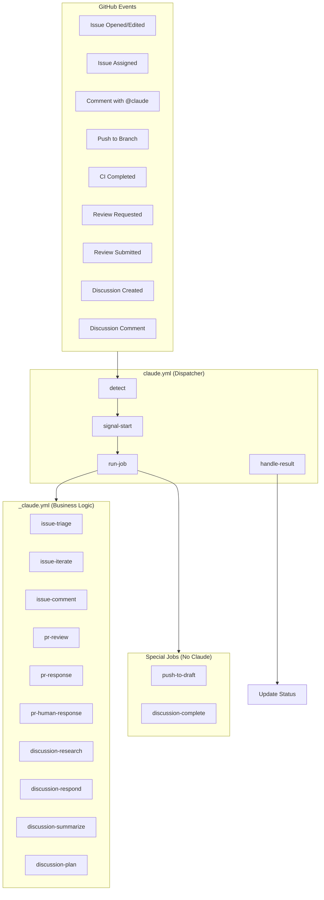
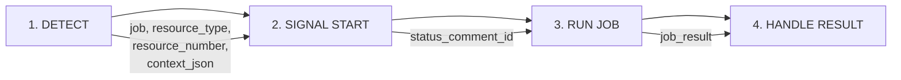
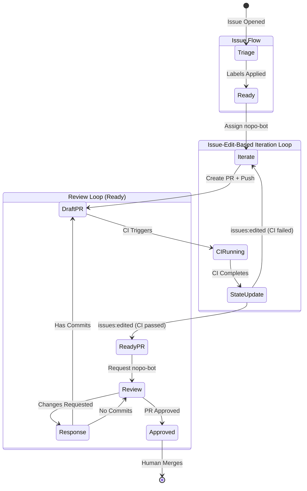
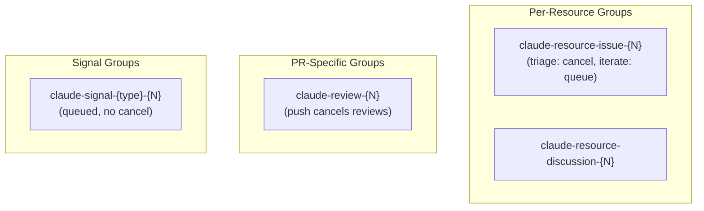

# Claude Automation Architecture

This document describes the fully automated development workflow powered by Claude agents and GitHub Actions.

## High-Level Architecture



## Workflow Files

| File | Purpose |
|------|---------|
| `claude.yml` | **Unified Dispatcher** - Handles ALL triggers, routes to jobs |
| `_claude.yml` | **Business Logic** - Contains all Claude job implementations |
| `claude-ci-state.yml` | **CI Result Handler** - Updates issue state on CI completion (triggers iteration) |
| `_test_claude.yml` | Tests Claude jobs with mock mode |
| `claude-stalled-review.yml` | Scheduled job for stalled PR reviews |

## The 4-Step Processing Pipeline

Every Claude automation event goes through 4 steps:



### Step 1: Detect (`claude-detect-event` action)

Analyzes the GitHub event and determines:
- **job**: Which job to run (or empty if no action needed)
- **resource_type**: `issue`, `pr`, or `discussion`
- **resource_number**: The issue/PR/discussion number
- **comment_id**: If responding to a comment (for reaction)
- **context_json**: All context needed by the job
- **skip**: Whether to skip (e.g., bot author, skip label)

### Step 2: Signal Start (`claude-signal-start` action)

Provides user feedback that work is starting:
- Adds 👀 reaction to triggering comment
- Creates/updates sticky status comment
- Returns `status_comment_id` for later update

### Step 3: Run Job (`_claude.yml`)

Executes the appropriate Claude job with:
- Checkout at correct branch/ref
- Claude prompt execution
- Job-specific post-processing
- Git operations (commit, push)

### Step 4: Handle Result (`claude-handle-result` action)

Updates status based on outcome:
- **Success**: ✅ Updates status comment, adds 🚀 reaction
- **Failure**: ❌ Updates status comment with error details
- **Cancelled**: ⏹️ Updates status comment

## Event-to-Job Mapping

```mermaid
flowchart LR
    subgraph Issues
        I1[opened/edited] --> |no 'triaged' label| J1[issue-triage]
        I2[assigned to nopo-bot] --> J2[issue-iterate]
        I3[comment with @claude] --> J3[issue-comment]
        I4[workflow_run completed] --> |Claude branch| J2[issue-iterate]
    end

    subgraph Push
        P1[push to branch] --> |has open PR| J4[push-to-draft]
    end

    subgraph Reviews
        R1[review requested for nopo-bot] --> J8[pr-review]
        R2[claude bot submitted review] --> J9[pr-response]
        R3[human reviewed Claude PR] --> J10[pr-human-response]
    end

    subgraph Discussions
        D1[discussion created] --> J11[discussion-research]
        D2[/summarize command] --> J12[discussion-summarize]
        D3[/plan command] --> J13[discussion-plan]
        D4[/complete command] --> J14[discussion-complete]
        D5[regular comment] --> J15[discussion-respond]
    end
```

## State Machine: Issue → PR → Merge



**Issue-Edit-Based Loop**: CI results flow through `claude-ci-state.yml` which updates the issue body. This edit triggers `issues: edited`, which starts the next iteration. The loop closes when Claude marks the issue complete and exits without editing.

### Iteration State (Stored in Issue Body)

The `issue-iterate` job tracks state in an HTML comment in the issue body:

```markdown
<!-- CLAUDE_ITERATION
iteration: 3
branch: claude/issue/42
pr_number: 123
last_ci_run: 456789
last_ci_result: failure
consecutive_failures: 1
failure_type: ci
last_failure_timestamp: 2024-01-15T10:30:00Z
complete: false
-->
```

### Retry Logic

- **Max retries**: Configurable via `vars.MAX_CLAUDE_RETRIES` (default: 5)
- **Backoff**: Exponential with jitter (60s base, ±20% jitter, 15min cap)
- **Triggers retry**: Both CI failures and workflow failures
- **Circuit breaker**: Stops after max retries, unassigns nopo-bot (labels would trigger edit loop)
- **Success clears failures**: Successful CI pass resets `consecutive_failures` to 0

### Restarting After Breakpoint

When iteration stops (circuit breaker, max iterations, etc.), to restart:

1. Review the issue and workflow logs
2. Fix any blocking issues manually if needed
3. **Re-assign `nopo-bot`** to the issue

Re-assignment triggers a `reset` action:
- Clears `consecutive_failures`, `failure_type`, `last_failure_timestamp`
- Sets `complete` to false
- Preserves iteration count and history
- Logs the reset in the Iteration History table

### Iteration Display

Each workflow run displays iteration state in the GitHub Actions job summary:
- Current iteration number
- Issue and PR links
- Consecutive failure count
- Trigger type (initial, CI fix, CI success)

This provides visibility into the iteration loop directly in the CI UI.

## Concurrency Strategy

Concurrency groups prevent race conditions:



| Group Pattern | Behavior | Use Case |
|---------------|----------|----------|
| `claude-resource-{type}-{N}` | Triage: Cancel, Iterate: Queue | Issue/discussion jobs |
| `claude-review-{N}` | Cancel | Push cancels in-flight reviews |
| `claude-signal-{type}-{N}` | Queue | Status updates must complete |

**Key behaviors:**
- **Iteration uses queue mode**: Each `issues: edited` event is processed in order, ensuring no state updates are missed
- **Triage uses cancel mode**: New edits cancel in-flight triage (re-triage with latest content)

## Job Descriptions

### Issue Jobs

| Job | Trigger | Action |
|-----|---------|--------|
| `issue-triage` | Issue opened/edited without "triaged" label (and nopo-bot not assigned) | Adds labels, sets project fields, creates sub-issues |
| `issue-iterate` | Issue assigned to nopo-bot OR issues:edited (when nopo-bot assigned) | Unified iteration loop: implements code, fixes CI, handles completion |
| `issue-comment` | Comment contains @claude | Answers questions, provides explanations |

The `issue-iterate` job handles the entire implementation lifecycle:
- **First iteration** (`assigned`): Creates branch, implements initial code, opens draft PR
- **CI failure** (`edited` with failed CI state): Reads CI logs, fixes issues, pushes fix
- **CI success** (`edited` with success CI state): Marks PR ready for review, requests nopo-bot as reviewer
- **Workflow failure**: Records failure in state, retries with exponential backoff
- **Complete**: Exits without editing issue (loop closes cleanly)

### PR Jobs

| Job | Trigger | Action |
|-----|---------|--------|
| `push-to-draft` | Push to branch with open PR | Converts PR to draft (cancels reviews) |
| `pr-review` | nopo-bot requested as reviewer | Reviews code, submits batch review |
| `pr-response` | Claude submitted review | Addresses review comments, pushes fixes |
| `pr-human-response` | Human reviewed Claude PR | Addresses human feedback |

### Discussion Jobs

| Job | Trigger | Action |
|-----|---------|--------|
| `discussion-research` | Discussion created | Spawns research threads with questions |
| `discussion-respond` | Comment on discussion | Investigates and answers |
| `discussion-summarize` | `/summarize` command | Creates comprehensive summary |
| `discussion-plan` | `/plan` command | Creates GitHub issues from discussion |
| `discussion-complete` | `/complete` command | Marks discussion as complete |

## Context JSON Structure

Each job receives context via `context_json`:

```json
{
  "issue-triage": {
    "issue_number": "123",
    "issue_title": "Bug: ...",
    "issue_body": "..."
  },
  "issue-iterate": {
    "issue_number": "123",
    "issue_title": "...",
    "issue_body": "...",
    "branch_name": "claude/issue/123",
    "existing_branch": "false",
    "trigger_type": "assigned",
    "ci_result": "",
    "pr_number": ""
  },
  "pr-review": {
    "pr_number": "456",
    "branch_name": "claude/issue/123",
    "issue_section": "Fixes #123"
  },
  "discussion-research": {
    "discussion_number": "789",
    "discussion_title": "...",
    "discussion_body": "..."
  }
}
```

For `issue-iterate` triggered by `issues: edited` (after CI state update):
```json
{
  "trigger_type": "edited",
  "issue_number": "123",
  "issue_title": "...",
  "issue_body": "...",
  "branch_name": "claude/issue/123",
  "existing_branch": "true"
}
```
Note: CI result is read from issue body state (set by `claude-ci-state.yml`), not from context JSON.

## TypeScript Actions

Custom actions in `.github/actions-ts/`:

| Action | Purpose |
|--------|---------|
| `claude-detect-event` | Analyzes GitHub event, determines job and context |
| `claude-signal-start` | Adds reactions, creates status comments with iteration progress |
| `claude-handle-result` | Updates status based on job result, triggers retries on failure |
| `claude-parse-state` | Parses/updates iteration state from issue body |

### claude-parse-state Actions

The `claude-parse-state` action supports the following operations:

| Action | Purpose |
|--------|---------|
| `read` | Read current state from issue body (does not modify) |
| `init` | Initialize state for first iteration (no-op if state exists) |
| `update` | Update specific fields (pr_number, last_ci_run, last_ci_result) |
| `increment` | Increment iteration counter |
| `record_failure` | Record a failure (increments consecutive_failures) |
| `clear_failure` | Clear failure state without marking complete |
| `complete` | Mark iteration as complete, clear failures |
| `reset` | Reset for restart (clears failures, preserves iteration history) |

## Actors

| Actor | Role |
|-------|------|
| **nopo-bot** | Trigger account - assign to issues, request as reviewer |
| **claude[bot]** | AI worker - performs implementations, reviews |
| **Human** | Supervisor - assigns, reviews PRs, merges |

## Required Secrets

| Secret | Purpose |
|--------|---------|
| `CLAUDE_CODE_OAUTH_TOKEN` | OAuth token for Claude Code CLI |
| `NOPO_BOT_PAT` | nopo-bot's Personal Access Token for git push and reviews (triggers workflows) |
| `PROJECT_TOKEN` | (Optional) PAT for updating GitHub Project fields |

## Testing

### Mock Mode

All jobs support `mock_mode: true` which:
- Skips actual Claude API calls
- Skips git operations
- Allows testing workflow logic in isolation

### Test Workflow

`_test_claude.yml` runs jobs with mock context:

```yaml
uses: ./.github/workflows/_claude.yml
with:
  job: issue-triage
  context_json: '{"issue_number":"99999",...}'
  mock_mode: true
```

### Manual Dispatch

Test specific jobs via workflow_dispatch:

```bash
gh workflow run claude.yml \
  -f job=issue-triage \
  -f resource_number=123 \
  -f context_json='{"issue_number":"123",...}'
```

## How to Use

1. **Create an Issue**: Describe what you want. Claude will triage it automatically.
2. **Assign to nopo-bot**: When ready, assign the issue to `nopo-bot` to trigger implementation.
3. **Wait for PR**: Claude creates a draft PR and fixes CI failures automatically.
4. **Review**: Once CI passes, Claude requests itself as reviewer. Add your own review too.
5. **Iterate**: Use @claude in comments to ask questions or request changes.
6. **Merge**: Once approved, merge the PR.

## Debugging

### Check Workflow Runs

```bash
# List recent Claude runs
gh run list --workflow=claude.yml

# View specific run
gh run view <run-id> --log
```

### Status Comments

Every Claude action creates a status comment on the resource showing:
- Current job being run
- Progress indicator
- Link to workflow run
- Final result (success/failure)

### Skip Automation

Add `skip-dispatch` label to an issue/PR to prevent automation from running.
