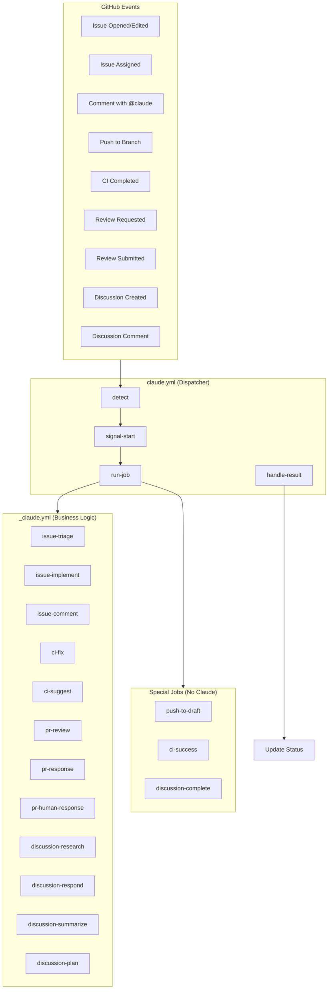
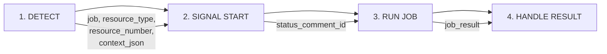
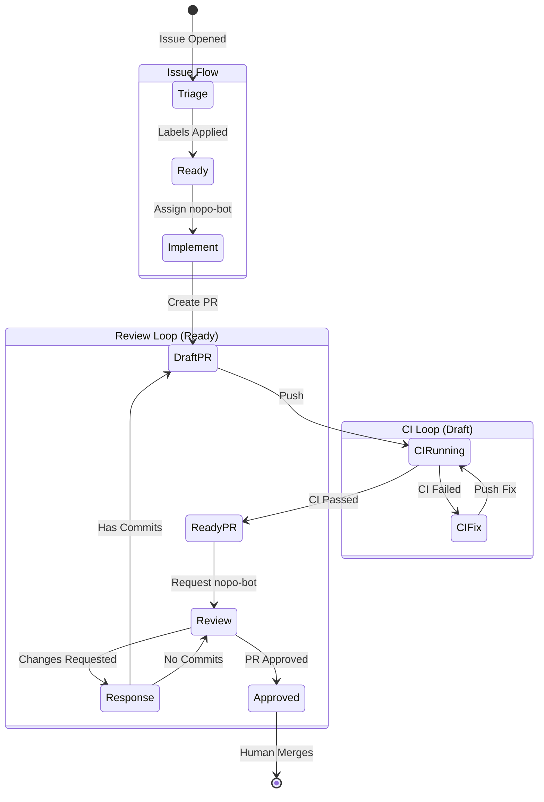
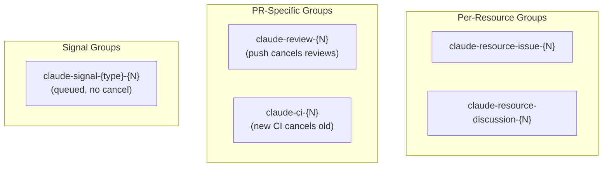

# Claude Automation Architecture

This document describes the fully automated development workflow powered by Claude agents and GitHub Actions.

## High-Level Architecture



## Workflow Files

| File | Purpose |
|------|---------|
| `claude.yml` | **Unified Dispatcher** - Handles ALL triggers, routes to jobs |
| `_claude.yml` | **Business Logic** - Contains all Claude job implementations |
| `_test_claude.yml` | Tests Claude jobs with mock mode |
| `claude-stalled-review.yml` | Scheduled job for stalled PR reviews |

## The 4-Step Processing Pipeline

Every Claude automation event goes through 4 steps:



### Step 1: Detect (`claude-detect-event` action)

Analyzes the GitHub event and determines:
- **job**: Which job to run (or empty if no action needed)
- **resource_type**: `issue`, `pr`, or `discussion`
- **resource_number**: The issue/PR/discussion number
- **comment_id**: If responding to a comment (for reaction)
- **context_json**: All context needed by the job
- **skip**: Whether to skip (e.g., bot author, skip label)

### Step 2: Signal Start (`claude-signal-start` action)

Provides user feedback that work is starting:
- Adds 👀 reaction to triggering comment
- Creates/updates sticky status comment
- Returns `status_comment_id` for later update

### Step 3: Run Job (`_claude.yml`)

Executes the appropriate Claude job with:
- Checkout at correct branch/ref
- Claude prompt execution
- Job-specific post-processing
- Git operations (commit, push)

### Step 4: Handle Result (`claude-handle-result` action)

Updates status based on outcome:
- **Success**: ✅ Updates status comment, adds 🚀 reaction
- **Failure**: ❌ Updates status comment with error details
- **Cancelled**: ⏹️ Updates status comment

## Event-to-Job Mapping

```mermaid
flowchart LR
    subgraph Issues
        I1[opened/edited] --> |no 'triaged' label| J1[issue-triage]
        I2[assigned to nopo-bot] --> J2[issue-implement]
        I3[comment with @claude] --> J3[issue-comment]
    end

    subgraph Push
        P1[push to branch] --> |has open PR| J4[push-to-draft]
    end

    subgraph CI["CI Events"]
        C1[CI failed + Claude PR] --> J5[ci-fix]
        C2[CI failed + Human PR] --> J6[ci-suggest]
        C3[CI passed + Claude PR] --> J7[ci-success]
    end

    subgraph Reviews
        R1[review requested for nopo-bot] --> J8[pr-review]
        R2[claude bot submitted review] --> J9[pr-response]
        R3[human reviewed Claude PR] --> J10[pr-human-response]
    end

    subgraph Discussions
        D1[discussion created] --> J11[discussion-research]
        D2[/summarize command] --> J12[discussion-summarize]
        D3[/plan command] --> J13[discussion-plan]
        D4[/complete command] --> J14[discussion-complete]
        D5[regular comment] --> J15[discussion-respond]
    end
```

## State Machine: Issue → PR → Merge



## Concurrency Strategy

Concurrency groups prevent race conditions:



| Group Pattern | Behavior | Use Case |
|---------------|----------|----------|
| `claude-resource-{type}-{N}` | Queue | Issue/discussion jobs |
| `claude-review-{N}` | Cancel | Push cancels in-flight reviews |
| `claude-ci-{N}` | Cancel | New CI obsoletes old fix attempts |
| `claude-signal-{type}-{N}` | Queue | Status updates must complete |

## Job Descriptions

### Issue Jobs

| Job | Trigger | Action |
|-----|---------|--------|
| `issue-triage` | Issue opened/edited without "triaged" label | Adds labels, sets project fields, creates sub-issues |
| `issue-implement` | Issue assigned to nopo-bot | Creates branch, implements code, opens draft PR |
| `issue-comment` | Comment contains @claude | Answers questions, provides explanations |

### CI Jobs

| Job | Trigger | Action |
|-----|---------|--------|
| `ci-fix` | CI failed on Claude PR | Analyzes failures, fixes code, pushes |
| `ci-suggest` | CI failed on Human PR | Posts review comments with fix suggestions |
| `ci-success` | CI passed on Claude PR | Marks ready, requests nopo-bot review |

### PR Jobs

| Job | Trigger | Action |
|-----|---------|--------|
| `push-to-draft` | Push to branch with open PR | Converts PR to draft (cancels reviews) |
| `pr-review` | nopo-bot requested as reviewer | Reviews code, submits batch review |
| `pr-response` | Claude submitted review | Addresses review comments, pushes fixes |
| `pr-human-response` | Human reviewed Claude PR | Addresses human feedback |

### Discussion Jobs

| Job | Trigger | Action |
|-----|---------|--------|
| `discussion-research` | Discussion created | Spawns research threads with questions |
| `discussion-respond` | Comment on discussion | Investigates and answers |
| `discussion-summarize` | `/summarize` command | Creates comprehensive summary |
| `discussion-plan` | `/plan` command | Creates GitHub issues from discussion |
| `discussion-complete` | `/complete` command | Marks discussion as complete |

## Context JSON Structure

Each job receives context via `context_json`:

```json
{
  "issue-triage": {
    "issue_number": "123",
    "issue_title": "Bug: ...",
    "issue_body": "..."
  },
  "issue-implement": {
    "issue_number": "123",
    "issue_title": "...",
    "issue_body": "...",
    "branch_name": "claude/issue/123",
    "existing_branch": "false"
  },
  "ci-fix": {
    "pr_number": "456",
    "branch_name": "claude/issue/123",
    "failed_jobs": ["build", "test"],
    "run_url": "..."
  },
  "pr-review": {
    "pr_number": "456",
    "branch_name": "claude/issue/123",
    "issue_section": "Fixes #123"
  },
  "discussion-research": {
    "discussion_number": "789",
    "discussion_title": "...",
    "discussion_body": "..."
  }
}
```

## TypeScript Actions

Custom actions in `.github/actions-ts/`:

| Action | Purpose |
|--------|---------|
| `claude-detect-event` | Analyzes GitHub event, determines job and context |
| `claude-signal-start` | Adds reactions, creates status comments |
| `claude-handle-result` | Updates status based on job result |

## Actors

| Actor | Role |
|-------|------|
| **nopo-bot** | Trigger account - assign to issues, request as reviewer |
| **claude[bot]** | AI worker - performs implementations, reviews |
| **Human** | Supervisor - assigns, reviews PRs, merges |

## Required Secrets

| Secret | Purpose |
|--------|---------|
| `CLAUDE_CODE_OAUTH_TOKEN` | OAuth token for Claude Code CLI |
| `PAT_TOKEN` | Personal Access Token for git push (triggers workflows) |
| `PROJECT_TOKEN` | (Optional) PAT for updating GitHub Project fields |

## Testing

### Mock Mode

All jobs support `mock_mode: true` which:
- Skips actual Claude API calls
- Skips git operations
- Allows testing workflow logic in isolation

### Test Workflow

`_test_claude.yml` runs jobs with mock context:

```yaml
uses: ./.github/workflows/_claude.yml
with:
  job: issue-triage
  context_json: '{"issue_number":"99999",...}'
  mock_mode: true
```

### Manual Dispatch

Test specific jobs via workflow_dispatch:

```bash
gh workflow run claude.yml \
  -f job=issue-triage \
  -f resource_number=123 \
  -f context_json='{"issue_number":"123",...}'
```

## How to Use

1. **Create an Issue**: Describe what you want. Claude will triage it automatically.
2. **Assign to nopo-bot**: When ready, assign the issue to `nopo-bot` to trigger implementation.
3. **Wait for PR**: Claude creates a draft PR and fixes CI failures automatically.
4. **Review**: Once CI passes, Claude requests itself as reviewer. Add your own review too.
5. **Iterate**: Use @claude in comments to ask questions or request changes.
6. **Merge**: Once approved, merge the PR.

## Debugging

### Check Workflow Runs

```bash
# List recent Claude runs
gh run list --workflow=claude.yml

# View specific run
gh run view <run-id> --log
```

### Status Comments

Every Claude action creates a status comment on the resource showing:
- Current job being run
- Progress indicator
- Link to workflow run
- Final result (success/failure)

### Skip Automation

Add `skip-dispatch` label to an issue/PR to prevent automation from running.
