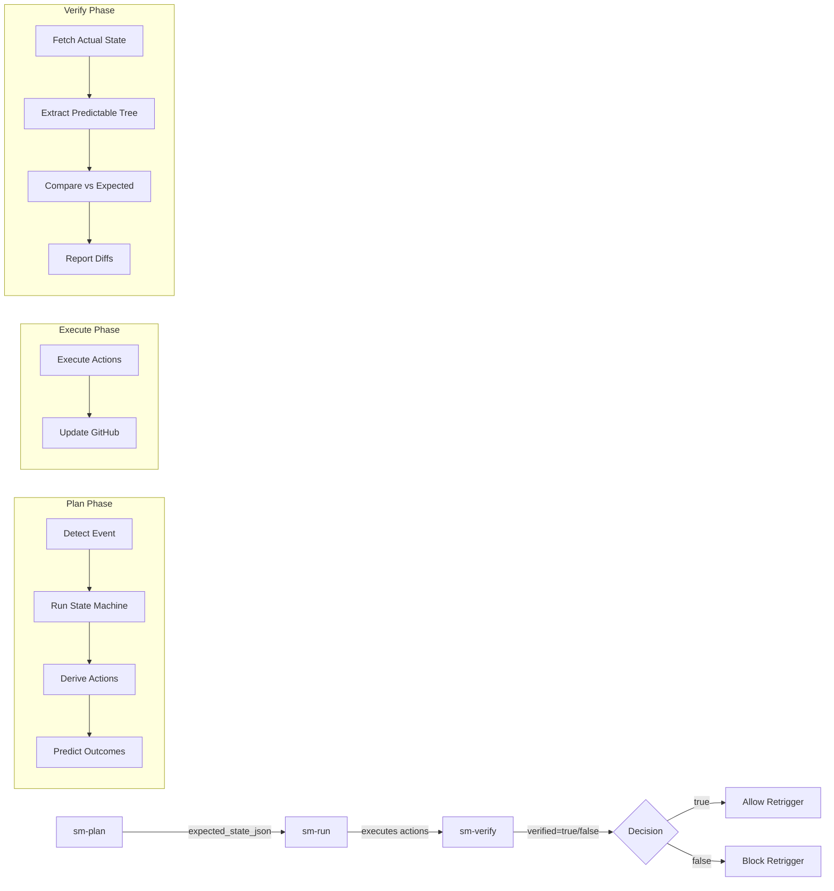

# State Verification System (sm-verify) Architecture

## Overview

The State Verification System implements a prediction-execution-verification loop for the Claude automation state machine. It ensures that state machine actions produce the expected outcomes by comparing predicted state against actual post-execution state.

This system is a critical component in the evolution toward a more reliable and predictable state machine architecture as outlined in `packages/statemachine/ARC.md`.

## Motivation

**Problem**: The state machine modifies GitHub resources (issues, PRs, labels, project fields) through a series of actions. Without verification, there's no programmatic way to detect:
- Actions that failed silently
- Partial state updates
- Divergence between intended and actual state
- Race conditions or timing issues

**Solution**: A three-phase approach:
1. **Plan**: Predict what the state should be after execution
2. **Execute**: Run the state machine actions
3. **Verify**: Compare actual state against predictions

This provides a verification gate that can block retriggers if state diverges, preventing cascading failures.

## Architecture

### Three-Phase Pipeline



### Phase Details

#### 1. Plan Phase (sm-plan action)

**Input**: GitHub event trigger (issue assignment, CI completion, etc.)

**Process**:
1. Parse issue/PR context using `parseIssue()`
2. Run state machine to derive actions
3. Simulate state mutations to predict outcomes
4. Generate union of possible outcome states

**Output**: `expected_state_json` containing:
- `finalState`: Terminal state name
- `outcomes`: Array of `PredictableStateTree` (union of possibilities)
- `timestamp`: When prediction was made
- `trigger`: Trigger type that initiated this run
- `issueNumber`: Current issue being processed
- `parentIssueNumber`: Parent issue if current is a sub-issue

#### 2. Run Phase (sm-run action)

**Input**: Derived actions from sm-plan

**Process**:
1. Execute actions sequentially or in phases
2. Make GitHub API calls (create PRs, add labels, update fields, etc.)
3. Commit and push code changes

**Output**: Modified GitHub resources

#### 3. Verify Phase (sm-verify action)

**Input**:
- `expected_state_json` from sm-plan
- `github_token` for fetching current state
- `project_number` for project field lookups

**Process**:
1. Fetch actual post-execution state via `parseIssue()`
2. Extract `PredictableStateTree` from actual state
3. Compare against each expected outcome (union-aware)
4. Generate field-level diffs for best match

**Output**:
- `verified`: Boolean string ("true" or "false")
- `diff_json`: Structured diff showing mismatches

## Core Data Structures

### PredictableStateTree

The state tree captures the hierarchical structure of parent issue + sub-issues:

```typescript
interface PredictableStateTree {
  issue: PredictableIssueState;        // Root issue (parent or standalone)
  subIssues: PredictableSubIssueState[]; // All sub-issues (empty if no phasing)
}
```

**Design principles**:
- **Extractable**: Can be derived from both actual GitHub state and simulated mutations
- **Verifiable**: Contains only fields that can be reliably predicted
- **Complete**: Includes all state that actions might modify

### PredictableIssueState

Captures the verifiable state of an issue:

```typescript
interface PredictableIssueState {
  number: number;
  state: "open" | "closed";
  projectStatus: ProjectStatus | null;
  iteration: number;
  failures: number;
  labels: string[];
  assignees: string[];
  hasBranch: boolean;
  hasPR: boolean;
  pr: PredictablePRState | null;
  body: ParentIssueBodyStructure;
}
```

**Key fields**:
- `iteration`, `failures`: Tracked in issue body HTML comment
- `projectStatus`: GitHub Project field value
- `hasBranch`, `hasPR`: Boolean flags (not full branch/PR data)
- `body`: Structured representation of issue body sections

### PredictableSubIssueState

Similar to parent issue but without `iteration`, `failures`, `assignees`:

```typescript
interface PredictableSubIssueState {
  number: number;
  state: "open" | "closed";
  projectStatus: ProjectStatus | null;
  labels: string[];
  hasBranch: boolean;
  hasPR: boolean;
  pr: PredictablePRState | null;
  body: SubIssueBodyStructure;
}
```

### Body Structures

Issue bodies are parsed into structured AST and then extracted to:

**SubIssueBodyStructure**:
```typescript
{
  hasDescription: boolean;
  hasTodos: boolean;
  hasHistory: boolean;
  hasAgentNotes: boolean;
  hasQuestions: boolean;
  hasAffectedAreas: boolean;
  todoStats: { total, completed, uncheckedNonManual };
  questionStats: { total, answered };
  historyEntries: { iteration, phase, action }[];
}
```

**ParentIssueBodyStructure**: Extends SubIssueBodyStructure with:
```typescript
{
  hasRequirements: boolean;
  hasApproach: boolean;
  hasAcceptanceCriteria: boolean;
  hasTesting: boolean;
  hasRelated: boolean;
}
```

## Comparison Engine

### Union-Aware Comparison

The state machine can produce multiple valid outcomes (e.g., "iterate" vs "complete" depending on CI result). The comparison engine handles this via union semantics:

```typescript
function compareStateTree(
  expected: PredictableStateTree[],  // Union of outcomes
  actual: PredictableStateTree
): VerifyResult {
  // Passes if ANY expected outcome matches actual
  // Returns best match (fewest diffs) for diagnostics
}
```

### Comparison Rules

Different fields use different comparison strategies:

| Field Type | Rule | Rationale |
|------------|------|-----------|
| `state`, `projectStatus` | Exact match | Must be precisely predicted |
| `iteration` | `actual >= expected` | May increment multiple times |
| `failures` | Exact OR 0 | Can be cleared by success |
| `labels`, `assignees` | Superset (`expected ⊆ actual`) | Other actors may add labels |
| `hasBranch`, `hasPR` | If expected=true, actual=true | Can't predict deletion |
| `todoStats.total` | `actual >= expected` | Todos may be added |
| `todoStats.completed` | `actual >= expected` | May complete more than predicted |
| `historyEntries` | Contains expected entries | May have additional entries |

**Rationale**: The rules accommodate:
- Multiple iterations per trigger
- External actors (humans, other bots)
- Non-deterministic action ordering
- Agent-driven content additions

### Field Diffs

When verification fails, detailed diffs are provided:

```typescript
interface FieldDiff {
  path: string;                    // e.g., "issue.labels" or "subIssues[123].body.hasHistory"
  expected: unknown;
  actual: unknown;
  comparison: "exact" | "superset" | "gte" | "lte" | "history_entry";
}
```

Example diff output:
```json
{
  "path": "issue.projectStatus",
  "expected": "In Progress",
  "actual": "Backlog",
  "comparison": "exact"
}
```

## State Mutators

Mutators define how actions transform state. Organized by domain:

| Domain | File | Actions |
|--------|------|---------|
| **Iteration** | `iteration.ts` | Increment iteration, record CI result |
| **Orchestration** | `orchestration.ts` | Create sub-issues, update phase status |
| **Review** | `review.ts` | Request reviewer, convert draft/ready |
| **Control** | `control.ts` | Block retrigger, record failures |
| **Logging** | `logging.ts` | Add history entries, agent notes |
| **Terminal** | `terminal.ts` | Close issue, mark complete |
| **AI-Dependent** | `ai-dependent.ts` | Actions that depend on Claude output (add todos, questions) |

**Example mutator** (simplified):

```typescript
export const incrementIteration: Mutator = (tree) => {
  return produce(tree, (draft) => {
    draft.issue.iteration += 1;
    draft.issue.body.historyEntries.push({
      iteration: draft.issue.iteration,
      phase: "iterate",
      action: "🔄 Started iteration"
    });
  });
};
```

Mutators use **immer** for immutable updates and compose via function chaining.

## Integration with Workflows

### GitHub Actions Flow

```yaml
# .github/workflows/sm-runner.yml
jobs:
  plan:
    steps:
      - uses: packages/statemachine/actions/sm-plan
        id: plan
        # Outputs: expected_state_json, actions_json

  run:
    needs: plan
    steps:
      - uses: packages/statemachine/actions/sm-run
        with:
          actions_json: ${{ steps.plan.outputs.actions_json }}

  verify:
    needs: [plan, run]
    steps:
      - uses: packages/statemachine/actions/sm-verify
        id: verify
        with:
          expected_state_json: ${{ steps.plan.outputs.expected_state_json }}
      # Outputs: verified, diff_json

  decide:
    needs: verify
    if: steps.verify.outputs.verified == 'false'
    steps:
      - name: Block retrigger
        run: |
          echo "::error::State verification failed"
          echo "${{ steps.verify.outputs.diff_json }}"
          exit 1
```

### Retrigger Gating

The verification result controls whether the state machine can retrigger:

- **verified=true**: Allow `issues:edited` to retrigger iteration
- **verified=false**: Block retrigger, log failure to issue history

This prevents cascading failures when the state machine enters an inconsistent state.

## Constants and Shared Schemas

To support verification, shared constants were extracted to `packages/statemachine/src/constants.ts`:

### History Icons
```typescript
export const HISTORY_ICONS = {
  START: "🚀",
  ITERATE: "🔄",
  SUCCESS: "✅",
  FAILURE: "❌",
  BLOCKED: "🚫",
  // ... etc
} as const;
```

### History Messages
```typescript
export const HISTORY_MESSAGES = {
  startIteration: (iter: number) => `Started iteration ${iter}`,
  recordCIFailure: () => "CI failed",
  // ... etc
};
```

### Section Names
```typescript
export const SECTION_NAMES = {
  DESCRIPTION: "Description",
  TODO: "Todo",
  HISTORY: "Iteration History",
  AGENT_NOTES: "Agent Notes",
  // ... etc
} as const;
```

These constants ensure consistency between:
- Action execution (creating history entries)
- State prediction (simulating history entries)
- State extraction (parsing history entries)

## Test Infrastructure

### Scenario-Based Testing

Test scenarios live in `packages/statemachine/actions/sm-test-runner/fixtures/scenarios/`:

**Example**: `grooming-with-subissues`
```
01-detecting/
  issue-6122.json          # Input: Issue before grooming
  expected-state.json      # Output: Predicted state
02-grooming/
  issue-6122.json          # Input: Issue after grooming
  sub-6124.json            # Phase 1 sub-issue
  sub-6125.json            # Phase 2 sub-issue
  sub-6126.json            # Phase 3 sub-issue
  expected-state.json      # Output: Predicted next state
```

Each scenario tests:
1. **State derivation**: Does sm-plan predict correct actions?
2. **State prediction**: Are predicted outcomes accurate?
3. **State verification**: Does sm-verify correctly compare states?

### Test Commands

```bash
# Run state machine tests
nopo test statemachine

# Test specific scenario
nopo test statemachine --scenario grooming-with-subissues

# Verify comparison logic
nopo test statemachine --unit compare
```

## Error Handling and Debugging

### Verification Failures

When verification fails, the diff output provides diagnostics:

```json
{
  "pass": false,
  "matchedOutcomeIndex": null,
  "bestMatch": {
    "outcomeIndex": 0,
    "diffs": [
      {
        "path": "issue.projectStatus",
        "expected": "In Progress",
        "actual": "Backlog",
        "comparison": "exact"
      },
      {
        "path": "issue.body.historyEntries[iter=1,phase=iterate]",
        "expected": "🔄 Started iteration",
        "actual": ["🚀 Created PR"],
        "comparison": "history_entry"
      }
    ]
  }
}
```

**Debugging steps**:
1. Check `bestMatch.diffs` for specific field mismatches
2. Review workflow logs for sm-run errors
3. Verify mutators are correctly applied in sm-plan
4. Check for timing issues (e.g., GitHub API delays)

### Common Failure Modes

| Failure | Cause | Fix |
|---------|-------|-----|
| Missing history entry | Mutator not called | Add mutator to action sequence |
| Project status mismatch | GitHub Project API delay | Retry or relax comparison |
| Iteration too high | Multiple rapid triggers | Expected behavior, adjust prediction |
| Labels missing | External actor removed label | Use superset comparison |

## Future Enhancements

### Planned Improvements

1. **Retry Logic**: Automatically retry verification after a delay if GitHub API lag suspected
2. **Partial Verification**: Allow some fields to be marked "non-critical" and not block retrigger
3. **Diff History**: Track verification failures over time to identify flaky checks
4. **Action Rollback**: If verification fails, attempt to rollback state changes
5. **Prediction Confidence**: Attach confidence scores to predictions, skip verification for low-confidence outcomes

### Evolution Toward Full State Machine

This verification system is Phase 1 of the architecture outlined in `ARC.md`:

**Current** (sm-verify):
- Verification as separate action (sm-plan → sm-run → sm-verify)
- Operates on existing issue/discussion workflows
- Manual retrigger gating

**Future** (full state machine):
- Integrated verify step in single action (`run → verify → retrigger` loop)
- Single input: machine type (issue | discussion)
- Structured phases for concurrent execution
- Automatic verification-based retrigger decisions

The sm-verify system provides the foundation for this evolution by:
- Establishing predictable state schemas
- Validating the mutator model
- Proving the union-aware comparison approach
- Demonstrating verification-gated control flow

## References

### Key Files

- **Core Types**: `packages/statemachine/src/verify/predictable-state.ts`
- **Comparison Engine**: `packages/statemachine/src/verify/compare.ts`
- **Mutators**: `packages/statemachine/src/verify/mutators/`
- **Action**: `packages/statemachine/actions/sm-verify/`
- **Constants**: `packages/statemachine/src/constants.ts`
- **Architecture Vision**: `packages/statemachine/ARC.md`

### Related Documentation

- **State Machine Overview**: `docs/automation/ARCHITECTURE.md`
- **Issue State Schema**: `packages/issue-state/`
- **Parser**: `packages/statemachine/src/parser/`
- **Test Scenarios**: `packages/statemachine/actions/sm-test-runner/fixtures/scenarios/`

---

**Document Version**: 1.0
**Last Updated**: 2026-02-11
**Issue**: #6122 Phase 1
