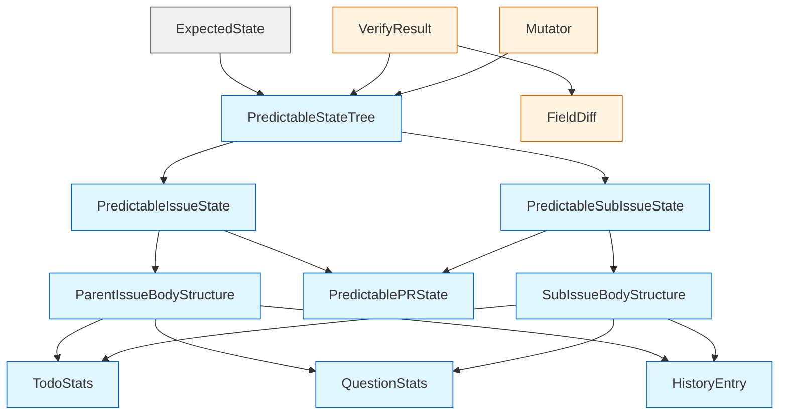

# State Verification System - Interface Definitions

This document defines the key interfaces for the state verification system (sm-verify).

## Overview

The verification system operates on three main interface categories:
1. **State Schemas** - What can be verified
2. **Comparison Interfaces** - How states are compared
3. **Action Interfaces** - GitHub Action inputs/outputs

## 1. State Schemas

### PredictableStateTree

The root data structure representing the complete verifiable state of an issue tree.

```typescript
interface PredictableStateTree {
  /**
   * The root issue (parent if there are sub-issues, otherwise the current issue).
   * Contains all state that can be predicted and verified.
   */
  issue: PredictableIssueState;

  /**
   * All sub-issues belonging to the root issue.
   * Empty array if the issue has no phased sub-issues.
   */
  subIssues: PredictableSubIssueState[];
}
```

**Usage contexts**:
- **sm-plan**: Outputs array of possible outcome trees (union)
- **sm-verify**: Compares actual tree against expected trees
- **Mutators**: Transform trees to predict state changes

---

### PredictableIssueState

Complete state for a parent issue or standalone issue.

```typescript
interface PredictableIssueState {
  /**
   * GitHub issue number.
   */
  number: number;

  /**
   * Issue state: "open" or "closed".
   * Terminal actions close issues.
   */
  state: "open" | "closed";

  /**
   * GitHub Project status field.
   * Maps to project column (e.g., "Backlog", "In Progress", "Done").
   * Null if not in a project.
   */
  projectStatus: ProjectStatus | null;

  /**
   * Current iteration number.
   * Stored in issue body HTML comment, incremented each iteration.
   */
  iteration: number;

  /**
   * Consecutive failure count.
   * Resets on success, triggers circuit breaker at max.
   */
  failures: number;

  /**
   * Issue labels (array of label names).
   * Used for type, priority, topic, and control labels.
   */
  labels: string[];

  /**
   * Assigned users (array of GitHub usernames).
   * Includes nopo-bot when automation is active.
   */
  assignees: string[];

  /**
   * Whether a git branch exists for this issue.
   * Format: claude/issue/{number}
   */
  hasBranch: boolean;

  /**
   * Whether a pull request exists.
   */
  hasPR: boolean;

  /**
   * Pull request state (if hasPR=true).
   * Null if no PR exists.
   */
  pr: PredictablePRState | null;

  /**
   * Structured representation of the issue body.
   * Includes section flags, todos, history, etc.
   */
  body: ParentIssueBodyStructure;
}
```

**Field sources**:
- `number`, `state`, `labels`, `assignees`: GitHub Issues API
- `projectStatus`: GitHub Projects API
- `iteration`, `failures`: Parsed from issue body HTML comment
- `hasBranch`: Git branch existence check
- `hasPR`, `pr`: GitHub Pull Requests API
- `body`: Parsed from issue body markdown AST

---

### PredictableSubIssueState

State for a sub-issue (phase of a larger parent issue).

```typescript
interface PredictableSubIssueState {
  /**
   * GitHub issue number.
   */
  number: number;

  /**
   * Issue state: "open" or "closed".
   */
  state: "open" | "closed";

  /**
   * GitHub Project status field.
   * Sub-issues use statuses like "Ready", "Working", "Review", "Done".
   */
  projectStatus: ProjectStatus | null;

  /**
   * Issue labels.
   * Typically inherit parent labels plus phase-specific labels.
   */
  labels: string[];

  /**
   * Whether a git branch exists.
   * Format: claude/issue/{parent-number}/phase-{N}
   */
  hasBranch: boolean;

  /**
   * Whether a pull request exists.
   */
  hasPR: boolean;

  /**
   * Pull request state (if hasPR=true).
   */
  pr: PredictablePRState | null;

  /**
   * Structured representation of the sub-issue body.
   * Simpler than parent (no requirements/approach sections).
   */
  body: SubIssueBodyStructure;
}
```

**Differences from PredictableIssueState**:
- No `iteration` or `failures` (only parent tracks this)
- No `assignees` (sub-issues are not assigned, parent is)
- Simpler `body` structure

---

### PredictablePRState

Minimal verifiable state for a pull request.

```typescript
interface PredictablePRState {
  /**
   * Whether the PR is in draft mode.
   * Draft = still iterating (CI fixes)
   * Ready = requesting review
   */
  isDraft: boolean;

  /**
   * PR state: "open", "closed", or "merged".
   * Most PRs stay "open" until human merges.
   */
  state: "open" | "closed" | "merged";
}
```

**Rationale**: We only track draft/ready status and merge state, not detailed PR content (title, description, commits) which are not predicted.

---

### ParentIssueBodyStructure

Structured representation of a parent issue's body.

```typescript
interface ParentIssueBodyStructure {
  // ============= Section Flags (Parent-specific) =============

  /**
   * Whether the issue has a "Requirements" section.
   * Added by triage for complex features.
   */
  hasRequirements: boolean;

  /**
   * Whether the issue has an "Approach" section.
   * Added by triage to describe implementation strategy.
   */
  hasApproach: boolean;

  /**
   * Whether the issue has an "Acceptance Criteria" section.
   * Defines what "done" means for this issue.
   */
  hasAcceptanceCriteria: boolean;

  /**
   * Whether the issue has a "Testing" section.
   * Describes test plan and coverage.
   */
  hasTesting: boolean;

  /**
   * Whether the issue has a "Related Issues" section.
   * Links to dependencies or related work.
   */
  hasRelated: boolean;

  // ============= Section Flags (Common to all issues) =============

  /**
   * Whether the issue has a "Description" section.
   * Present in all issues (created by user or triage).
   */
  hasDescription: boolean;

  /**
   * Whether the issue has a "Todo" section.
   * Added by iteration or orchestration agents.
   */
  hasTodos: boolean;

  /**
   * Whether the issue has an "Iteration History" section.
   * Added after first iteration, tracks progress.
   */
  hasHistory: boolean;

  /**
   * Whether the issue has an "Agent Notes" section.
   * Added by agents to record insights for future iterations.
   */
  hasAgentNotes: boolean;

  /**
   * Whether the issue has a "Questions" section.
   * Added by agents when they need clarification.
   */
  hasQuestions: boolean;

  /**
   * Whether the issue has an "Affected Areas" section.
   * Added by triage to list files/modules touched.
   */
  hasAffectedAreas: boolean;

  // ============= Todo Statistics =============

  /**
   * Statistics about todos (if hasTodos=true).
   */
  todoStats: {
    /**
     * Total number of todo items.
     */
    total: number;

    /**
     * Number of checked-off (completed) todos.
     */
    completed: number;

    /**
     * Number of unchecked todos that are NOT marked [Manual].
     * Used to determine if iteration is complete.
     */
    uncheckedNonManual: number;
  } | null;

  // ============= Question Statistics =============

  /**
   * Statistics about questions (if hasQuestions=true).
   */
  questionStats: {
    /**
     * Total number of questions asked.
     */
    total: number;

    /**
     * Number of questions with answers (marked [Answered]).
     */
    answered: number;
  } | null;

  // ============= History Entries =============

  /**
   * Parsed iteration history entries.
   * Each entry represents a significant state transition.
   */
  historyEntries: Array<{
    /**
     * Iteration number when this event occurred.
     */
    iteration: number;

    /**
     * Phase name (e.g., "iterate", "review", "orchestrate").
     */
    phase: string;

    /**
     * Action description (e.g., "🔄 Started iteration", "✅ CI passed").
     */
    action: string;
  }>;
}
```

**Body parsing**:
- Markdown AST is parsed by `packages/statemachine/src/parser/`
- Section headings are matched against `SECTION_NAMES` constants
- Todos and questions are extracted with regex patterns
- History table is parsed as markdown table

---

### SubIssueBodyStructure

Simplified body structure for sub-issues.

```typescript
interface SubIssueBodyStructure {
  // All the "common" fields from ParentIssueBodyStructure:
  hasDescription: boolean;
  hasTodos: boolean;
  hasHistory: boolean;
  hasAgentNotes: boolean;
  hasQuestions: boolean;
  hasAffectedAreas: boolean;

  todoStats: {
    total: number;
    completed: number;
    uncheckedNonManual: number;
  } | null;

  questionStats: {
    total: number;
    answered: number;
  } | null;

  historyEntries: Array<{
    iteration: number;
    phase: string;
    action: string;
  }>;
}
```

**Omitted fields** (parent-only):
- `hasRequirements`
- `hasApproach`
- `hasAcceptanceCriteria`
- `hasTesting`
- `hasRelated`

---

### ExpectedState

Wrapper for expected state with metadata.

```typescript
interface ExpectedState {
  /**
   * The terminal state name reached by sm-plan.
   * Examples: "complete", "waiting_manual", "blocked"
   */
  finalState: string;

  /**
   * Array of possible outcome state trees (union).
   * sm-verify passes if actual matches ANY of these.
   */
  outcomes: PredictableStateTree[];

  /**
   * ISO timestamp when this prediction was made.
   */
  timestamp: string;

  /**
   * Trigger type that initiated this run.
   * Examples: "assigned", "ci_completed", "review_requested"
   */
  trigger: string;

  /**
   * Issue number being processed.
   */
  issueNumber: number;

  /**
   * Parent issue number (if current issue is a sub-issue).
   * Null if current issue is standalone or parent.
   */
  parentIssueNumber: number | null;
}
```

**Usage**:
- **sm-plan**: Outputs this as JSON
- **sm-verify**: Parses this to get expected outcomes
- **Debugging**: Logged to workflow artifacts for troubleshooting

---

## 2. Comparison Interfaces

### VerifyResult

Result of comparing expected vs actual state.

```typescript
interface VerifyResult {
  /**
   * Whether verification passed.
   * True if actual state matches ANY expected outcome.
   */
  pass: boolean;

  /**
   * Index of the matched outcome (if pass=true).
   * Null if verification failed.
   */
  matchedOutcomeIndex: number | null;

  /**
   * Best match for diagnostics.
   * If pass=false, this is the outcome with fewest diffs.
   */
  bestMatch: {
    /**
     * Index of the outcome that was closest to actual.
     */
    outcomeIndex: number;

    /**
     * Array of field-level differences.
     * Empty if pass=true.
     */
    diffs: FieldDiff[];
  };
}
```

**Example (success)**:
```typescript
{
  pass: true,
  matchedOutcomeIndex: 1,  // Matched second outcome
  bestMatch: {
    outcomeIndex: 1,
    diffs: []
  }
}
```

**Example (failure)**:
```typescript
{
  pass: false,
  matchedOutcomeIndex: null,
  bestMatch: {
    outcomeIndex: 0,  // Closest to first outcome
    diffs: [
      {
        path: "issue.projectStatus",
        expected: "In Progress",
        actual: "Backlog",
        comparison: "exact"
      }
    ]
  }
}
```

---

### FieldDiff

A single field mismatch between expected and actual state.

```typescript
interface FieldDiff {
  /**
   * JSON path to the mismatched field.
   * Examples:
   * - "issue.state"
   * - "issue.labels"
   * - "subIssues[123].body.hasTodos"
   * - "issue.body.historyEntries[iter=1,phase=iterate]"
   */
  path: string;

  /**
   * Expected value (from prediction).
   */
  expected: unknown;

  /**
   * Actual value (from GitHub).
   */
  actual: unknown;

  /**
   * Comparison type used for this field.
   * Determines the semantics of "match".
   */
  comparison: "exact" | "superset" | "gte" | "lte" | "history_entry";
}
```

**Comparison types**:

| Type | Meaning | Example |
|------|---------|---------|
| `exact` | Values must be identical | `state: "open"` vs `"closed"` |
| `superset` | Expected is subset of actual | `labels: ["bug"] ⊆ ["bug", "priority:high"]` |
| `gte` | Actual must be ≥ expected | `iteration: 2 >= 1` |
| `lte` | Actual must be ≤ expected | `uncheckedTodos: 0 <= 5` |
| `history_entry` | Expected entry must exist in actual | History entry with (iter=1, phase=iterate) |

---

### Mutator Function

Function signature for state mutations (used in predictions).

```typescript
type Mutator = (tree: PredictableStateTree) => PredictableStateTree;
```

**Usage**:
```typescript
// Example: Increment iteration and add history entry
const incrementIteration: Mutator = (tree) => {
  return produce(tree, (draft) => {
    draft.issue.iteration += 1;
    draft.issue.body.historyEntries.push({
      iteration: draft.issue.iteration,
      phase: "iterate",
      action: "🔄 Started iteration"
    });
  });
};
```

**Composition**:
```typescript
// Apply multiple mutators in sequence
const finalTree = mutators.reduce(
  (tree, mutator) => mutator(tree),
  initialTree
);
```

**Categories of mutators**:
- **Iteration**: `incrementIteration`, `recordCIResult`
- **Orchestration**: `createSubIssues`, `updatePhaseStatus`
- **Review**: `requestReviewer`, `convertToDraft`
- **Control**: `blockRetrigger`, `recordFailure`
- **Logging**: `addHistoryEntry`, `addAgentNotes`
- **Terminal**: `closeIssue`, `markComplete`

---

## 3. GitHub Action Interfaces

### sm-plan Inputs/Outputs

**Inputs**:
```yaml
inputs:
  github_token:
    description: GitHub token for API operations
    required: true
  issue_number:
    description: Issue number to process
    required: true
  trigger_type:
    description: Event trigger type (assigned, ci_completed, etc.)
    required: true
  project_number:
    description: GitHub Project number
    required: false
    default: "1"
```

**Outputs**:
```yaml
outputs:
  expected_state_json:
    description: JSON-encoded ExpectedState object
  actions_json:
    description: JSON-encoded array of actions to execute
  final_state:
    description: Terminal state name (for control flow)
```

---

### sm-run Inputs

**Inputs**:
```yaml
inputs:
  github_token:
    description: GitHub token for API operations
    required: true
  actions_json:
    description: JSON-encoded array of actions from sm-plan
    required: true
  nopo_bot_pat:
    description: nopo-bot PAT for git operations
    required: true
```

**Outputs**: None (modifies GitHub state directly)

---

### sm-verify Inputs/Outputs

**Inputs**:
```yaml
inputs:
  github_token:
    description: GitHub token for API operations (fetch current issue state)
    required: true
  expected_state_json:
    description: Predicted post-run state JSON from sm-plan
    required: true
  project_number:
    description: GitHub Project number (for fetching project fields)
    required: false
    default: "1"
```

**Outputs**:
```yaml
outputs:
  verified:
    description: Whether the actual state matches any expected outcome (true/false string)
  diff_json:
    description: Structured diff JSON showing mismatches (empty object if verified)
```

**Example outputs**:

Success:
```yaml
verified: "true"
diff_json: "{}"
```

Failure:
```yaml
verified: "false"
diff_json: |
  {
    "pass": false,
    "matchedOutcomeIndex": null,
    "bestMatch": {
      "outcomeIndex": 0,
      "diffs": [
        {
          "path": "issue.projectStatus",
          "expected": "In Progress",
          "actual": "Backlog",
          "comparison": "exact"
        }
      ]
    }
  }
```

---

## 4. Type Relationships

### Dependency Graph



### Type Hierarchy

```
ExpectedState (top-level wrapper)
└── PredictableStateTree[] (union of outcomes)
    ├── PredictableIssueState (root issue)
    │   ├── ParentIssueBodyStructure
    │   │   ├── TodoStats
    │   │   ├── QuestionStats
    │   │   └── HistoryEntry[]
    │   └── PredictablePRState?
    └── PredictableSubIssueState[] (sub-issues)
        ├── SubIssueBodyStructure
        │   ├── TodoStats
        │   ├── QuestionStats
        │   └── HistoryEntry[]
        └── PredictablePRState?
```

---

## 5. Zod Schemas

All interfaces have corresponding Zod schemas for runtime validation:

```typescript
// From packages/statemachine/src/verify/predictable-state.ts
export const PredictableStateTreeSchema = z.object({
  issue: PredictableIssueStateSchema,
  subIssues: z.array(PredictableSubIssueStateSchema),
});

export const PredictableIssueStateSchema = z.object({
  number: z.number().int().positive(),
  state: IssueStateSchema,
  projectStatus: ProjectStatusSchema.nullable(),
  iteration: z.number().int().min(0),
  failures: z.number().int().min(0),
  labels: z.array(z.string()),
  assignees: z.array(z.string()),
  hasBranch: z.boolean(),
  hasPR: z.boolean(),
  pr: PredictablePRStateSchema.nullable(),
  body: ParentIssueBodyStructureSchema,
});

// ... etc
```

**Usage**:
```typescript
// Parse and validate at runtime
const tree = PredictableStateTreeSchema.parse(jsonData);

// Type-safe extraction
const expected = ExpectedStateSchema.parse(expectedStateJson);
```

---

## 6. Key Functions

### extractPredictableTree

Extract a predictable state tree from a MachineContext.

```typescript
function extractPredictableTree(
  context: MachineContext
): PredictableStateTree;
```

**Logic**:
- If `context.parentIssue` exists → current is sub-issue, parent is root
- Otherwise → current issue is root

**Usage**:
```typescript
// In sm-verify
const context = await parseIssue(issueNumber);
const actualTree = extractPredictableTree(context);
```

---

### buildExpectedState

Build an ExpectedState object from sm-plan results.

```typescript
function buildExpectedState(options: {
  finalState: string;
  outcomes: PredictableStateTree[];
  trigger: TriggerType;
  issueNumber: number;
  parentIssueNumber: number | null;
}): ExpectedState;
```

**Usage**:
```typescript
// In sm-plan
const expected = buildExpectedState({
  finalState: "complete",
  outcomes: [outcomeTree1, outcomeTree2],
  trigger: "ci_completed",
  issueNumber: 123,
  parentIssueNumber: null,
});

core.setOutput("expected_state_json", JSON.stringify(expected));
```

---

### compareStateTree

Compare expected state trees against actual state.

```typescript
function compareStateTree(
  expected: PredictableStateTree[],  // Union of outcomes
  actual: PredictableStateTree
): VerifyResult;
```

**Logic**:
- Try each expected outcome tree
- Return first exact match (pass=true)
- If no match, return best match (fewest diffs)

**Usage**:
```typescript
// In sm-verify
const result = compareStateTree(
  expectedState.outcomes,
  actualTree
);

core.setOutput("verified", result.pass.toString());
core.setOutput("diff_json", JSON.stringify(result));
```

---

## 7. Integration Example

Complete workflow integration:

```typescript
// ============= sm-plan =============
import { parseIssue } from "@more/issue-state";
import { runStateMachine } from "./state-machine.js";
import { extractPredictableTree, buildExpectedState } from "./verify/predictable-state.js";

// 1. Parse current state
const context = await parseIssue(issueNumber);

// 2. Run state machine to get actions
const result = runStateMachine(context, trigger);

// 3. Predict outcomes by applying mutators
const outcomes = result.possibleOutcomes.map(mutations => {
  let tree = extractPredictableTree(context);
  for (const mutator of mutations) {
    tree = mutator(tree);
  }
  return tree;
});

// 4. Build expected state
const expected = buildExpectedState({
  finalState: result.finalState,
  outcomes,
  trigger,
  issueNumber: context.issue.number,
  parentIssueNumber: context.parentIssue?.number ?? null,
});

core.setOutput("expected_state_json", JSON.stringify(expected));

// ============= sm-run =============
// (executes actions, modifies GitHub state)

// ============= sm-verify =============
import { compareStateTree } from "./verify/compare.js";

// 1. Parse expected state
const expected = JSON.parse(expectedStateJson);

// 2. Fetch actual state
const actualContext = await parseIssue(expected.issueNumber);
const actualTree = extractPredictableTree(actualContext);

// 3. Compare
const result = compareStateTree(expected.outcomes, actualTree);

core.setOutput("verified", result.pass.toString());
core.setOutput("diff_json", JSON.stringify(result));
```

---

## Summary

The state verification system provides:

1. **Predictable State Schemas**: Capture verifiable issue/PR state
2. **Comparison Engine**: Union-aware, field-specific comparison rules
3. **Mutators**: Composable state transformations for prediction
4. **GitHub Actions**: sm-plan → sm-run → sm-verify pipeline
5. **Error Diagnostics**: Field-level diffs for debugging failures

These interfaces form a complete verification framework that can:
- Predict state changes before execution
- Verify actual outcomes match predictions
- Gate retriggers on verification success
- Provide detailed diagnostics on failures

This enables reliable, observable state machine automation with verification as a first-class concern.
