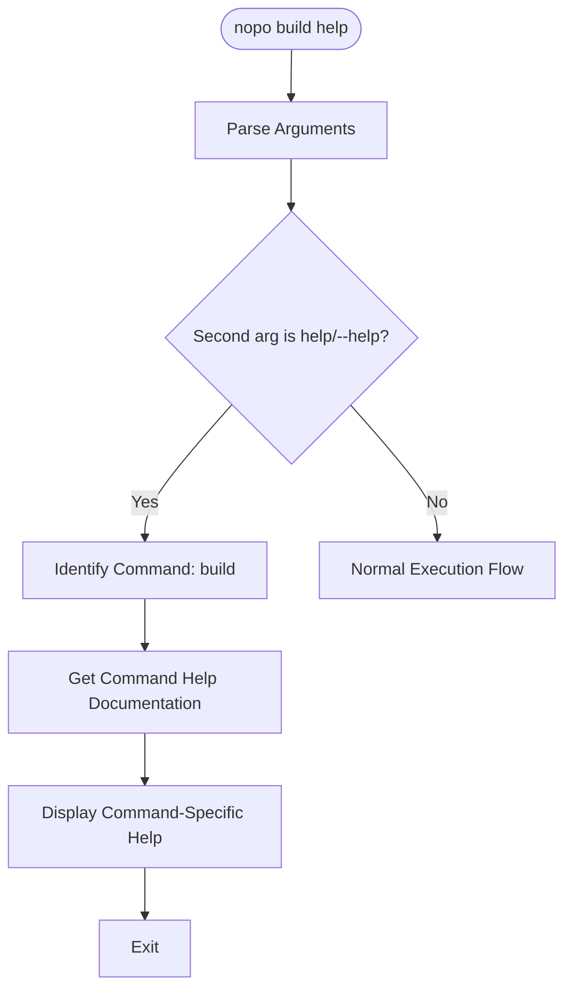
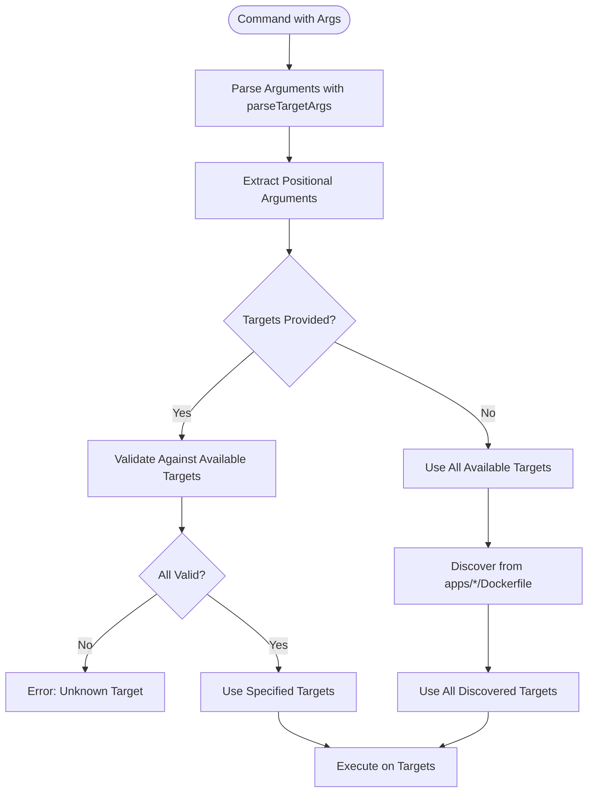
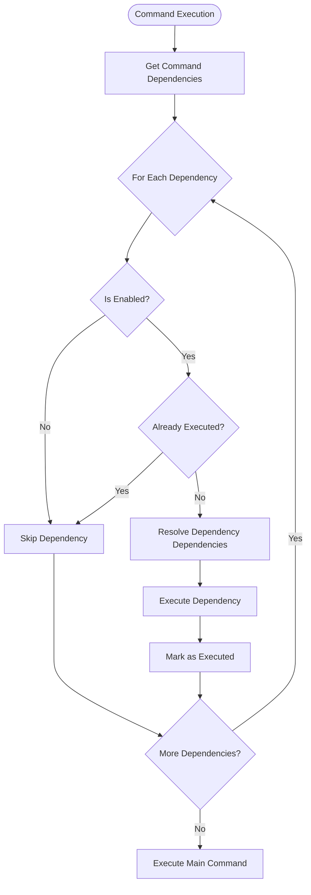
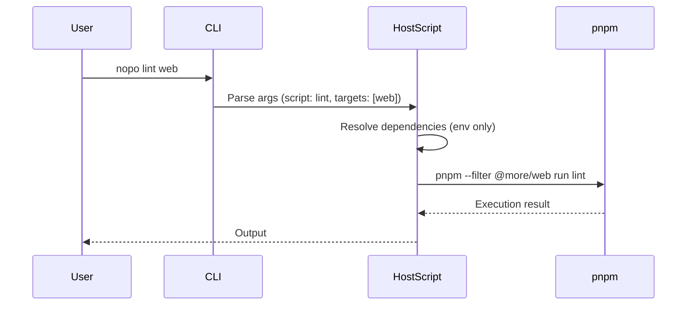
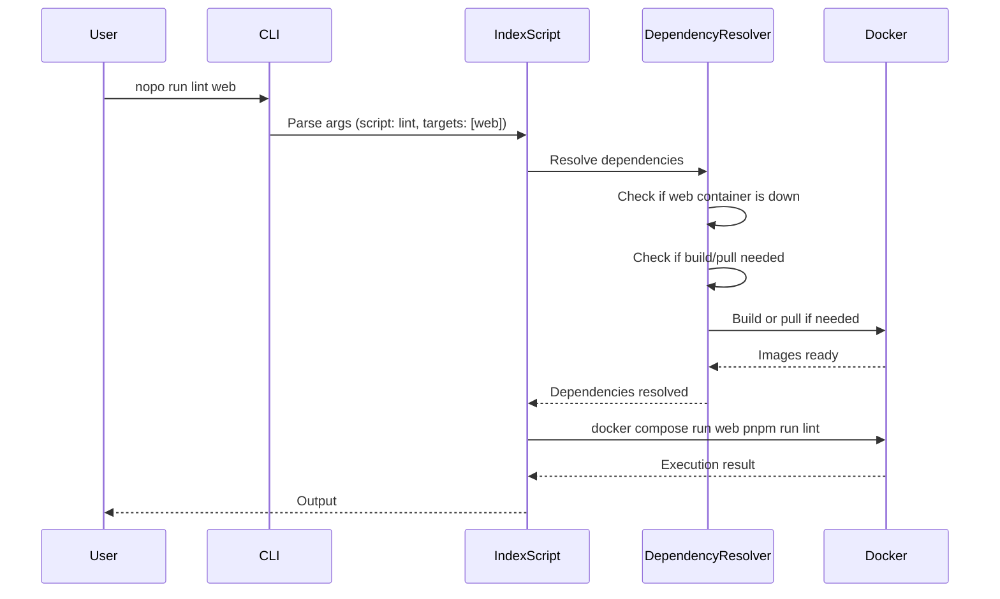
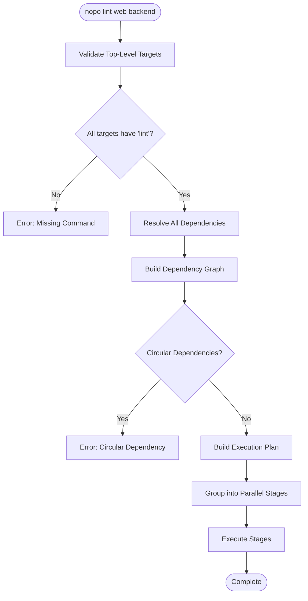

# CLI Architecture

## Overview

The Nopo CLI uses a unified command routing system that supports both **script classes** (built-in commands like `build`, `up`, `down`) and **arbitrary commands** (any pnpm script like `lint`, `test`, `dev`). Both types of commands share the same dependency resolution and target resolution algorithms.

## Command Routing

The CLI uses a multi-step routing algorithm to determine how to execute a command:

```mermaid
flowchart TD
    Start([CLI Invocation]) --> CheckArgs{Arguments?}
    CheckArgs -->|No args| Help[Print General Help]
    CheckArgs -->|help| Help
    CheckArgs -->|Has args| ParseFirst[Parse First Argument]
    
    ParseFirst --> IsHelp{Second arg is help/--help?}
    IsHelp -->|Yes| CommandHelp[Print Command-Specific Help]
    IsHelp -->|No| IsRun{First arg is 'run'?}
    
    IsRun -->|Yes| ContainerMode[Container Execution Mode]
    IsRun -->|No| CheckScript{Matches Script Class?}
    
    CheckScript -->|Yes build/up/down/etc| ScriptClass[Execute Script Class]
    CheckScript -->|No| HostMode[Host Execution Mode]
    
    ContainerMode --> IndexScript[IndexScript (run command)]
    HostMode --> HostScript[HostScript]
    
    ScriptClass --> DependencyResolution[Dependency Resolution]
    IndexScript --> DependencyResolution
    HostScript --> DependencyResolution
    
    DependencyResolution --> TargetResolution[Target Resolution]
    TargetResolution --> Execution[Execute Command]
```

### Routing Algorithm

1. **Help Detection**: 
   - If no arguments or `help` is provided → Print general help and exit
   - If second argument is `help` or `--help` → Print command-specific help and exit
2. **Container Mode Detection**: If first argument is `run`, enter container execution mode
3. **Script Class Lookup**: Check if first argument matches a known script class
4. **Command Routing**:
   - **Script Class**: Route to the corresponding script class (e.g., `BuildScript`, `UpScript`)
   - **Container Execution** (`nopo run ...`): Route to `IndexScript` (run command)
   - **Host Execution** (`nopo <script> ...`): Route to `HostScript`

### Recursive Help

Help works recursively - you can get help for any command:

```bash
nopo help              # General help (all commands)
nopo build help        # Help for build command
nopo build --help      # Help for build command (alternative)
nopo up help           # Help for up command
nopo lint help         # Help for arbitrary commands (generic)
```

**How it works**:
1. Check if second argument is `help` or `--help`
2. If yes, route to command-specific help instead of execution
3. Each script class provides its own help documentation
4. For arbitrary commands, show generic help about arbitrary command execution

**Help Resolution Flow**:


### Examples

| Command | Routing Decision | Execution Mode |
|---------|-----------------|----------------|
| `nopo` | Help | N/A |
| `nopo help` | Help | N/A |
| `nopo build help` | Command Help → `BuildScript` help | Help |
| `nopo build --help` | Command Help → `BuildScript` help | Help |
| `nopo build` | Script Class → `BuildScript` | Script Class |
| `nopo build backend` | Script Class → `BuildScript` | Script Class |
| `nopo lint` | Arbitrary → `HostScript` | Host |
| `nopo lint web` | Arbitrary → `HostScript` | Host |
| `nopo run lint web` | Arbitrary → `IndexScript` | Container |

## Target Resolution

Target resolution is a shared algorithm used by all commands to determine which targets to operate on.



### Target Resolution Algorithm

1. **Parse Arguments**: Use `parseTargetArgs()` to extract positional arguments
2. **Extract Targets**: Positional arguments after leading args (like script name) are treated as targets
3. **Validation**: Validate targets against discovered targets from `apps/*/Dockerfile`
4. **Default Behavior**: If no targets provided, use all discovered targets (or root for host execution)

### Target Discovery

Targets are automatically discovered from the filesystem:

- **Location**: `apps/*/Dockerfile`
- **Process**: Scan `apps/` directory for subdirectories containing `Dockerfile`
- **Examples**: `apps/backend/Dockerfile` → target `backend`, `apps/web/Dockerfile` → target `web`

### Special Cases

- **`build` command**: Also supports `base` target for base image
- **`run` command**: First positional is script name, subsequent are targets
- **Arbitrary commands**: First positional is command name, subsequent are targets

## Dependency Resolution

Dependency resolution ensures prerequisites are met before executing a command. The algorithm is shared between script classes and arbitrary commands.



### Dependency Types

1. **Always Enabled**: Dependencies that always run (e.g., `EnvScript`)
2. **Conditionally Enabled**: Dependencies that run based on conditions:
   - Service state (up/down)
   - Environment variables (`DOCKER_VERSION`, `DOCKER_BUILD`)
   - Target availability

### Common Dependencies

| Dependency | When Enabled | Purpose |
|------------|--------------|---------|
| `EnvScript` | Always | Ensure `.env` file exists and is up-to-date |
| `BuildScript` | Service down + local build needed | Build images before starting services |
| `PullScript` | Service down + pull needed | Pull images from registry |

### Dependency Resolution for Arbitrary Commands

**Host Execution** (`nopo lint web` - uses `HostScript`):
- Only `EnvScript` dependency (environment variables needed)
- No build/pull dependencies (running on host, not in containers)

**Container Execution** (`nopo run lint web` - uses `IndexScript`):
- Full dependency resolution (same as `run` command)
- `EnvScript` → `BuildScript` or `PullScript` (if service down) → Execute

## Execution Modes

### Host Execution

Commands executed on the host machine using pnpm workspace filters.



**Implementation**:
- Uses `pnpm --filter @more/{target} run {command}` for each target
- If no targets: `pnpm run {command}` at root level
- Runs in current shell environment
- No Docker container involvement

**Dependencies**: Only `EnvScript` (for environment variables)

### Container Execution

Commands executed inside Docker containers using `docker compose run`.



**Implementation**:
- Uses `docker compose run --rm --remove-orphans {target} pnpm run {command}`
- Each target runs sequentially
- Containers are removed after execution (`--rm`)
- Full dependency resolution (env, build, pull if needed)

**Dependencies**: Full dependency chain (env, build/pull if service down)

## Command Flow Examples

### Example 1: Script Class with Targets

```mermaid
flowchart LR
    A[nopo build backend web] --> B[Route to BuildScript]
    B --> C[Parse Args: targets=[backend, web]]
    C --> D[Resolve Dependencies: EnvScript]
    D --> E[Execute BuildScript.fn]
    E --> F[Build backend and web images]
```

### Example 2: Arbitrary Command on Host

```mermaid
flowchart LR
    A[nopo lint web] --> B[Route to HostScript]
    B --> C[Parse Args: script=lint, targets=[web]]
    C --> D[Resolve Dependencies: EnvScript only]
    D --> E[Execute on Host: pnpm --filter @more/web run lint]
    E --> F[Output from host execution]
```

### Example 3: Arbitrary Command in Container

```mermaid
flowchart LR
    A[nopo run lint web] --> B[Route to IndexScript]
    B --> C[Parse Args: script=lint, targets=[web]]
    C --> D[Resolve Dependencies: EnvScript, BuildScript if needed]
    D --> E[Execute in Container: docker compose run web pnpm run lint]
    E --> F[Output from container execution]
```

## Shared Algorithms

### Target Resolution Algorithm

```typescript
function resolveTargets(
  argv: string[],
  availableTargets: string[],
  leadingPositionals: number = 0
): string[] {
  const parsed = parseTargetArgs(argv, availableTargets, { leadingPositionals });
  
  if (parsed.targets.length > 0) {
    return parsed.targets; // Use specified targets
  }
  
  return availableTargets; // Use all targets (or empty for root execution)
}
```

### Dependency Resolution Algorithm

```typescript
async function resolveDependencies(
  script: BaseScript,
  runner: Runner
): Promise<void> {
  for (const dependency of script.dependencies) {
    const enabled = await checkDependencyEnabled(dependency, runner);
    
    if (enabled && !alreadyExecuted(dependency)) {
      await resolveDependencies(dependency.class, runner); // Recursive
      await executeDependency(dependency, runner);
      markAsExecuted(dependency);
    }
  }
}
```

## Error Handling

### Unknown Command

If a command doesn't match a script class and isn't a valid pnpm script:

```plaintext
Error: Unknown command 'invalid'. 
Available commands: build, up, down, pull, status, env
Or use: nopo <pnpm-script> [targets...]
```

### Unknown Target

If a target doesn't exist:

```plaintext
Error: Unknown target 'invalid'. 
Available targets: backend, web
```

### Missing Script

If a pnpm script doesn't exist:

```plaintext
ERR_PNPM_NO_SCRIPT  Missing script: /^lint.*/
```

## Performance Considerations

1. **Target Discovery**: Cached after first discovery
2. **Dependency Resolution**: Dependencies are only executed once per command invocation
3. **Container Execution**: Containers are reused when possible, removed after execution
4. **Host Execution**: Faster (no container overhead) but requires local dependencies

## Command Configuration Resolution

Commands can be defined in service `nopo.yml` files with explicit dependency declarations. This enables powerful dependency resolution across services.

### Command Schema

```yaml
name: web
dockerfile: Dockerfile
dependencies:           # Service-level dependencies
  - backend
commands:
  lint:
    dependencies: {}    # Override: no dependencies
    command: eslint .
  build:
    dependencies:       # Override with specific dependencies
      - backend
      - worker
    command: npm run build
  deploy:
    dependencies:       # Override with different commands per service
      backend:
        - build
        - migrate
    command: npm run deploy
```

### Command Resolution Algorithm



### Execution Plan

Commands are grouped into stages for parallel execution:

```
Stage 1: [shared:build]           # No dependencies, runs first
Stage 2: [backend:build, api:build]  # Both depend on shared
Stage 3: [web:build]              # Depends on backend
```

### Dependency Resolution Rules

1. **Command-level dependencies** override service-level dependencies
2. **Empty object `{}`** means no dependencies (explicit override)
3. **Array format** `["backend"]` runs the same command on each
4. **Object format** `{ backend: ["build", "clean"] }` runs specific commands
5. **Dependencies without the command** are skipped (no error)

See [Command Configuration](./commands/config.md) for detailed documentation.

## Future Enhancements

- Dependency caching
- Incremental builds
- Watch mode for development

