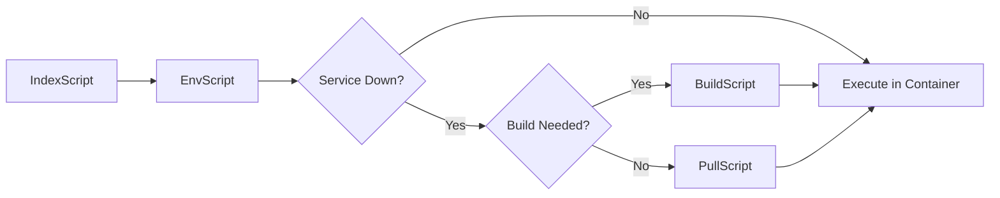

# Arbitrary Commands

Run any pnpm script from your `package.json` files, either on the host machine or inside Docker containers.

## Overview

Arbitrary commands allow you to execute any pnpm script (like `lint`, `test`, `dev`, `typecheck`) using the same target resolution and dependency management as built-in commands. You can choose to run them on your host machine or inside Docker containers.

## Usage

### Host Execution

Run pnpm scripts directly on your host machine:

```bash
nopo <script> [targets...] [options]
```

### Container Execution

Run pnpm scripts inside Docker containers:

```bash
nopo run <script> [targets...] [options]
```

## Arguments

| Argument | Description | Required |
|----------|-------------|----------|
| `script` | The pnpm script name to run (e.g., `lint`, `test`, `dev`) | Yes |
| `targets` | Optional list of targets to run the script in/on | No |

### Available Targets

Targets are discovered from `apps/*/Dockerfile` (e.g., `backend`, `web`).

## Execution Modes

### Host Execution

When you run a command without the `run` prefix, it executes on your host machine:

```bash
nopo lint web
```

**How it works**:
- Uses `pnpm --filter @more/{target} run {script}` for each target
- If no targets specified: `pnpm run {script}` at root level
- Runs in your current shell environment
- No Docker container involvement

**Dependencies**: Only `EnvScript` (ensures `.env` file exists)

**Use cases**:
- Quick linting/type checking without container overhead
- Running scripts that need access to host filesystem
- Development workflows where containers aren't needed

### Container Execution

When you use the `run` prefix, it executes inside Docker containers:

```bash
nopo run lint web
```

**How it works**:
- Uses `docker compose run --rm --remove-orphans {target} pnpm run {script}`
- Each target runs sequentially
- Containers are automatically removed after execution (`--rm`)
- Full dependency resolution (build/pull images if needed)

**Dependencies**: Full dependency chain:
- `EnvScript` (always)
- `BuildScript` (if service down and local build needed)
- `PullScript` (if service down and pull needed)

**Use cases**:
- Running tests in isolated container environments
- Ensuring consistent execution environment
- Running scripts that require container-specific dependencies

## Examples

### Host Execution Examples

```bash
# Run lint on all targets (or root)
nopo lint

# Run lint on specific target
nopo lint web

# Run lint on multiple targets
nopo lint backend web

# Run test on a target
nopo test backend

# Run type checking
nopo typecheck web

# Run dev server (if defined in package.json)
nopo dev backend
```

### Container Execution Examples

```bash
# Run lint in container (all targets)
nopo run lint

# Run lint in specific container
nopo run lint web

# Run lint in multiple containers
nopo run lint backend web

# Run test in container
nopo run test backend

# Run migrations in container
nopo run migrate backend
```

## Comparison: Host vs Container

| Aspect | Host Execution | Container Execution |
|--------|----------------|-------------------|
| **Command** | `nopo lint web` | `nopo run lint web` |
| **Environment** | Your host machine | Docker container |
| **Dependencies** | Only `EnvScript` | Full (env, build, pull) |
| **Speed** | Faster (no container overhead) | Slower (container startup) |
| **Isolation** | Uses host environment | Isolated container environment |
| **Consistency** | May vary by host | Consistent across machines |
| **Use Case** | Quick checks, development | Tests, production-like environment |

## How It Works

### Command Routing

```mermaid
flowchart TD
    Start([nopo lint web]) --> CheckRun{First arg is 'run'?}
    CheckRun -->|No| HostMode[Host Execution Mode]
    CheckRun -->|Yes| ContainerMode[Container Execution Mode]
    
    HostMode --> ParseArgs1[Parse: command=lint, targets=[web]]
    ContainerMode --> ParseArgs2[Parse: command=lint, targets=[web], inContainer=true]
    
    ParseArgs1 --> ResolveDeps1[Resolve: EnvScript only]
    ParseArgs2 --> ResolveDeps2[Resolve: EnvScript, BuildScript if needed]
    
    ResolveDeps1 --> ExecuteHost[pnpm --filter @more/web run lint]
    ResolveDeps2 --> ExecuteContainer[docker compose run web pnpm run lint]
    
    ExecuteHost --> Output1[Output from host]
    ExecuteContainer --> Output2[Output from container]
```

### Target Resolution

Targets are resolved using the same algorithm as script classes:

1. Parse positional arguments after the command name
2. Validate against discovered targets from `apps/*/Dockerfile`
3. If no targets specified:
   - **Host**: Run at root level
   - **Container**: Run in all target containers sequentially

### Dependency Resolution

**Host Execution**:


**Container Execution**:


## Error Handling

### Script Not Found

If the pnpm script doesn't exist:

```plaintext
ERR_PNPM_NO_SCRIPT  Missing script: /^lint.*/
```

**Solution**: Ensure the script exists in the target's `package.json` or root `package.json`.

### Target Not Found

If the specified target doesn't exist:

```plaintext
Error: Unknown target 'invalid'. 
Available targets: backend, web
```

**Solution**: Check available targets with `nopo status` or verify `apps/*/Dockerfile` exists.

### Container Not Running

If container execution is requested but container isn't available:

- Dependencies (build/pull) will automatically run to prepare the container
- If build/pull fails, the command will fail with appropriate error messages

## Best Practices

### When to Use Host Execution

- Quick linting or type checking during development
- Scripts that need access to host filesystem
- Commands that don't require container-specific dependencies
- Fast iteration cycles

### When to Use Container Execution

- Running tests that need isolated environments
- Ensuring consistent execution across team members
- Scripts that require container-specific dependencies
- CI/CD pipelines where consistency is critical

### Performance Tips

- Use host execution for quick checks (`nopo lint`)
- Use container execution for comprehensive testing (`nopo run test`)
- Specify targets to avoid unnecessary work (`nopo lint web` vs `nopo lint`)
- Cache dependencies when possible

## See Also

- [Architecture Documentation](../architecture.md) - Detailed system architecture
- [`run`](./run.md) - Legacy run command (being replaced by arbitrary commands)
- [`build`](./build.md) - Build images before running in containers
- [`up`](./up.md) - Start services for container execution

