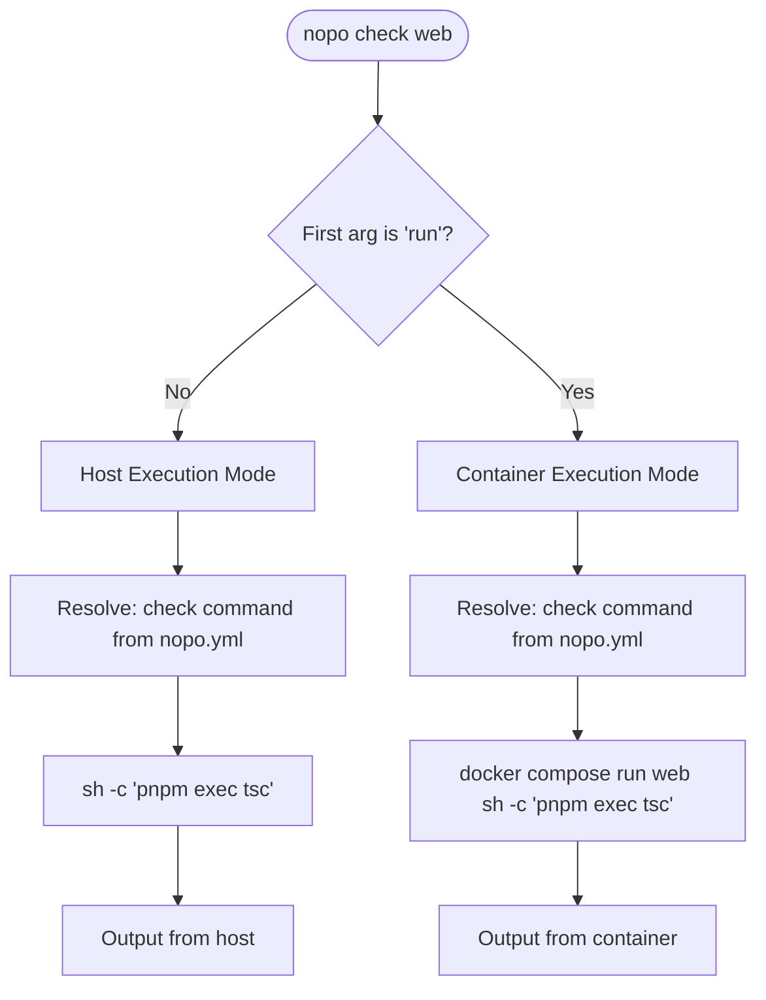
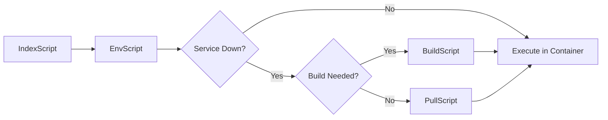

# Arbitrary Commands

Run any command defined in your `nopo.yml` files, either on the host machine or inside Docker containers.

## Overview

Arbitrary commands allow you to execute any command defined in `nopo.yml` (like `lint`, `test`, `dev`, `check`) using the same target resolution and dependency management as built-in commands. Both `nopo <command>` and `nopo run <command>` use the same nopo.yml command definitions, with the only difference being where the command executes.

## Usage

### Host Execution

Run nopo.yml commands directly on your host machine:

```bash
nopo <command> [subcommand] [targets...] [options]
```

### Container Execution

Run nopo.yml commands inside Docker containers:

```bash
nopo run <command> [subcommand] [targets...] [options]
```

## Arguments

| Argument | Description | Required |
|----------|-------------|----------|
| `command` | The nopo.yml command name to run (e.g., `check`, `test`, `dev`) | Yes |
| `subcommand` | Optional subcommand (e.g., `py` for `check:py`) | No |
| `targets` | Optional list of targets to run the command in/on | No |

### Available Targets

Targets are discovered from `apps/*/Dockerfile` (e.g., `backend`, `web`).

## Execution Modes

### Host Execution

When you run a command without the `run` prefix, it executes on your host machine:

```bash
nopo check web
```

**How it works**:
- Looks up the `check` command in `apps/web/nopo.yml`
- Executes the command string directly via `sh -c`
- Runs in your current shell environment
- No Docker container involvement

**Dependencies**: Only `EnvScript` (ensures `.env` file exists)

**Use cases**:
- Quick linting/type checking without container overhead
- Running commands that need access to host filesystem
- Development workflows where containers aren't needed

### Container Execution

When you use the `run` prefix, it executes inside Docker containers:

```bash
nopo run check web
```

**How it works**:
- Looks up the `check` command in `apps/web/nopo.yml`
- Uses `docker compose run --rm --remove-orphans {target} sh -c "{command}"`
- Each target runs sequentially
- Containers are automatically removed after execution (`--rm`)
- Full dependency resolution (build/pull images if needed)

**Dependencies**: Full dependency chain:
- `EnvScript` (always)
- `BuildScript` (if service down and local build needed)
- `PullScript` (if service down and pull needed)

**Use cases**:
- Running tests in isolated container environments
- Ensuring consistent execution environment
- Running commands that require container-specific dependencies
- CI/CD pipelines where consistency is critical

## Command Resolution

Both host and container execution use the same command resolution from `nopo.yml`:

```yaml
# apps/backend/nopo.yml
commands:
  test: uv run python manage.py test src
  check:
    commands:
      py: uv tool run ruff check
      js: pnpm exec eslint
      types:
        commands:
          py: uv run mypy .
          js: pnpm exec tsc --noEmit
```

| Command | Resolved Executable |
|---------|---------------------|
| `test` | `uv run python manage.py test src` |
| `check py` | `uv tool run ruff check` |
| `check types py` | `uv run mypy .` |
| `check` (no subcommand) | Runs all subcommands: `py`, `js`, `types:py`, `types:js` |

## Examples

### Host Execution Examples

```bash
# Run check on all targets (or root)
nopo check

# Run check on specific target
nopo check web

# Run check on multiple targets
nopo check backend web

# Run test on a target
nopo test backend

# Run type checking subcommand
nopo check types backend

# Run dev server
nopo dev backend
```

### Container Execution Examples

```bash
# Run check in container (all targets)
nopo run check

# Run check in specific container
nopo run check web

# Run check in multiple containers
nopo run check backend web

# Run test in container
nopo run test backend

# Run migrations in container
nopo run migrate run backend

# Run type checking subcommand in container
nopo run check types backend
```

## Comparison: Host vs Container

| Aspect | Host Execution | Container Execution |
|--------|----------------|-------------------|
| **Command** | `nopo check web` | `nopo run check web` |
| **Command Source** | nopo.yml | nopo.yml |
| **Environment** | Your host machine | Docker container |
| **Dependencies** | Only `EnvScript` | Full (env, build, pull) |
| **Speed** | Faster (no container overhead) | Slower (container startup) |
| **Isolation** | Uses host environment | Isolated container environment |
| **Consistency** | May vary by host | Consistent across machines |
| **Use Case** | Quick checks, development | Tests, production-like environment |

## How It Works

### Command Routing



### Target Resolution

Targets are resolved using the same algorithm:

1. Parse positional arguments after the command name
2. Validate against discovered targets from `apps/*/Dockerfile`
3. If no targets specified:
   - Filter to services that have the command defined
   - Run on all matching services

### Dependency Resolution

**Host Execution**:


**Container Execution**:


## Error Handling

### Command Not Found

If the command doesn't exist in the service's `nopo.yml`:

```plaintext
Error: Command 'foo' not found in service 'backend'. Available commands: test, check, dev, ...
```

**Solution**: Ensure the command is defined in the target's `nopo.yml`.

### Target Not Found

If the specified target doesn't exist:

```plaintext
Error: Unknown target 'invalid'.
Available targets: backend, web
```

**Solution**: Check available targets with `nopo status` or verify `apps/*/Dockerfile` exists.

### No Services Have Command

If no services define the specified command:

```plaintext
Error: No services have command 'foo'
```

**Solution**: Verify the command name or specify a target that has it.

## Best Practices

### When to Use Host Execution

- Quick linting or type checking during development
- Commands that need access to host filesystem
- Commands that don't require container-specific dependencies
- Fast iteration cycles

### When to Use Container Execution

- Running tests that need isolated environments
- Ensuring consistent execution across team members
- Commands that require container-specific dependencies
- CI/CD pipelines where consistency is critical
- Testing in production-like environments

### Performance Tips

- Use host execution for quick checks (`nopo check`)
- Use container execution for comprehensive testing (`nopo run test`)
- Specify targets to avoid unnecessary work (`nopo check web` vs `nopo check`)
- Cache dependencies when possible

## See Also

- [Architecture Documentation](../architecture.md) - Detailed system architecture
- [`run`](./run.md) - Container execution command
- [`build`](./build.md) - Build images before running in containers
- [`up`](./up.md) - Start services for container execution

