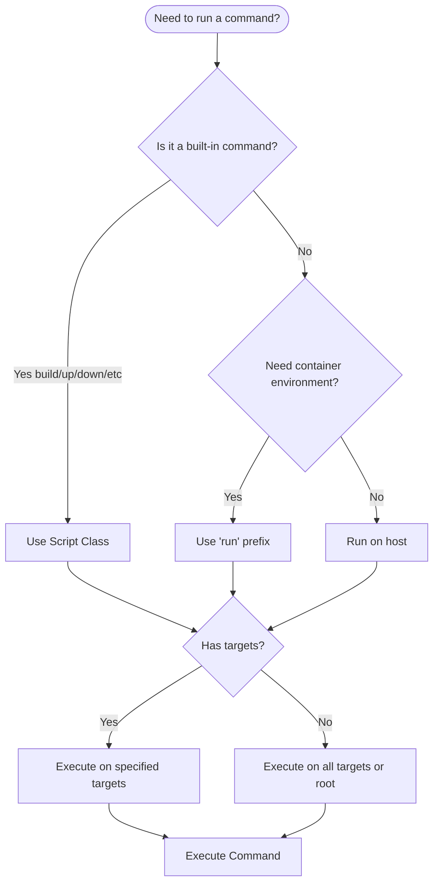

# Quick Reference

A quick guide to common CLI usage patterns and scenarios.

## Command Patterns

### Help

```bash
# General help
nopo              # Print help
nopo help         # Print help
nopo --help       # Print help

# Command-specific help
nopo build help   # Help for build command
nopo build --help # Help for build command
nopo up help      # Help for up command
nopo lint help    # Help for arbitrary commands
```

### Script Classes

```bash
# Build
nopo build                    # Build all targets
nopo build backend            # Build backend target
nopo build backend web        # Build multiple targets
nopo build backend --no-cache # Build with options

# Start Services
nopo up              # Start all targets
nopo up backend      # Start specific target

# Stop Services
nopo down            # Stop all targets
nopo down backend    # Stop specific targets

# Pull Images
nopo pull            # Pull base image
nopo pull backend    # Pull backend image

# Status
nopo status          # Check system status
```

### Arbitrary Commands - Host Execution

```bash
# Run on host (no targets = root level)
nopo lint
nopo test
nopo typecheck

# Run on host (specific target)
nopo lint web
nopo test backend
nopo typecheck web

# Run on host (multiple targets)
nopo lint backend web
nopo test backend web
```

### Arbitrary Commands - Container Execution

```bash
# Run in containers (no targets = all containers)
nopo run lint
nopo run test

# Run in container (specific target)
nopo run lint web
nopo run test backend

# Run in containers (multiple targets)
nopo run lint backend web
nopo run test backend web
```

## Common Scenarios

### Development Workflow

```bash
# 1. Start services
nopo up

# 2. Run linting (host - fast)
nopo lint web

# 3. Run tests (container - isolated)
nopo run test backend

# 4. Make changes and repeat
nopo lint web
nopo run test backend
```

### CI/CD Pipeline

```bash
# 1. Build images
nopo build --no-cache

# 2. Run linting (host)
nopo lint

# 3. Run tests (containers)
nopo run test

# 4. Type checking (host)
nopo typecheck
```

### Quick Checks

```bash
# Fast linting without containers
nopo lint web

# Type checking
nopo typecheck backend

# Format checking
nopo format
```

### Testing

```bash
# Run all tests in containers
nopo run test

# Run tests for specific target
nopo run test backend

# Run unit tests only
nopo run test:unit backend

# Run e2e tests
nopo run test:e2e
```

## Command Comparison

### Same Command, Different Execution

| Host Execution | Container Execution | Difference |
|----------------|---------------------|------------|
| `nopo lint web` | `nopo run lint web` | Host vs Container |
| `nopo test backend` | `nopo run test backend` | Host vs Container |
| `nopo typecheck` | `nopo run typecheck` | Host vs Container |

### Target Resolution

| Command | Targets Specified | Behavior |
|---------|-------------------|----------|
| `nopo build` | None | Build all targets |
| `nopo build backend` | `backend` | Build backend only |
| `nopo lint` | None | Run at root level (host) |
| `nopo lint web` | `web` | Run on web target (host) |
| `nopo run lint` | None | Run in all containers |
| `nopo run lint web` | `web` | Run in web container |

## Decision Tree



## Quick Tips

1. **Fast iteration**: Use host execution (`nopo lint`) for quick checks
2. **Consistency**: Use container execution (`nopo run test`) for tests
3. **Targets**: Always specify targets when possible to avoid unnecessary work
4. **Help**: Use `nopo` or `nopo help` to see all available commands
5. **Status**: Use `nopo status` to check which services are running

## See Also

- [Main Documentation](./index.md) - Complete CLI documentation
- [Architecture](./architecture.md) - System architecture and algorithms
- [Arbitrary Commands](./commands/arbitrary.md) - Detailed arbitrary command guide

